## ESXI安装部署OpenWRT

> 本次使用的是官方提供的镜像，通过StarWind官网工具进行转换后，在ESXI上运行使用

### 环境说明

* ESXI 8.0
* Intel I350 T4网卡全直通
* OpenWRT 23.05.2
* StarWind V2V Converter

### 申请StarWind V2V Converter工具下载

> 官网地址需要通过邮箱和信息进行申请，邮箱不能乱写，需要接受下载连接（一个月的试用）

* 官网地址：[申请地址](https://www.starwindsoftware.com/starwind-v2v-converter#download)


### 邮箱收到邮件后，直接下载


### OpenWRT官方镜像下载（自编译看[【YC】openwrt自编译.md]）

> 此次使用的是efi，下载下来的文件需要解压成img文件，然后通过StarWind V2V Converter进行转换成ESXI能识别的格式；
> 选择自编译的，直接使用生成的`xxx-efi.img.gz`文件做下面的步骤

* 官网地址：[历史版本](https://downloads.openwrt.org/releases/)，此次使用的是最新的23.05.2

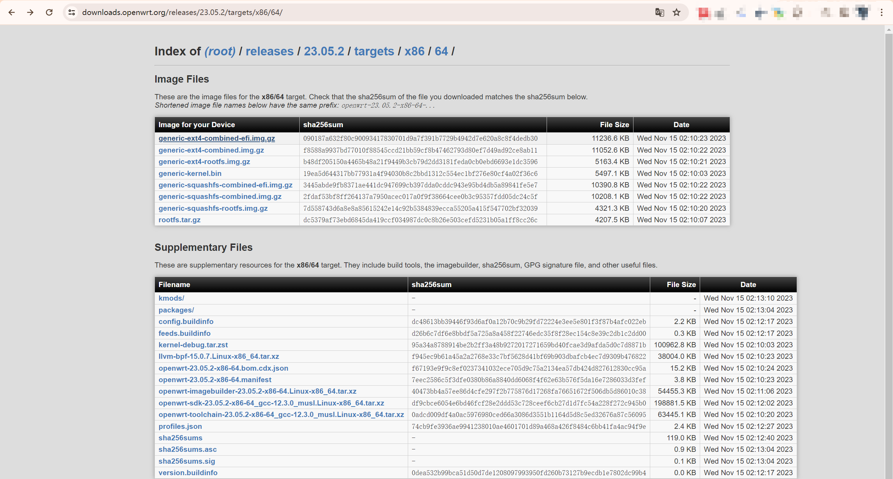

### 转换格式

> 打开安装好的StarWind V2V Converter，通过如下步骤进行转换；最终会生成两个文件

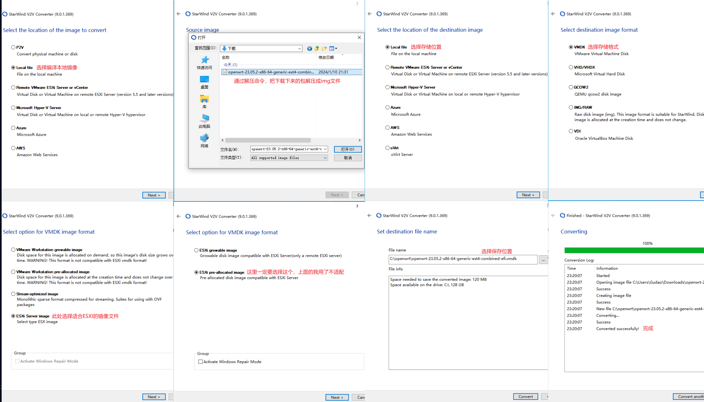

### 上传转换后的文件到ESXI磁盘中

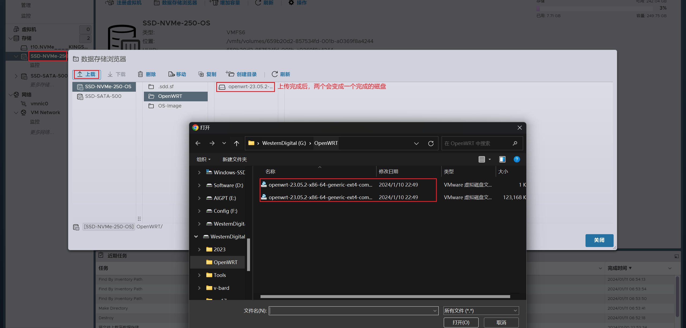

### 创建OpenWRT虚拟机

#### 创建类型选择

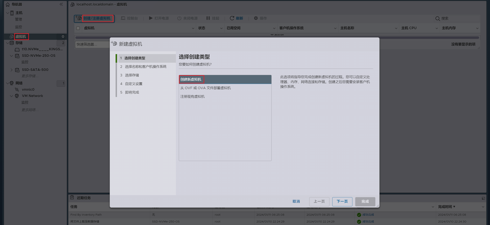

#### 配置名称与系统

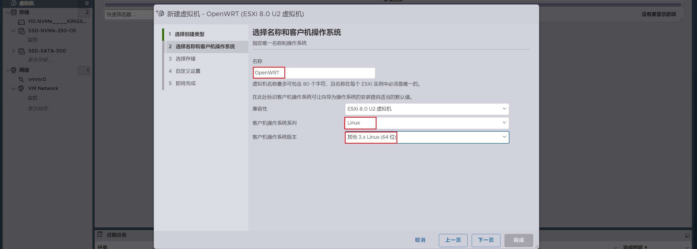

#### 指定镜像位置

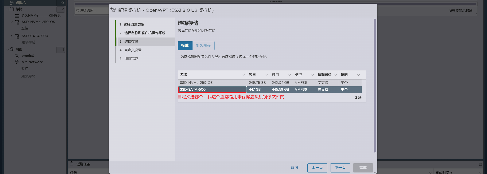

#### 虚拟机内存配置

> CPU选择了2核2线程，内存配置了2G，但是一定要勾选预留所有客户机内存

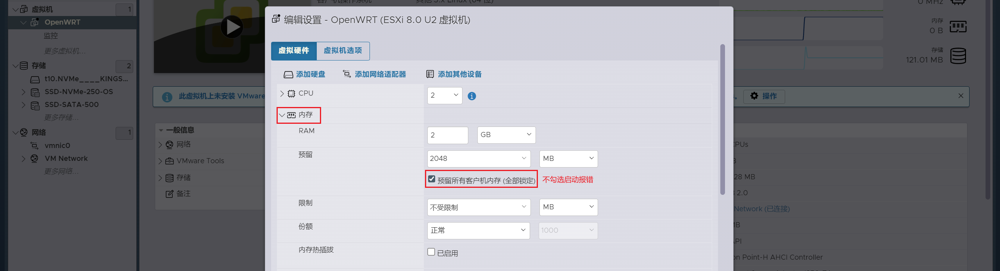

#### 删除多余磁盘，指定OpenWRT磁盘

> 此处将原本绑定的磁盘删除，将转换后的磁盘绑定到这个虚拟机中

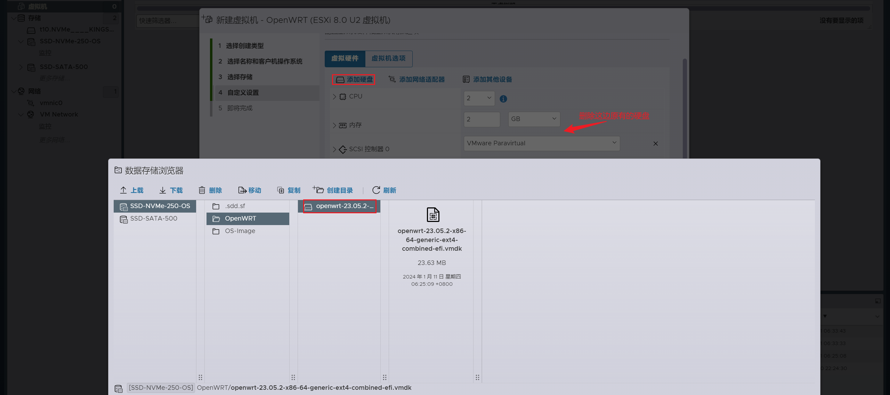

#### 绑定网卡

> 因为网卡做了直通，所以要添加PCI设备，然后选择直通后的网卡进行绑定

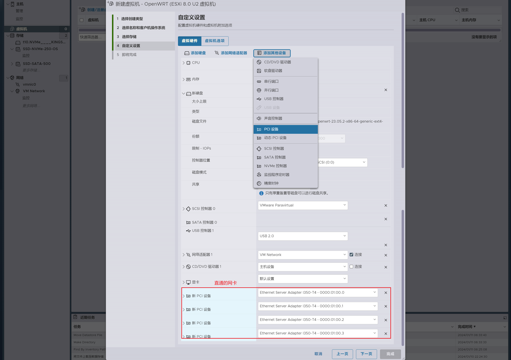

#### 启动

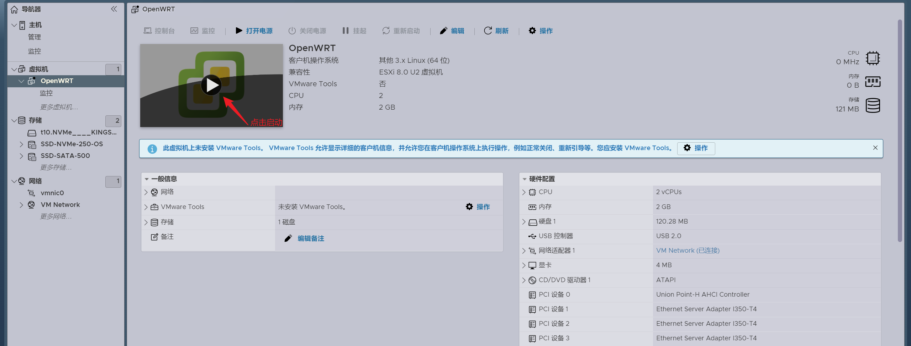

#### 配置完成，正常运行

> 看到`adding vlan0 to...`点击回车，就能进入命令行

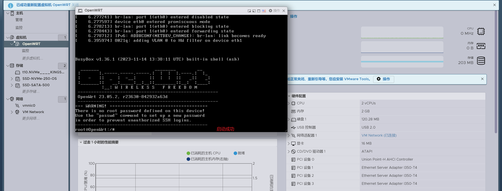

#### 查看IP

```shell
# 通过ip a查看ip信息，获取到地址为192.168.1.1
ip a | grep inet

# 修改ip
vim /etc/config/network
```


### 登录

> 访问界面，初始没有密码，直接点击登录或随便输入密码就能进入，进入后重新配置密码

