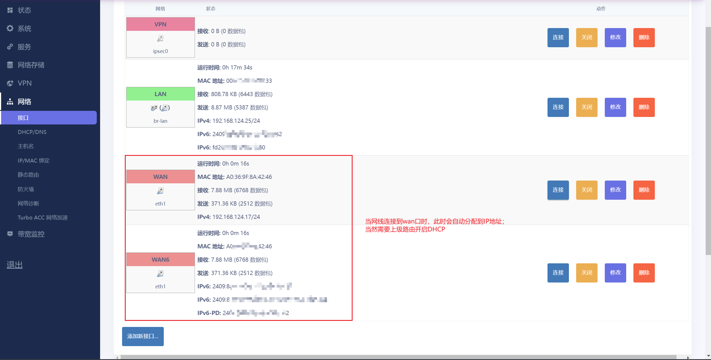

## OpenWRT登录后配置网口
> 部署和环境跟[【YC】openwrt下载与安装.md]一致，只是此次用的是自编译后的镜像包

### 环境说明
* ESXI 8.0.2U
* 网卡：I350 T4（ESXI直通）
* 板载网口*1（直连笔记本操作，与ESXI配置同一网段）
* Github代码仓库 [LEDE](https://github.com/coolsnowwolf/lede)

### 登录OpenWRT界面
> 登录地址默认192.168.1.1，或者在编译的时候手动进行修改；
> 初始默认无密码；

### 查看接口界面
> 直连笔记本的网口，op会默认它是lan口；
> 此时的wan口是没有任何ip信息的，而且流量等信息都是0（图中的是调通后，又拔了的示例）

### 网线正确连接到wan口后
> 将网线挨个网口测试，大约半分钟左右，如果网线连接对wan口，就会显示如下：wan口获得ip，流量正常（此处的网线需要从上级路由或者光猫中分发出来的，能访问互联网）
> 图二就是实体机器找到正确wan口后的网线连接

### 添加lan口
> 多网口，在调试结束后，可以将其余的网口加入到lan口中，这样除了wan口的其余网口都能访问互联网

