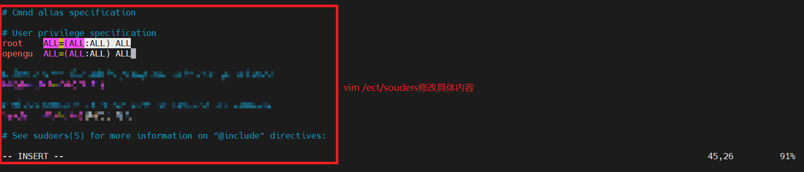
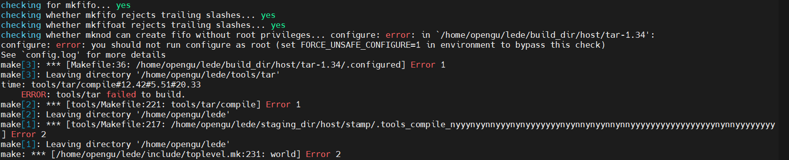

## OpenWRT固件自编译

### 环境说明
* vultr云主机：Ubuntu 22.04 LTS x64 2c 2g （国际网环境）

### 准备Vultr主机环境

### 查看服务器详情并连接


### 创建用户
> 不推荐使用 `root` 用户进行编译，所以先使用 `root` 权限创建一个用户，以创建 `opengu` 用户为例
```shell
# 创建用户opengu，默认会创建组opengu绑定这个用户
adduser opengu
# 设置密码，自定义（弹出New password）
xxxxx
# 后面的信息全默认即可
# 创建用户的同时，会默认在/home创建改用户的用户文件夹
```


### 指定用户命令解释程序为`/bin/bash`
```shell
# usermod 设置用户属性，修改`/etc/password`中内容
# 将用户 opengu 的登录Shell更改为 /bin/bash，以便该用户在登录时使用 Bash Shell
usermod -s /bin/bash opengu
```

### 添加 sudo 权限
```shell
# 因 /etc/sudoers 文件默认是只读文件，因此需先添加 sudoers 文件的写权限
chmod u+w /etc/sudoers
# 编辑 sudoers 文件
vim /etc/sudoers

# 找到 root ALL=(ALL) ALL 追加新行
opengu ALL=(ALL:ALL) ALL

# 保存退出
:wq

# 修改完成后，安全考虑建议撤销 sudoers 文件写权限
chmod u-w /etc/sudoers

# 创建新用户会自动创建一个以用户名命名的新目录，需要为新目录添加读写权限（将opengu改成自己使用的用户名即可）
chown opengu:opengu -R /home/opengu/

# 切换使用新用户，运行两次，并输入新用户的密码进行切换
su opengu

# # 更新软件列表、升级软件包（使用下面命令或：sudo sh -c "apt update && apt upgrade -y"）
sudo sh -c "apt update -y && sudo apt full-upgrade -y"
```



### 安装OpenWRT-LEDE编译依赖
```shell
sudo apt install -y ack antlr3 asciidoc autoconf automake autopoint binutils bison build-essential \
bzip2 ccache cmake cpio curl device-tree-compiler fastjar flex gawk gettext gcc-multilib g++-multilib \
git gperf haveged help2man intltool libc6-dev-i386 libelf-dev libfuse-dev libglib2.0-dev libgmp3-dev \
libltdl-dev libmpc-dev libmpfr-dev libncurses5-dev libncursesw5-dev libpython3-dev libreadline-dev \
libssl-dev libtool lrzsz mkisofs msmtp ninja-build p7zip p7zip-full patch pkgconf python2.7 python3 \
python3-pyelftools python3-setuptools qemu-utils rsync scons squashfs-tools subversion swig texinfo \
uglifyjs upx-ucl unzip vim wget xmlto xxd zlib1g-dev
```

### 进入用户目录，下载源码
```shell
# 进入创建的opengu用户目录（自己创建的用户名，就是home下面的用户目录名）
cd /home/opengu/

# 下载源码
git clone https://github.com/coolsnowwolf/lede
```


### 个性化配置需要的功能
#### 修改固件的初始网络配置（可选）
> 如果不进行这一步骤的操作，该路由器固件安装成功后，路由器 LAN 口管理 IP 为 192.168.1.1。如果断网操作肯定是没问题的，但是如果在现有的网络环境下部署旁路由（旁路网关）的话，一般就会和主路由器的 IP 地址冲突。所以这里介绍一下如何在编译固件前修改路由器固件的默认 IP。
```shell
# 进入项目目录lede
cd lede

# 修改 zzz-default-settings 文件，在 exit 0 这一行上方添加自定义配置。具体操作如下
vim ./package/lean/default-settings/files/zzz-default-settings

# 添加ip信息
uci set network.lan.ipaddr='192.168.1.254'   # 默认 IP 地址
uci set network.lan.proto='static'   # 静态 IP
uci set network.lan.type='bridge'   # 接口类型：桥接
uci set network.lan.ifname='eth0'   # 网络端口：默认 eth0，第一个接口
uci set network.lan.netmask='255.255.255.0' # 子网掩码
uci set network.lan.gateway='192.168.1.1'   # 默认网关地址（主路由 IP）
uci set network.lan.dns='192.168.1.1'  # 默认上游 DNS 地址
uci commit network
```

#### 启用必要的软件源
> 下面是两种添加自定义源的方式，都可以
```shell
# 进入项目目录lede
cd lede

# 添加自定义源，直接写入自定义源文件feeds.conf.default
cat >> feeds.conf.default <<EOF
src-git kenzo https://github.com/kenzok8/openwrt-packages
src-git passwall https://github.com/xiaorouji/openwrt-passwall
EOF

# 通过vim修改feeds.conf.default文件
vim ./feeds.conf.default
# 添加自定义源
src-git kenzo https://github.com/kenzok8/openwrt-packages
src-git passwall https://github.com/xiaorouji/openwrt-passwall

# 更新 feeds 
./scripts/feeds update -a && ./scripts/feeds install -a

# 选择配置
make menuconfig
```


#### 选择配置

### 下载 dl 库，编译固件
> -j 后面是线程数，第一次编译推荐用单线程
```shell
# -j后面改成自己cpu的线程数量
make download -j8
# 编译，此次使用的是ssh工具连接，编译较久，使用守护进程执行
nohup make V=s -j$(nproc) 2>&1 >> log.txt &

# 查看日志
tail log.txt -f
```

### 使用`root`编译报错如下（切换非root账户即可）
```shell
error: you should not run configure as root (set FORCE_UNSAFE_CONFIGURE=1 in environment to bypass this check)
See `config.log' for more details
```
