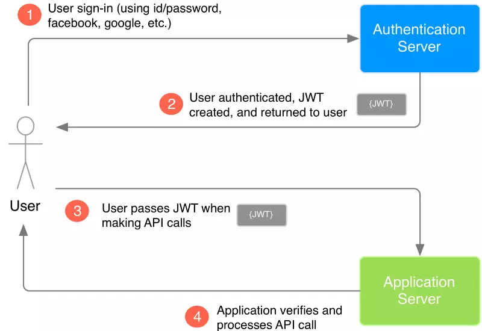

## JWT使用说明

### 说明
> `json web token`基于JSON的、用于在网络上声明某种主张的令牌（token）。JWT通常由三部分组成: 头信息（header）, 消息体（payload）和签名（signature）；它将用户信息加密到token里，服务器不保存任何用户信息。服务器通过使用保存的密钥验证token的正确性，只要正确即通过验证

### 使用JWT后信息交互图

用户首先使用认证服务器的登录系统（用户和密码，或者第三方认证）登录认证服务器
随后认证服务器创建 JWT 然后发送给用户。当用户发起请求调用应用服务器的 API 时会附带上 JWT。在这一步，应用服务器会被配置为校验传入的 JWT 是否由认证服务器创建（校验的过程在后面会详细说明）
当用户使用附带 JWT 的请求调用 API 的时候，应用服务器可以使用 JWT 来验证 API 请求是否来自一个可信任的用户

### 优点

### 缺点
