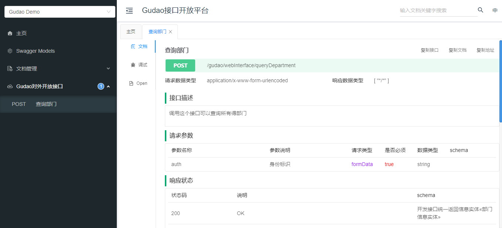

## Knife4j使用说明

### 版本与配置说明
* SpringBoot：2.5.0
* knife4j：2.0.8（添加配置信息自定义等增强）
* validation-api：2.0.1.Final（解决knife4j中缺少的jar包）
* lombok：1.18.20（springboot项目集成）
* java：1.8

### 配置信息
#### pom 坐标
* knife4j中自带`knife4j-spring-ui 2.0.8`
```xml
<!-- knife4j:swagger前端界面增强（2.0.7之后提供配置文件自定义配置，此处使用2.0.8来删除knife4j中的版权信息） -->
<dependency>
    <groupId>com.github.xiaoymin</groupId>
    <artifactId>knife4j-spring-boot-starter</artifactId>
    <version>2.0.8</version>
</dependency>
<dependency>
    <groupId>javax.validation</groupId>
    <artifactId>validation-api</artifactId>
    <version>2.0.1.Final</version>
</dependency>
```
#### applocation.yml文件配置knife4j信息
```yaml
knife4j:
  enable: true
  # 生产环境屏蔽
  # production: true
  # 开启Swagger的Basic认证功能,默认是false
  basic:
    # 开启登录验证
    enable: true
    # 用户名
    username: admin
    # 密码
    password: admin
  setting:
    # 关闭页足版权信息显示
    enableFooter: false
    # 开启实体类显示
    enableSwaggerModels: true
```
#### 项目信息配置类
```java
import com.github.xiaoymin.knife4j.spring.extension.OpenApiExtensionResolver;
import org.springframework.beans.factory.annotation.Autowired;
import org.springframework.context.annotation.Bean;
import org.springframework.context.annotation.Configuration;
import org.springframework.context.annotation.Import;
import springfox.bean.validators.configuration.BeanValidatorPluginsConfiguration;
import springfox.documentation.builders.ApiInfoBuilder;
import springfox.documentation.builders.PathSelectors;
import springfox.documentation.builders.RequestHandlerSelectors;
import springfox.documentation.service.ApiInfo;
import springfox.documentation.service.Contact;
import springfox.documentation.spi.DocumentationType;
import springfox.documentation.spring.web.plugins.Docket;
import com.fasterxml.classmate.TypeResolver;
import springfox.documentation.swagger2.annotations.EnableSwagger2WebMvc;

/**
 * @Auther: Gudao
 * @Date: 2021/06/03
 * @Description:
 */
@Configuration
@EnableSwagger2WebMvc
@Import(BeanValidatorPluginsConfiguration.class)// 可注释，注释后，knife4j配置信息不生效
public class SwaggerConfig {

    private final TypeResolver typeResolver;// 可注释，注释后，knife4j配置信息不生效
    private final OpenApiExtensionResolver openApiExtensionResolver;// 可注释，注释后，knife4j配置信息不生效

    @Autowired// 可注释
    public SwaggerConfig(TypeResolver typeResolver, OpenApiExtensionResolver openApiExtensionResolver) {// 可注释
        this.typeResolver = typeResolver;// 可注释，注释后，knife4j配置信息不生效
        this.openApiExtensionResolver = openApiExtensionResolver;// 可注释，注释后，knife4j配置信息不生效
    }// 可注释

    @Bean
    public Docket createRestApi() {
        return new Docket(DocumentationType.SWAGGER_2)
                .apiInfo(apiInfo())
                // 项目组信息（多项目中可以通过选择框来指定到所选项目中去）
                .groupName("Gudao Demo")
                .select()
                // 为当前路径下controller生成API文档
                .apis(RequestHandlerSelectors.basePackage("com.gudao.knife4jproject.controller"))//扫描包
                // 为有@Api注解的Controller生成API文档
                //.apis(RequestHandlerSelectors.withClassAnnotation(Api.class))
                // 为有@ApiOperation注解的方法生成API文档
                //.apis(RequestHandlerSelectors.withMethodAnnotation(ApiOperation.class))
                .paths(PathSelectors.any())
                .build()
                .extensions(openApiExtensionResolver.buildExtensions("2.X版本"));// 可注释，注释后，knife4j配置信息不生效
    }

    private ApiInfo apiInfo() {
        return new ApiInfoBuilder()
                // 项目标题
                .title("Gudao接口开放平台")
                // 项目简介
                .description("Gudao接口")
                // 项目版本
                .version("v1.0")
                // 作者说明
                .contact(new Contact("Gudao", "www.gudao.ink", "2873908996@qq.com"))
                .build();
    }
}
```
** 到此项目启动就能通过 ip:port/doc.html 访问了 **


### 下面配置是关于实体与返回信息的，按自己的项目来即可
#### model，注解中的字段含义看`【YC】swagger使用说明.md`
```java
/**
 * @Auther: Gudao
 * @Date: 2021/06/02
 * @Description:
 */
@ApiModel("部门信息实体")
@Data
public class OpenDepartmentModel implements Serializable {

    private static final long serialVersionUID = 1L;

    @ApiModelProperty(value="部门id", name="id",dataType="String")
    private String id;
    
    @ApiModelProperty(value="部门名称", name="departmentName",dataType="String")
    private String departmentName;
    
    @ApiModelProperty(value="本部门编码", name="departmentCode",dataType="String")
    private String departmentCode;

}
```
#### enum实体
```java
/**
 * @Auther: Gudao
 * @Date: 2021/06/03
 * @Description:
 */
@Getter
public enum OpenApiEnum {

    SUCCESS(0, "正常"),
    FAILURE(1, "失败"),
    PARAM_NULL(1, "参数信息不匹配"),
    MEMBER_NULL(1, "用户信息不存在"),
    AUTHORITY_DOWN(1, "用户无权查询此信息");

    private final int code;
    private final String msg;

    OpenApiEnum(int code, String msg) {
        this.code = code;
        this.msg = msg;
    }
}
```
#### response返回实体
```java
/**
 * @Auther: zhangxiayu
 * @Date: 2021/04/25
 * @Description:
 */
@ApiModel(value = "开发接口统一返回信息实体")
@Setter
@Getter
public class OpenApiResponse<T> implements Serializable {

    private static final long serialVersionUID = 1L;

    /**
     * 请求返回状态码
     */
    @ApiModelProperty(value="请求返回状态码：0 正常，1 失败", name="code",dataType="Integer")
    private int code;

    /**
     * 请求返回信息
     */
    @JsonInclude(value= JsonInclude.Include.NON_NULL)
    @ApiModelProperty(value="请求返回信息", name="msg",dataType="String",required=true)
    private String msg;

    /**
     * 请求返回数据
     */
    @JsonInclude(value= JsonInclude.Include.NON_NULL)
    @ApiModelProperty(value="请求返回数据", name="result",dataType="Object",required=true)
    private T result;

    private OpenApiResponse(int code, String msg, T result) {
        this.code = code;
        this.msg = msg;
        this.result = result;
    }

    private OpenApiResponse(int code, String msg) {
        this.code = code;
        this.msg = msg;
    }

    /**
     * 成功
     * 成功相应
     *
     * @return {@link OpenApiResponse<T>}
     */
    public static <T> OpenApiResponse<T> success() {
        return new OpenApiResponse<T>(OpenApiEnum.SUCCESS.getCode(), OpenApiEnum.SUCCESS.getMsg());
    }

    /**
     * 成功
     * 成功相应
     *
     * @param result 结果
     * @return {@link OpenApiResponse<T>}
     */
    public static <T> OpenApiResponse<T> success(T result) {
        return new OpenApiResponse<T>(OpenApiEnum.SUCCESS.getCode(), null,result);
    }

    /**
     * 失败
     * 失败的响应
     *
     * @param msg 错误信息
     * @return {@link OpenApiResponse<String>}
     */
    public static OpenApiResponse<String> failure(String msg) {
        return new OpenApiResponse<>(OpenApiEnum.FAILURE.getCode(), msg);
    }

    /**
     * 失败
     * 失败的响应
     *
     * @param openApiEnum 枚举信息
     * @return {@link OpenApiResponse<T>}
     */
    public static<T> OpenApiResponse<T> failure(OpenApiEnum openApiEnum) {
        return new OpenApiResponse<>(openApiEnum.getCode(), openApiEnum.getMsg());
    }

    /**
     * 响应
     * 其他的响应
     *
     * @param r      枚举常量
     * @param result 结果
     * @return {@link OpenApiResponse<T>}
     */
    public static <T> OpenApiResponse<T> response(OpenApiEnum r, T result) {
        return new OpenApiResponse<T>(r.getCode(), r.getMsg(), result);
    }

    /**
     * 构建
     * 自定义异常信息
     *
     * @param code    代码
     * @param message 消息
     * @return {@link OpenApiResponse<T>}
     */
    public static <T> OpenApiResponse<T> build(int code, String message) {
        return new OpenApiResponse<T>(code, message);
    }
}
```
#### controller：重点，配置多层级返回数据
* @PostMapping(value = "/queryDepartment", consumes = "application/x-www-form-urlencoded")：consumes配置，会显示到接口中的请求类型中去，请求类型也能通过@PostMapping()识别
  
* @ApiImplicitParams({ @ApiImplicitParam(name = "auth", value = "身份标识", required = true) })：请求参数说明
  
* @ApiOperation(value = "查询部门", notes = "调用这个接口可以查询所有得部门")：notes接口说明
* public OpenApiResponse<OpenDepartmentModel> queryDepartment(@RequestParam("auth") String auth)：OpenApiResponse<OpenDepartmentModel>就会通过多层级在接口文档中显示
  
```java
/**
 * @Auther: Gudao
 * @Date: 2021/06/03
 * @Description:
 */
@Api(tags = "Gudao对外开放接口")
@RestController
@RequestMapping("/gudao/webInterface")
public class OpenApiController {
    
    /**
     * 查询部门
     *
     * @param auth 身份标识
     * @return {@link OpenApiResponse<OpenDepartmentModel>}
     */
    @ApiOperation(value = "查询部门", notes = "调用这个接口可以查询所有得部门")
    @ApiImplicitParams({
    @ApiImplicitParam(name = "auth", value = "身份标识", required = true)
})
    @PostMapping(value = "/queryDepartment", consumes = "application/x-www-form-urlencoded")
    public OpenApiResponse<OpenDepartmentModel> queryDepartment(@RequestParam("auth") String auth){
        return OpenApiResponse.success();
    }

}
```


### 遇到问题
#### 问题：SpringBoot启动报错

```text
2021-06-02 22:17:29.250 ERROR 25832 --- [           main] o.s.b.d.LoggingFailureAnalysisReporter   : 

***************************
APPLICATION FAILED TO START
***************************

Description:

Parameter 1 of constructor in com.gudao.knife4jproject.config.SwaggerConfig required a bean of type 'com.github.xiaoymin.knife4j.spring.extension.OpenApiExtensionResolver' that could not be found.


Action:

Consider defining a bean of type 'com.github.xiaoymin.knife4j.spring.extension.OpenApiExtensionResolver' in your configuration.
```
#### 解决：在SpringBoot配置文件中添加Knife4j的配置参数
application.yml
```yaml
  # knife4j配置项
  knife4j:
  # 启用
  enable: true
```

#### 问题：SpringBoot启动报：BeanCreationException

```text
2021-06-03 21:28:49.867 ERROR 13304 --- [           main] o.s.boot.SpringApplication               : Application run failed

org.springframework.beans.factory.BeanCreationException: Error creating bean with name 'sizePlugin' defined in class path resource [springfox/bean/validators/configuration/BeanValidatorPluginsConfiguration.class]: Post-processing of merged bean definition failed; nested exception is java.lang.IllegalStateException: Failed to introspect Class [springfox.bean.validators.plugins.schema.SizeAnnotationPlugin] from ClassLoader [sun.misc.Launcher$AppClassLoader@18b4aac2]
	at org.springframework.beans.factory.support.AbstractAutowireCapableBeanFactory.doCreateBean(AbstractAutowireCapableBeanFactory.java:579) ~[spring-beans-5.3.7.jar:5.3.7]
	at org.springframework.beans.factory.support.AbstractAutowireCapableBeanFactory.createBean(AbstractAutowireCapableBeanFactory.java:524) ~[spring-beans-5.3.7.jar:5.3.7]
	at org.springframework.beans.factory.support.AbstractBeanFactory.lambda$doGetBean$0(AbstractBeanFactory.java:335) ~[spring-beans-5.3.7.jar:5.3.7]
	at org.springframework.beans.factory.support.DefaultSingletonBeanRegistry.getSingleton(DefaultSingletonBeanRegistry.java:234) ~[spring-beans-5.3.7.jar:5.3.7]
	at org.springframework.beans.factory.support.AbstractBeanFactory.doGetBean(AbstractBeanFactory.java:333) ~[spring-beans-5.3.7.jar:5.3.7]
	at org.springframework.beans.factory.support.AbstractBeanFactory.getBean(AbstractBeanFactory.java:208) ~[spring-beans-5.3.7.jar:5.3.7]
	at org.springframework.beans.factory.support.DefaultListableBeanFactory.preInstantiateSingletons(DefaultListableBeanFactory.java:944) ~[spring-beans-5.3.7.jar:5.3.7]
	at org.springframework.context.support.AbstractApplicationContext.finishBeanFactoryInitialization(AbstractApplicationContext.java:918) ~[spring-context-5.3.7.jar:5.3.7]
	at org.springframework.context.support.AbstractApplicationContext.refresh(AbstractApplicationContext.java:583) ~[spring-context-5.3.7.jar:5.3.7]
	at org.springframework.boot.web.servlet.context.ServletWebServerApplicationContext.refresh(ServletWebServerApplicationContext.java:145) ~[spring-boot-2.5.0.jar:2.5.0]
	at org.springframework.boot.SpringApplication.refresh(SpringApplication.java:758) [spring-boot-2.5.0.jar:2.5.0]
	at org.springframework.boot.SpringApplication.refreshContext(SpringApplication.java:438) [spring-boot-2.5.0.jar:2.5.0]
	at org.springframework.boot.SpringApplication.run(SpringApplication.java:337) [spring-boot-2.5.0.jar:2.5.0]
	at org.springframework.boot.SpringApplication.run(SpringApplication.java:1336) [spring-boot-2.5.0.jar:2.5.0]
	at org.springframework.boot.SpringApplication.run(SpringApplication.java:1325) [spring-boot-2.5.0.jar:2.5.0]
	at com.gudao.knife4jproject.Knife4jSwaggerSpringBootDemoApplication.main(Knife4jSwaggerSpringBootDemoApplication.java:10) [classes/:na]
Caused by: java.lang.IllegalStateException: Failed to introspect Class [springfox.bean.validators.plugins.schema.SizeAnnotationPlugin] from ClassLoader [sun.misc.Launcher$AppClassLoader@18b4aac2]
	at org.springframework.util.ReflectionUtils.getDeclaredMethods(ReflectionUtils.java:481) ~[spring-core-5.3.7.jar:5.3.7]
	at org.springframework.util.ReflectionUtils.doWithLocalMethods(ReflectionUtils.java:321) ~[spring-core-5.3.7.jar:5.3.7]
	at org.springframework.beans.factory.annotation.InitDestroyAnnotationBeanPostProcessor.buildLifecycleMetadata(InitDestroyAnnotationBeanPostProcessor.java:232) ~[spring-beans-5.3.7.jar:5.3.7]
	at org.springframework.beans.factory.annotation.InitDestroyAnnotationBeanPostProcessor.findLifecycleMetadata(InitDestroyAnnotationBeanPostProcessor.java:210) ~[spring-beans-5.3.7.jar:5.3.7]
	at org.springframework.beans.factory.annotation.InitDestroyAnnotationBeanPostProcessor.postProcessMergedBeanDefinition(InitDestroyAnnotationBeanPostProcessor.java:149) ~[spring-beans-5.3.7.jar:5.3.7]
	at org.springframework.context.annotation.CommonAnnotationBeanPostProcessor.postProcessMergedBeanDefinition(CommonAnnotationBeanPostProcessor.java:294) ~[spring-context-5.3.7.jar:5.3.7]
	at org.springframework.beans.factory.support.AbstractAutowireCapableBeanFactory.applyMergedBeanDefinitionPostProcessors(AbstractAutowireCapableBeanFactory.java:1098) ~[spring-beans-5.3.7.jar:5.3.7]
	at org.springframework.beans.factory.support.AbstractAutowireCapableBeanFactory.doCreateBean(AbstractAutowireCapableBeanFactory.java:576) ~[spring-beans-5.3.7.jar:5.3.7]
	... 15 common frames omitted
	
##问题所在
Caused by: java.lang.NoClassDefFoundError: javax/validation/constraints/Size
	at java.lang.Class.getDeclaredMethods0(Native Method) ~[na:1.8.0_251]
	at java.lang.Class.privateGetDeclaredMethods(Class.java:2701) ~[na:1.8.0_251]
	at java.lang.Class.getDeclaredMethods(Class.java:1975) ~[na:1.8.0_251]
	at org.springframework.util.ReflectionUtils.getDeclaredMethods(ReflectionUtils.java:463) ~[spring-core-5.3.7.jar:5.3.7]
	... 22 common frames omitted
Caused by: java.lang.ClassNotFoundException: javax.validation.constraints.Size
	at java.net.URLClassLoader.findClass(URLClassLoader.java:382) ~[na:1.8.0_251]
	at java.lang.ClassLoader.loadClass(ClassLoader.java:418) ~[na:1.8.0_251]
	at sun.misc.Launcher$AppClassLoader.loadClass(Launcher.java:355) ~[na:1.8.0_251]
	at java.lang.ClassLoader.loadClass(ClassLoader.java:351) ~[na:1.8.0_251]
	... 26 common frames omitted
```
#### 解决：pom文件中需要添加knife4j缺少的jar包
##### 项目中对jar包依赖管理没有那么苛刻，直接使用这个jar包

```xml
<dependency>
    <groupId>io.swagger</groupId>
    <artifactId>swagger-core</artifactId>
    <version>1.5.22</version>
</dependency>
```
##### 项目中对jar包依赖管理苛刻，直接引入它缺少的jar包：validation-api    
```xml
<dependency>
    <groupId>javax.validation</groupId>
    <artifactId>validation-api</artifactId>
    <version>2.0.1.Final</version>
</dependency>
```

#### 问题来自网络：SpringBoot启动报：BeanCreationException

#### 解决：升级spring-plugin-core
```xml
<dependency>
    <groupId>org.springframework.plugin</groupId>
    <artifactId>spring-plugin-core</artifactId>
    <version>2.0.0.RELEASE</version>
</dependency>
```