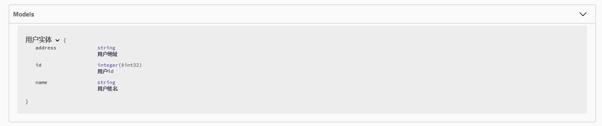

## Swagger配置

### 添加 Swagger2 依赖 + Swagger UI依赖
```shell
<dependency>
    <groupId>io.springfox</groupId>
    <artifactId>springfox-swagger2</artifactId>
    <version>2.9.2</version>
</dependency>

<dependency>
    <groupId>io.springfox</groupId>
    <artifactId>springfox-swagger-ui</artifactId>
    <version>2.9.2</version>
</dependency>
```

### Java 配置
```shell
@Configuration
@EnableSwagger2
public class SwaggerConfig {
    @Bean
    public Docket api() {
        return new Docket(DocumentationType.SWAGGER_2)
                // 将下方的api信息配置集成进来
                .apiInfo(apiInfo())
                .select()
                // 为当前包下controller生成API文档
                .apis(RequestHandlerSelectors.any())
                // 为有@Api注解的Controller生成API文档
                //.apis(RequestHandlerSelectors.withClassAnnotation(Api.class))
                // 为有@ApiOperation注解的方法生成API文档
                //.apis(RequestHandlerSelectors.withMethodAnnotation(ApiOperation.class))
                // 去除错误的Controller显示
                .paths(PathSelectors.regex("(?!/error.*).*"))
                .build();
    }
    private ApiInfo apiInfo() {
        return new ApiInfo(
            "Spring Boot 项目集成 Swagger 实例文档",
            "我的博客网站：gudao.ink",
            "API V1.0",
            "Terms of service",
            new Contact("名字想好没", "gudao.ink", "trailgudao@gmail.com"),
            "Apache", 
            "http://www.apache.org/", 
            Collections.emptyList());
    }
}
```
* @Configuration 是告诉 Spring Boot 需要加载这个配置类 
* @EnableSwagger2 是启用 Swagger2，如果没加的话自然而然也就看不到后面的验证效果了
* Docket 类提供了 apis() 和 paths() 两个方法来帮助我们在不同级别上过滤接口
    * apis() ：这种方式我们可以通过指定包名的方式，让 Swagger 只去某些包下面扫描
    * paths() ：这种方式可以通过筛选 API 的 url 来进行过滤
      * 修改之前定义的 Docket 对象的 apis() 方法和 paths() 方法为下面的内容，那么接口文档将只会展示 /user/add 和 /user/find/{id} 两个接口。
        ```java
        .apis(RequestHandlerSelectors.basePackage("cn.itweknow.sbswagger.controller"))
        .paths(Predicates.or(PathSelectors.ant("/user/add"),PathSelectors.ant("/user/find/*")))
        ```

#### 验证
> 启动项目后，通过在浏览器中访问：http://localhost:8080/v2/api-docs 来验证，您会发现返回的结果是一段 JSON 串，可读性非常差。幸运的是 Swagger2 为我们提供了可视化的交互界面 SwaggerUI；直接访问： http://localhost:8080/swagger-ui.html 就可以看到如下的效果了


### 配置说明
#### 通过在控制器类上增加 `@Api` 注解，可以给控制器增加描述和标签信息：通过在控制器类上增加 @Api 注解，可以给控制器增加描述和标签信息
```java
@Api(tags = "用户相关接口", description = "提供用户相关的 Rest API")
public class UserController
```
#### 通过在接口方法上增加 `@ApiOperation` 注解来展开对接口的描述：给接口添加描述信息
```java
@ApiOperation("新增用户接口")
@PostMapping("/add")
public boolean addUser(@RequestBody User user) {
        return false;
        }
```
#### 实体描述，我们可以通过 `@ApiModel` 和 `@ApiModelProperty` 注解来对 API 中所涉及到的对象做描述：给实体类添加描述信息
```java
@ApiModel("用户实体")
public class User {
    @ApiModelProperty("用户 id")
    private int id;
}
```
#### 接口过滤，如果想在文档中屏蔽掉删除用户的接口（user/delete），那么只需要在删除用户的方法上加上 `@ApiIgnore` 即可。
```java
@ApiIgnore
public boolean delete(@PathVariable("id") int id)
```
#### 补全信息后的 Swagger 文档界面


### 自定义响应消息
> Swagger 允许通过 Docket 的 globalResponseMessage() 方法全局覆盖 HTTP 方法的响应消息，但是首先得通过 Docket 的 useDefaultResponseMessages 方法告诉 Swagger 不使用默认的 HTTP 响应消息，假设我们现在需要覆盖所有 GET 方法的 500 和 403 错误的响应消息，只需要在 SwaggerConfig.java 类中的 Docket Bean 下添加如下
```java
        .useDefaultResponseMessages(false)
        .globalResponseMessage(RequestMethod.GET, newArrayList(
        new ResponseMessageBuilder()
        .code(500)
        .message("服务器发生异常")
        .responseModel(new ModelRef("Error"))
        .build(),
        new ResponseMessageBuilder()
        .code(403)
        .message("资源不可用")
        .build()
        ));
```


## Swagger UI 的使用
### 接口查看
> SwaggerUI 会以列表的方式展示所有扫描到的接口，初始状态是收缩的，我们只需要点击展开就好，而且会在左边标识接口的请求方式（GET、POST、PUT、DELETE 等等）


### 接口调用
> 点击接口展开后页面右上角的 Try it out 按钮后，页面会变成如图所示

> SwaggerUI 会给我们自动填充请求参数的数据结构，我们需要做的只是点击 Execute 即可发起调用

### Model
> SwaggerUI 会通过我们在实体上使用的 @ApiModel 注解以及 @ApiModelProperty 注解来自动补充实体以及其属性的描述和备注


## 注解说明
### Controller 相关注解

#### @Api: 可设置对控制器的描述
| **注解属性** | **类型** | **描述**                         |
| ------------ | -------- | -------------------------------- |
| tags         | String[] | 控制器标签                       |
| description  | String   | 控制器描述（该字段被申明为过期） |

#### @ApiOperation: 可设置对接口的描述
| **注解属性** | **类型** | **描述**     |
| :----------- | :------- | :----------- |
| value        | String   | 接口说明     |
| notes        | String   | 接口发布说明 |
| tags         | Stirng[] | 标签         |
| response     | Class<?> | 接口返回类型 |
| httpMethod   | String   | 接口请求方式 |
> @ApiIgnore: Swagger 文档不会显示拥有该注解的接口。 @ApiImplicitParams: 用于描述接口的非对象参数集。 @ApiImplicitParam: 用于描述接口的非对象参数，一般与 @ApiImplicitParams 组合使用。

#### @ApiImplicitParam 主要属性
| **注解属性** | **描述**                                                     |
| :----------- | :----------------------------------------------------------- |
| paramType    | 查询参数类型，实际上就是参数放在那里。取值：path：以地址的形式提交数据，根据 id 查询用户的接口就是这种形式传参；query：Query string 的方式传参；header：以流的形式提交；form：以 Form 表单的形式提交 |
| dataType     | 参数的数据类型。取值：Long 和 String                         |
| name         | 参数名字                                                     |
| value        | 参数意义的描述                                               |
| required     | 是否必填。取值：true：必填参数；false：非必填参数            |

### Model 相关注解
> @ApiModel: 可设置接口相关实体的描述。 @ApiModelProperty: 可设置实体属性的相关描述

#### ApiModelProperty 主要属性 
| **注解属性**    | **类型** | **描述**                                                     |
| :-------------- | :------- | :----------------------------------------------------------- |
| value           | String   | 字段说明。                                                   |
| name            | String   | 重写字段名称。                                               |
| dataType        | Stirng   | 重写字段类型。                                               |
| required        | boolean  | 是否必填。                                                   |
| example         | Stirng   | 举例说明。                                                   |
| hidden          | boolean  | 是否在文档中隐藏该字段。                                     |
| allowEmptyValue | boolean  | 是否允许为空。                                               |
| allowableValues | String   | 该字段允许的值，当我们 API 的某个参数为枚举类型时，使用这个属性就可以清楚地告诉 API 使用者该参数所能允许传入的值。 |

## Swagger集成github中的Bootstrap项目【com.github.xiaoymin】
### 引入maven坐标
```xml
<!-- BootStrap集成的Swagger 网址：ip:port/doc.html -->
<dependency>
    <groupId>com.github.xiaoymin</groupId>
    <artifactId>swagger-bootstrap-ui</artifactId>
    <version>1.9.6</version>
</dependency>
<!-- Swagger核心 -->
<dependency>
    <groupId>io.springfox</groupId>
    <artifactId>springfox-swagger2</artifactId>
    <version>2.9.2</version>
</dependency>
```
### 配置和前文中的`Java 配置`一样，然后访问
* 访问地址：ip:port/swagger-ui.html