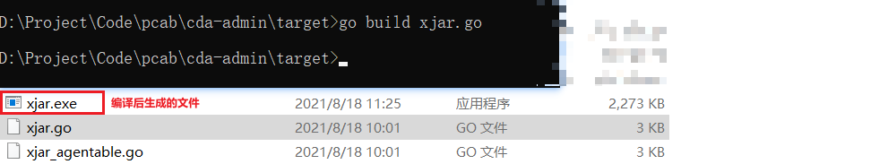

## xjar源码加密项目
> Springboot项目加密，一个jar包直接完事，不能通过maven打包插件进行结构拆分

[GitHub地址](https://github.com/core-lib/xjar)

### 使用版本说明
* JDK8
* xjar 4.0.2
* 加密jar包是SpringBoot项目的启动jar
* GO 1.16.6

### 项目代码
[xjar加密项目工具类]()

#### pom

```xml
<build>
    <plugins>
        <plugin>
            <groupId>org.apache.maven.plugins</groupId>
            <artifactId>maven-compiler-plugin</artifactId>
            <configuration>
                <source>8</source>
                <target>8</target>
            </configuration>
        </plugin>
    </plugins>
</build>

<dependencies>
    <dependency>
        <groupId>com.github.core-lib</groupId>
        <artifactId>xjar</artifactId>
        <version>4.0.2</version>
    </dependency>
    <dependency>
        <groupId>org.apache.commons</groupId>
        <artifactId>commons-compress</artifactId>
        <version>1.18</version>
    </dependency>
    <dependency>
        <groupId>com.github.core-lib</groupId>
        <artifactId>loadkit</artifactId>
        <version>v1.0.1</version>
    </dependency>
</dependencies>
```
#### 加密方法
```java
public static void main(String[] args) throws Exception {
    XBoot.encrypt(
            // 需要加密的jar包位置
            "D:\\Project\\Code\\xxx.jar",
            // 加密后jar包位置
            "D:\\Project\\Code\\xxx-xjar.jar",
            // 加密密码
            "gudao#@!zxy",
            (entry) -> {
                String name = entry.getName();
                // 需要加密的路径，注意：springboot项目的配置文件和静态文件不能加密，需要过滤
                String pkg = "com/cda/web/";
                return name.startsWith(pkg);
            }
    );
}
```
#### 运行后会生成一个加密的jar包和.go的GO文件


#### 通过`go build xjar.go`编译go文件（linux会生成xjar执行文件）


#### windows中通过`xjar.exe java -jar 加密jar包`（linux中通过`nohup 编译后go文件位置 java -jar 加密的jar包 &`或者`./xjar java -jar 加密jar包`）


**注意：**
* 最后的xjar.go文件一定要删除