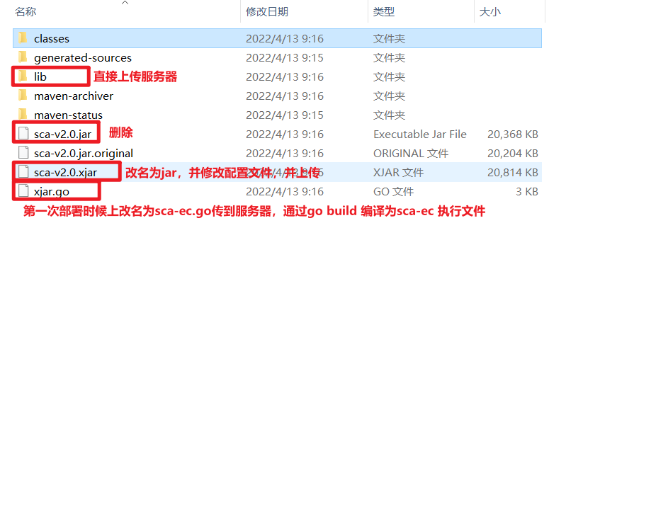
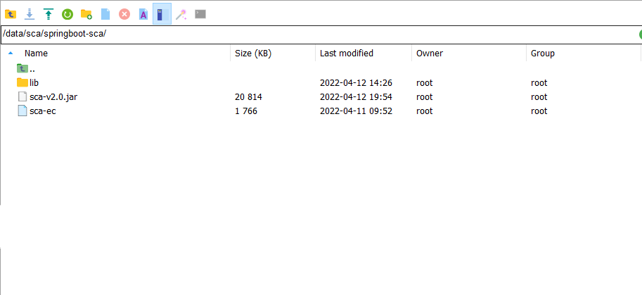

## SCA项目白杨树说明

#### 添加maven打包命令-此处可以执行密码
```java
clean package -Dmaven.test.skip=true -e -Dxjar.password=gudao -f pom.xml
```


#### 运行后会生成一个加密的xjar包、.go的GO文件和lib文件夹


#### 修改jar包内的 META-INF/MANIFEST.MF 并将文件解压出来 使用文本编辑器打开 MANIFEST.MF 文件, 修改 `Main-Class: io.xjar.boot.XExtLauncher 为 Main-Class: io.xjar.boot.XJarLauncher` 并保存
* 将xjar包更名为 任意名字.jar, 并使用winrar等压缩软件打开
* 找到jar包内的 META-INF/MANIFEST.MF 并将文件解压出来
* 使用文本编辑器打开 MANIFEST.MF 文件, 修改 Main-Class: io.xjar.boot.XExtLauncher 为 Main-Class: io.xjar.boot.XJarLauncher 并保存
* 将修改后的 MANIFEST.MF 覆盖 jar的 META-INF/MANIFEST.MF
    * 解压
      
    * 修改META-INF/MANIFEST.MF
      
    * 覆盖掉加密jar下的MANIFEST.MF，弹出提示直接点击全部替换就行
      

#### 忽略加密包的md5和sha1校验，方便以后打包；就不需要将两个包都重新替换（还有就是因为我们改了加密jar包的文件，文件md5和sha1都与go文件中的不一样了）


#### 通过`go build xjar.go`编译go文件（linux会生成xjar执行文件）


#### windows中通过`xjar.exe java -jar 加密jar包`（linux中通过`nohup 编译后go文件位置 java -jar 加密的jar包 &`或者`./xjar java -jar 加密jar包`）


#### 访问


**注意：**
* 最后的xjar.go文件一定要删除

#### SCA项目生成的项目信息


#### 第一次部署到服务器将xjar.go修改为sca-ec.go，然后编译成sca-ec执行文件，最后将，sca-v2.0.jar 和 lib放入项目中的 sca/springboot-sca下

* 项目更新只需要替换sca-v2.0.jar和lib，sca-ec无需替换
