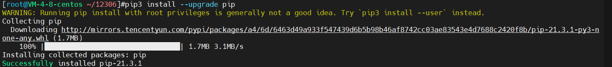

## Python安装教程-Linux

### 说明
* 安装版本：3.7.4
* CentOS：8

### 安装环境依赖
```shell
yum -y install zlib-devel bzip2-devel openssl-devel ncurses-devel sqlite-devel readline-devel tk-devel gdbm-devel db4-devel libpcap-devel xz-devel
```

### 安装gcc编译器（有可能已经安装）
```shell
yum install gcc -y
```

### 安装Python3
```shell
# 下载Python安装包
wget https://www.python.org/ftp/python/3.7.4/Python-3.7.4.tgz

# 将安装包移动到`/usr/local`文件夹下
mv Python-3.7.4.tgz /usr/local/

# 在local目录下创建Python3目录
mkdir /usr/local/python3

# 进入的Python安装包压缩包所在的目录
cd /usr/local/

# 解压安装包
tar -xvf Python-3.7.4.tgz

# 进入解压后的目录
cd /usr/local/Python-3.7.4/

# 配置安装目录
./configure --prefix=/usr/local/python3

# 编译源码
make

# 执行源码安装
make install

# 创建软连接
ln -sf /usr/local/python3/bin/python3  /usr/bin/python3

# 测试：输入python3打印
Python 3.7.4 (default, Sep  6 2020, 09:22:23) 
[GCC 4.8.5 20150623 (Red Hat 4.8.5-39)] on linux
Type "help", "copyright", "credits" or "license" for more information.
>>> 
```

### 问题
#### 报错:ModuleNotFoundError: No module named 'skbuild'
```shell
# 报错：用命令`pip3 install opencv-python`复现
Complete output from command python setup.py egg_info:
    Traceback (most recent call last):
      File "<string>", line 1, in <module>
      File "/tmp/pip-build-nmud90jq/opencv-python/setup.py", line 9, in <module>
        import skbuild
    ModuleNotFoundError: No module named 'skbuild'
    
    ----------------------------------------
Command "python setup.py egg_info" failed with error code 1 in /tmp/pip-build-nmud90jq/opencv-python/
```
#### 解决办法-linux
* python3.x: 命令行输入`pip3 install --upgrade pip`
* python2: 命令行输入`pip install --upgrade pip`

#### 出现信息
> pip 20.2.3 from /usr/local/lib/python3.6/dist-packages/pip (python 3.6)


#### 解决办法-windows
* pip install opencv-python -i https://pypi.tuna.tsinghua.edu.cn/simple，使用清华镜像池