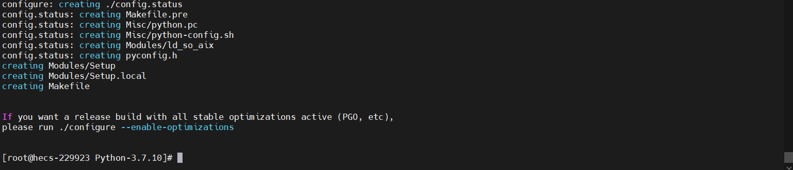
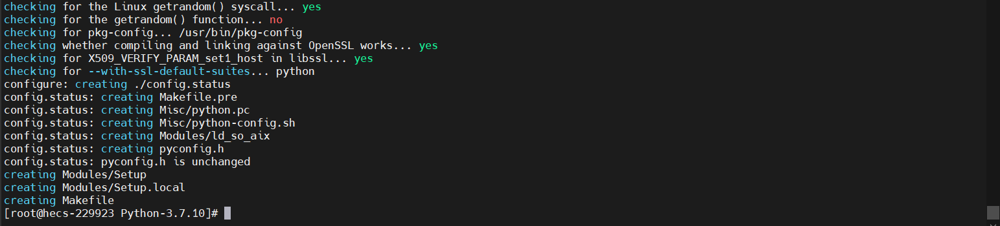
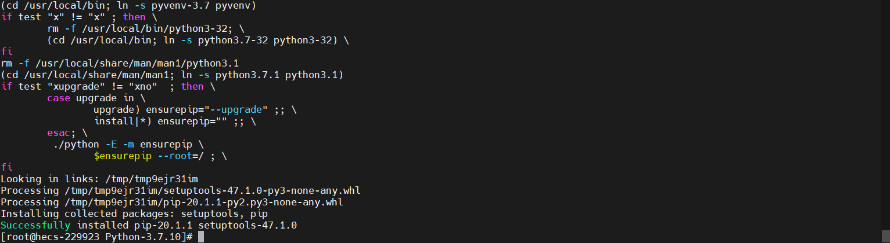
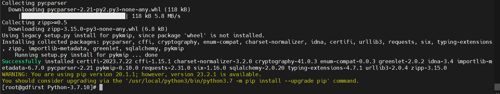
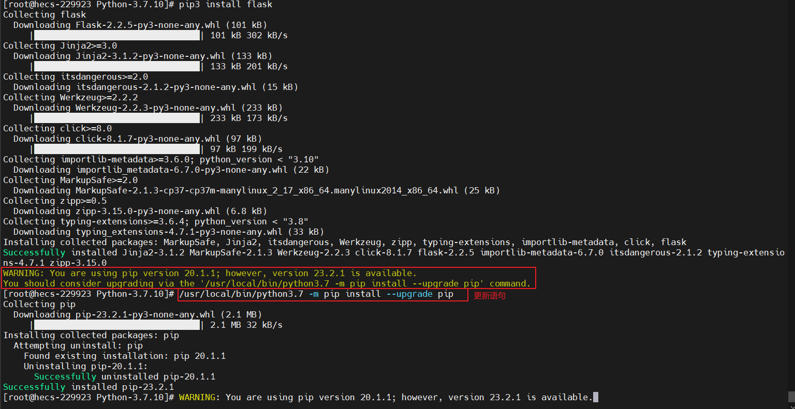

## Python安装教程-Linux

### 说明
* 安装版本：3.7.10
* CentOS：7.9

### 安装gcc编译器（有可能已经安装）
```shell
# 检查一下原来python的版本和是否有gcc
[root@loaclhost ~]# python -V
Python 2.7.5
[root@loaclhost ~]# gcc -version
-bash: gcc: 未找到命令

# 安装需要的依赖项
yum -y install gcc automake autoconf libtool make
```

### 安装环境依赖，3.7以上版本，安装依赖包:libffi-devel
```shell
yum -y install zlib-devel bzip2-devel openssl-devel ncurses-devel sqlite-devel readline-devel tk-devel gdbm-devel db4-devel libpcap-devel xz-devel
```

### 安装Python3
> [Python3 手动下载地址](https://www.python.org/downloads/)
```shell
# 安装wget
yum install wget -y

# 下载Python安装包
wget https://www.python.org/ftp/python/3.7.10/Python-3.7.10.tgz

# 解压Python安装包压缩包
tar -zxvf Python-3.7.10.tgz

# 进入解压后的目录
cd Python-3.7.10

# 在local目录下创建Python3目录
mkdir /usr/local/python3

# 配置安装目录
./configure --prefix=/usr/local/python3
# 指定openssl版本，需要先下载openssl编译后才能这个指定
# ./configure --prefix=/usr/local/python3 --with-openssl=/usr/local/openssl1.1.1 --with-openssl-rpath=auto
# --with-openssl=/usr/local/openssl1.1.1是openssl的安装位置
## 如果执行完成后有提示信息，入下图1；那么执行提示内容即可（python稳定优化提示）
./configure --enable-optimizations
## 完成日志如图2

# 编译源码
make

# 执行源码安装
make install
## 完成日志如图3

# 创建软连接
ln -s /usr/local/python3/bin/python3.7 /usr/bin/python3
ln -s /usr/local/python3/bin/pip3.7 /usr/bin/pip3

# 测试：输入python3打印
Python 3.7.10 (default, Mar 16 2022, 11:54:28) 
[GCC 4.8.5 20150623 (Red Hat 4.8.5-44)] on linux
Type "help", "copyright", "credits" or "license" for more information.
>>>

# 测试：输入pip3 --version打印
pip 20.1.1 from /usr/local/lib/python3.7/site-packages/pip (python 3.7)

# 安装测试
pip3 install pykmip
## 完成日志如图4

# 如果出现WARNING: You are using pip version 20.1.1; however, version 23.2.1 is available.直接进行更新如图5
/usr/local/bin/python3.7 -m pip install --upgrade pip 
```
#### 图1

#### 图2

#### 图3

#### 图4

#### 图5


### 问题
#### 报错:ModuleNotFoundError: No module named 'skbuild'
```shell
# 报错：用命令`pip3 install opencv-python`复现
Complete output from command python setup.py egg_info:
    Traceback (most recent call last):
      File "<string>", line 1, in <module>
      File "/tmp/pip-build-nmud90jq/opencv-python/setup.py", line 9, in <module>
        import skbuild
    ModuleNotFoundError: No module named 'skbuild'
    
    ----------------------------------------
Command "python setup.py egg_info" failed with error code 1 in /tmp/pip-build-nmud90jq/opencv-python/
```
#### 解决办法-linux
* python3.x: 命令行输入`pip3 install --upgrade pip`
* python2: 命令行输入`pip install --upgrade pip`

#### 出现信息
> pip 20.2.3 from /usr/local/lib/python3.6/dist-packages/pip (python 3.6)


#### 解决办法-windows
* pip install opencv-python -i https://pypi.tuna.tsinghua.edu.cn/simple，使用清华镜像池