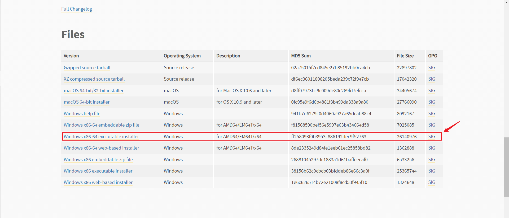
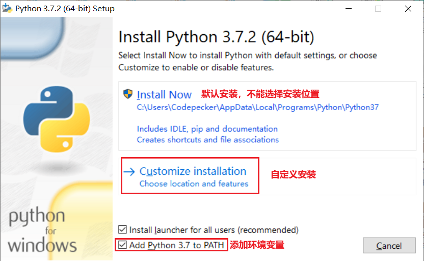
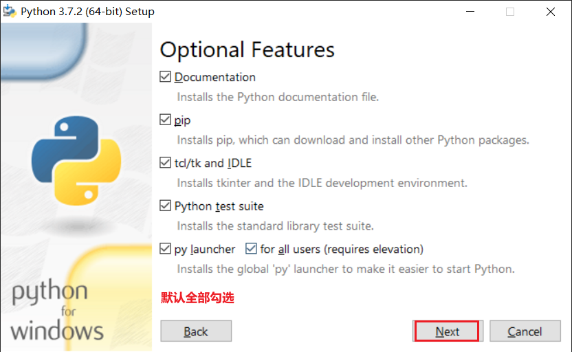
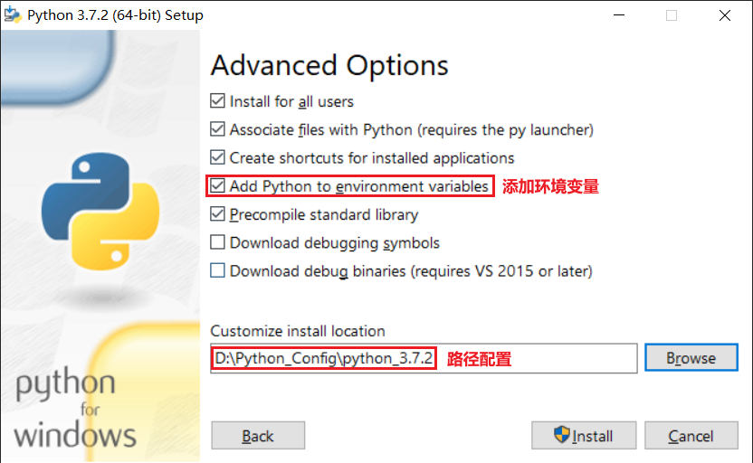
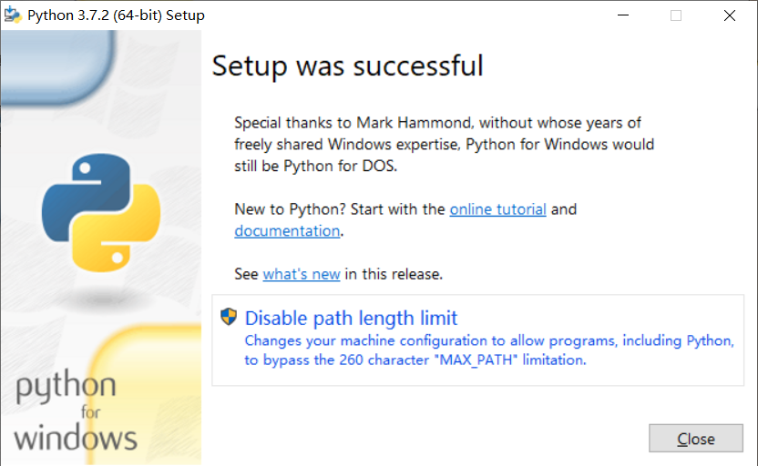
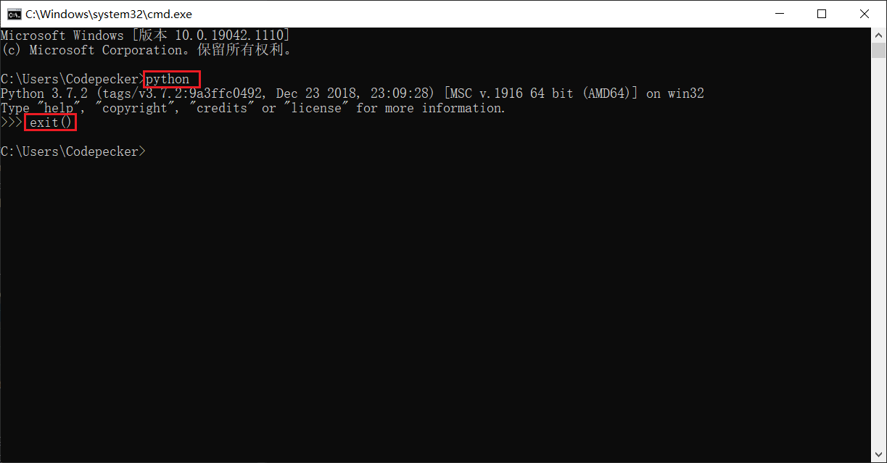

## Python安装教程-Windows

### 说明
* 安装版本：3.7.2

### 官网下载安装包
[官网地址](https://www.python.org/downloads/release/python-372/)  
[其他版本](https://www.python.org/downloads/)  

### 自定义安装

### 安装配置
 

### 安装完成

### 安装安成验证
 
**注意**：exit()是退出python编译器

### 多版本的情况下可以在dos窗口中使用 python大版本号 来进入指定的python中

