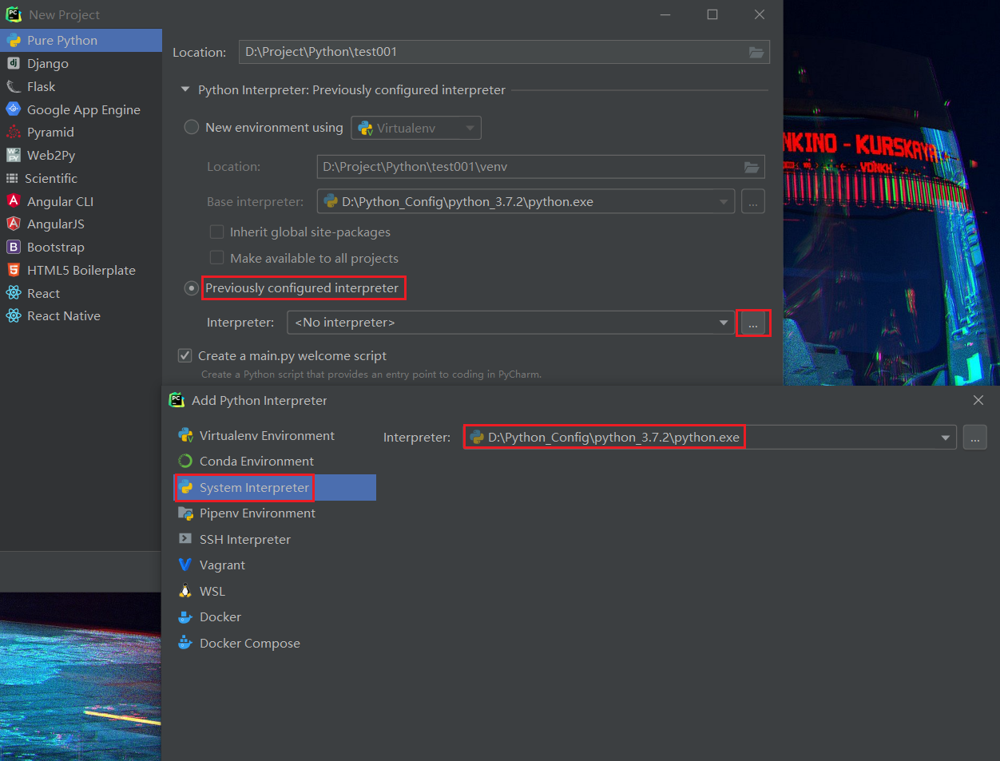
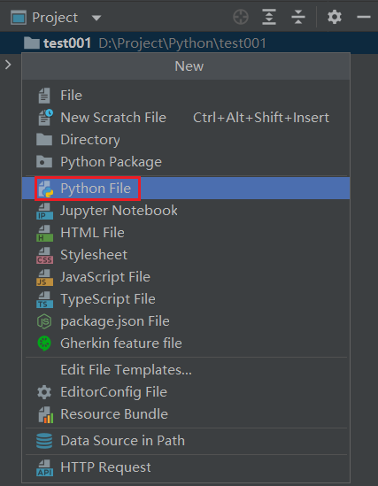
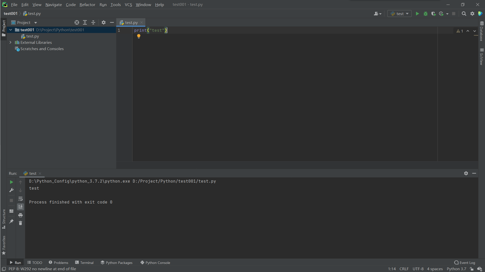
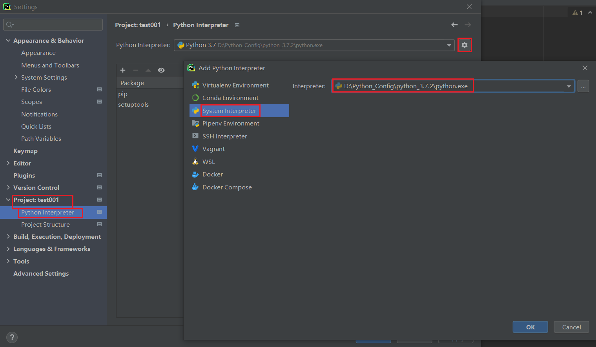

## PyCharm创建项目：使用PyCharm

### 新建项目
#### 选择自己的python解释器
* 打开PyCharm -- [Create New Project] -- 选择项目根目录和解释器版本 -- [Create]，即可完成新建一个项目<br>


#### 新建文件并书写代码[文件名不能是中文]
* 项目根目录或根目录内部任意位置 — 右键 -- [New] -- [Python File] -- 输入文件名 -- [OK]<br>

* 双击打开文件，并书写一个最简单的Python代码：
```python
print("hello world")
```

#### 3.3 运行文件
* 文件打开状态 -- 空白位置 — 右键 -- Run -- 即可调出Pycharm的控制台输出程序结果<br>


### 修改解释器
* [Project: 项目名称] -- [Project Interpreter] -- [设置图标] -- [Add] -- 浏览到目标解释器 -- [OK] -- [OK]<br>

