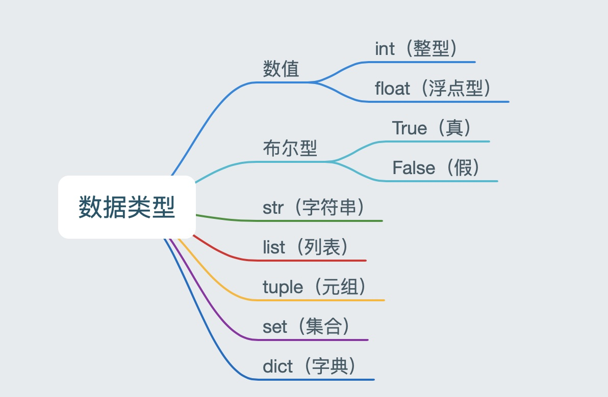

## 变量

### 定义变量
> 变量名自定义，要满足==标识符==命名规则。
```python
变量名 = 值
```

### 标识符
> 标识符命名规则是Python中定义各种名字的时候的统一规范，具体如下：
* 由数字、字母、下划线组成
* 不能数字开头
* 不能使用内置关键字
* 严格区分大小写
```html
False     None    True   and      as       assert   break     class  
continue  def     del    elif     else     except   finally   for
from      global  if     import   in       is       lambda    nonlocal
not       or      pass   raise    return   try      while     with  
yield
```

### 命名习惯
* 见名知义。
* 大驼峰：即每个单词首字母都大写，例如：`MyName`
* 小驼峰：第二个（含）以后的单词首字母大写，例如：`myName`
* 下划线：例如：`my_name`


## 数据类型


### 获取变量数据类型的方法
```python
type(变量名称)
```

```python
"""
1.  按经验将不同的变量存储不同的类型的数据

2. 验证这些数据到底是什么类型 -- 检测数据类型 -- type(数据)
"""

# int -- 整型
num1 = 1
print(type(num1))

# float -- 浮点型，就是小数
num2 = 1.1
print(type(num2))

# str -- 字符串，特点：数据都要带引号
a = 'hello world'
print(type(a))

# bool -- 布尔型，通常判断使用，布尔型有两个取值 True 和 False
b = True
print(type(b))


# list -- 列表
c = [10, 20, 30]
print(type(c))

# tuple -- 元组
d = (10, 20, 30)
print(type(d))

# set -- 集合
e = {10, 20, 30}
print(type(e))


# dict -- 字典 -- 键值对
f = {'name': 'TOM', 'age': 18}
print(type(f))
```