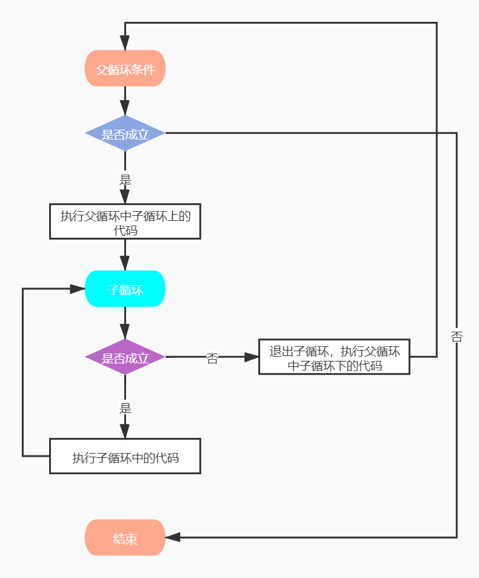

## 循环语句
> 在Python中，循环分为`while`和`for`两种，最终实现效果相同

### while语法
```python
while 条件:
    条件成立重复执行的代码1
    条件成立重复执行的代码2
    ......
```

#### 例子
```python
num = 0

while num < 10:
    print("执行成立语句：%s" % num)
    num += 1
```

#### break和continue
> break和continue是循环中满足一定条件退出循环的两种不同方式

##### break语法
> 结束循环，执行循环后面的语句
```python
num = 0

while num < 10:
    print("执行成立语句：%s" % num)
    if num == 5:
        break
    num += 1
    
# 结果：
执行成立语句：0
执行成立语句：1
执行成立语句：2
执行成立语句：3
执行成立语句：4
执行成立语句：5
```

##### continue语法
> 结束当前循环，继续下一次的循环

**注意：** 在continue之前一定要修改计数器，否则会陷入死循环
```python
num = 0

while num < 10:
    if num == 5:
        # 在continue之前一定要修改计数器，否则会陷入死循环
        num += 1
        continue
    print("执行成立语句：%s" % num)
    num += 1

# 结果：
执行成立语句：0
执行成立语句：1
执行成立语句：2
执行成立语句：3
执行成立语句：4
执行成立语句：6
执行成立语句：7
执行成立语句：8
执行成立语句：9
```

#### while循环嵌套语法
```python
while 条件1:
    条件1成立执行的代码
    ......
    while 条件2:
        条件2成立执行的代码
        ......
```

##### 例子
```python
num = 0

while num < 10:
    while num < 5:
        print("输出数字小于5：%s" % num)
        num += 1
    print("每次都打印：%s" % num)
    num += 1
    
# 结果：
输出数字小于5：0
输出数字小于5：1
输出数字小于5：2
输出数字小于5：3
输出数字小于5：4
每次都打印：5
每次都打印：6
每次都打印：7
每次都打印：8
每次都打印：9
```


### for循环语法
```python
for 临时变量 in 序列:
    重复执行的代码1
    重复执行的代码2
    ......
```

#### 例子
```python
info = "zhangxiaoyu"

for i in info:
    print(i)
```

#### break和continue
> break和continue是循环中满足一定条件退出循环的两种不同方式

##### break语法
> 结束循环，执行循环后面的语句
```python
info = "gudao"

for i in info:
    if i == "a":
        break
    print(i)
    
# 结果：
g
u
d
```

##### continue语法
> 结束当前循环，继续下一次的循环

**注意：** 在continue之前一定要修改计数器，否则会陷入死循环
```python
info = "gudao"

for i in info:
    if i == "a":
        continue
    print(i)

# 结果：
g
u
d
o
```

#### for嵌套循环语法
```python
```python
for 临时变量 in 序列:
    重复执行的代码1
    ......
    for 临时变量 in 序列:
        重复执行的代码2
        ......
```

##### 例子
```
```python
info = "gudao"

for i in info:
    for b in "ao":
        print("嵌套执行：%s" % b)
else:
    print("for循环结束后执行")
    
# 结果：
嵌套执行：a
嵌套执行：o
嵌套执行：a
嵌套执行：o
嵌套执行：a
嵌套执行：o
嵌套执行：a
嵌套执行：o
嵌套执行：a
嵌套执行：o
for循环结束后执行
```

### else
> 循环可以和else配合使用，else下方缩进的代码指的是**当循环正常结束之后要执行的代码**

#### while...else...语法
```python
while 条件:
    条件成立重复执行的代码
else:
    循环正常结束之后要执行的代码
```

##### 例子
```python
num = 0

while num < 10:
    print("打印小于10的数字：%s" % num)
    num += 1
else:
    print("while循环结束后执行")
    
# 结果：
打印小于10的数字：0
打印小于10的数字：1
打印小于10的数字：2
打印小于10的数字：3
打印小于10的数字：4
打印小于10的数字：5
打印小于10的数字：6
打印小于10的数字：7
打印小于10的数字：8
打印小于10的数字：9
while循环结束后执行
```

##### break在其中后执行效果
> 所谓else指的是循环正常结束之后要执行的代码，即如果是break终止循环的情况，else下方缩进的代码将不执行
```python
num = 0

while num < 10:
    if num == 3:
        break
    print("打印小于10的数字：%s" % num)
    num += 1
else:
    print("while循环结束后执行")
    
# 结果：
打印小于10的数字：0
打印小于10的数字：1
打印小于10的数字：2
```

##### continue在其中后执行效果
> continue是退出当前一次循环，继续下一次循环，所以该循环在continue控制下是可以正常结束的，当循环结束后，则执行了else缩进的代码
```python
num = 0

while num < 10:
    if num == 3:
        num += 1
        continue
    print("打印小于10的数字：%s" % num)
    num += 1
else:
    print("while循环结束后执行")
    
# 结果：
打印小于10的数字：0
打印小于10的数字：1
打印小于10的数字：2
打印小于10的数字：4
打印小于10的数字：5
打印小于10的数字：6
打印小于10的数字：7
打印小于10的数字：8
打印小于10的数字：9
while循环结束后执行
```

#### for...else语法
```python
for 临时变量 in 序列:
    重复执行的代码
    ...
else:
    循环正常结束之后要执行的代码
```

##### 例子
```python
info = "gudao"

for i in info:
    print(i)
else:
    print("for循环结束后执行")

# 结果：
g
u
d
a
o
for循环结束后执行
```

##### break在其中后执行效果
> 所谓else指的是循环正常结束之后要执行的代码，即如果是break终止循环的情况，else下方缩进的代码将不执行
```python
info = "gudao"

for i in info:
    if i == "a":
        break
    print(i)
else:
    print("for循环结束后执行")
    
# 结果：
g
u
d
```

##### continue在其中后执行效果
> continue是退出当前一次循环，继续下一次循环，所以该循环在continue控制下是可以正常结束的，当循环结束后，则执行了else缩进的代码  
```python
info = "gudao"

for i in info:
    if i == "a":
        continue
    print(i)
else:
    print("for循环结束后执行")
    
# 结果：
g
u
d
o
for循环结束后执行
```