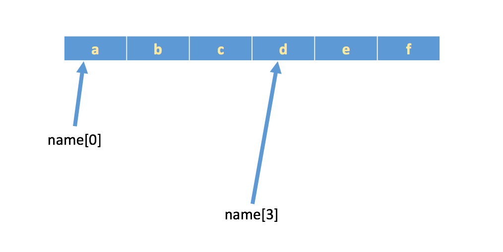

## 列表
> 格式：[数据1, 数据2, 数据3, 数据4......]
> 列表可以一次性存储多个数据，且可以为不同数据类型

### 列表下标
> `“下标”`又叫`“索引”`，就是编号。比如火车座位号，座位号的作用：按照编号快速找到对应的座位。同理，下标的作用即是通过下标快速找到对应的数据
* 下标从==0==开始<br>
  
```python
tList = ["info", "value", "key", "just", "back"]

print(tList[1])# value
print(tList[3])# just 
```

### 列表常用方法 

------------------------------------

<details>
<summary>index()</summary>

> 返回指定数据所在位置的下标
* 语法：`列表序列.index(数据, 开始位置下标, 结束位置下标)`
  * 例子
    ```python
    listInfo = ["info", "value", "key", "just", "back"]
    # 结果：2
    print(listInfo.index("key", 0, 4))
    ```
  * 注意：如果查找的数据不存在则报错
</details>

<details>
<summary>count()</summary>

> 统计指定数据在当前列表中出现的次数
* 语法：`列表序列.count(数据)`
    * 例子
      ```python
      listInfo = ["info", "value", "key", "just", "back", "info"]
    
      # 结果：2
      print(listInfo.count("info"))
      ```
</details>

<details>
<summary>len()</summary>

> 统计指定数据在当前列表中出现的次数
* 语法：`len(列表序列)`
    * 例子
      ```python
      listInfo = ["info", "value", "key", "just", "back", "info"]
    
      # 结果：6
      print(len(listInfo))
      ```
</details>

------------------------------------

<details>
<summary>in & not in</summary>

* in
> 判断指定数据在某个列表序列，如果在返回True，否则返回False
* 语法：`变量 in 列表序列`
    * 例子
      ```python
      listInfo = ["info", "value", "key", "just", "back", "info"]
      
      # 结果：True
      print("info" in listInfo)
      # 结果：False
      print("gudao" in listInfo)
      ```
      
* not in
> not in：判断指定数据不在某个列表序列，如果不在返回True，否则返回False
* 语法：`变量 not in 列表序列`
  * ``
    ```python
    listInfo = ["info", "value", "key", "just", "back", "info"]

    # 结果：False
    print("info" not in listInfo)
    # 结果：True
    print("gudao" not in listInfo)
    ```
</details>

------------------------------------

<details>
<summary>append()</summary>

> 列表结尾追加数据
* 语法：`列表序列.append(数据)`
    * 例子
      ```python
      listInfo = ["info", "value", "key", "just", "back"]

      # 结果：['info', 'value', 'key', 'just', 'back', 'gudao']
      listInfo.append("gudao")
      print(listInfo)
      
      # 如果append()追加的数据是一个序列，则追加整个序列到列表
      # 结果：['info', 'value', 'key', 'just', 'back', 'gudao', ['001', '002']]
      listInfo.append(["001", "002"])
      print(listInfo)
      ```
    * 注意：
      * 列表追加数据的时候，直接在原列表里面追加了指定数据，即修改了原列表，故列表为可变类型数据
      * 如果append()追加的数据是一个序列，则追加整个序列到列表
</details>

<details>
<summary>extend()</summary>

> 列表结尾追加数据，如果数据是一个序列，则将这个序列的数据逐一添加到列表
* 语法：`列表序列.extend(数据)`
    * 例子
      ```python
      # 单个数据
      listInfo = ["info", "value"]
      # 结果：['info', 'value', 'g', 'u', 'd', 'a', 'o']
      listInfo.extend("gudao")
      print(listInfo)
          
      # 序列数据
      listLib = ["001","002"]
      # 结果：['001', '002', 'gudao', 'test']
      listLib.extend(["gudao", "test"])
      print(listLib)
      ```
</details>

<details>
<summary>insert()</summary>

> 指定位置新增数据
* 语法：`列表序列.insert(位置下标, 数据)`
    * 例子
      ```python
      listInfo = ["info", "value"]

      # 结果：['gudao', 'info', 'value']
      listInfo.insert(0, "gudao")
      print(listInfo)
      ```
</details>

------------------------------------

<details>
<summary>del</summary>

> 删除指定数据
* 语法：`del 目标`
    * 例子
      ```python
      listInfo = ["info", "value"]

      # 删除指定数据
      # 结果：['value']
      del listInfo[0]
      print(listInfo)
      
      # 删除列表
      # 打印报错，listInfo列表已经被删除
      del listInfo
      print(listInfo)
      ```
</details>

<details>
<summary>pop()</summary>

> 删除指定下标的数据(默认为最后一个)，并返回该数据
* 语法：`列表序列.pop(下标)`
    * 例子
      ```python
      listInfo = ["info", "value", "gudao"]

      # 不写索引默认移除最后一个数据，会返回移除的数据
      resInfo = listInfo.pop()
      print(resInfo)# gudao
      print(listInfo)# ['info', 'value']
          
      # 移除指定索引下的值
      listInfo.pop(0)
      print(listInfo)# ['value']
      ```
</details>

<details>
<summary>remove()</summary>

> 移除列表中某个数据的第一个匹配项
* 语法：`列表序列.remove(数据)`
    * 例子
      ```python
      listInfo = ["info", "value", "gudao"]

      # 结果：['value', 'gudao']
      listInfo.remove("info")
      print(listInfo)
      
      # 移除列表中不存在的数据报错
      listInfo.remove("a")
      ```
    * 注意：移除列表中不存在的数据就报错
</details>

<details>
<summary>clear()</summary>

> 清空列表
* 语法：`列表序列.clear()`
    * 例子
      ```python
      listInfo = ["info", "value", "gudao"]

      # 结果：[]
      listInfo.clear()
      print(listInfo)
      ```
</details>

------------------------------------

 <details>
<summary>修改指定下标数据</summary>

* 语法：`列表序列[位置] = '数据'`
    * 例子
      ```python
      listInfo = ["info", "value", "gudao"]

      # 结果：['info', 'value', 'test']
      listInfo[2] = "test"
      print(listInfo)
      ```
</details>

<details>
<summary>reverse()</summary>

> 逆置
* 语法：`列表序列.reverse()`
    * 例子
      ```python
      listInfo = [1, 6, 8, 4, 5]

      # 结果：[5, 4, 8, 6, 1]
      listInfo.reverse()
      print(listInfo)
      ```
</details>

<details>
<summary>sort()</summary>

> 排序，reverse表示排序规则，**reverse = True** 降序， **reverse = False** 升序（默认），key是给字典用的
* 语法：`列表序列.sort( key=None, reverse=False)`
    * 例子
      ```python
      listInfo = [1, 6, 8, 4, 5]

      # 倒叙结果：[8, 6, 5, 4, 1]
      listInfo.sort(reverse=True)
      print(listInfo)
      ```
</details>

<details>
<summary>copy()</summary>

> 统计指定数据在当前列表中出现的次数
* 语法：`列表序列.copy()`
    * 例子
      ```python
      listInfo = [1, 6, 8, 4, 5]

      # 结果：[1, 6, 8, 4, 5]
      copyInfo = listInfo.copy()
      print(copyInfo)
      ```
</details>

### 列表的循环遍历
#### while
```python
listInfo = [1, 6, 8, 4, 5]

i = 0
while i < len(listInfo):
    print(listInfo[i])
    i += 1
```

#### for
```python
listInfo = [1, 6, 8, 4, 5]

for i in listInfo:
    print(i)
```

### 列表嵌套
> 列表嵌套指的就是一个列表里面包含了其他的子列表

```python
name_list = [['小明', '小红', '小绿'], ['Tom', 'Lily', 'Rose'], ['张三', '李四', '王五']]

# 结果：李四
print(name_list[2][1])
```
