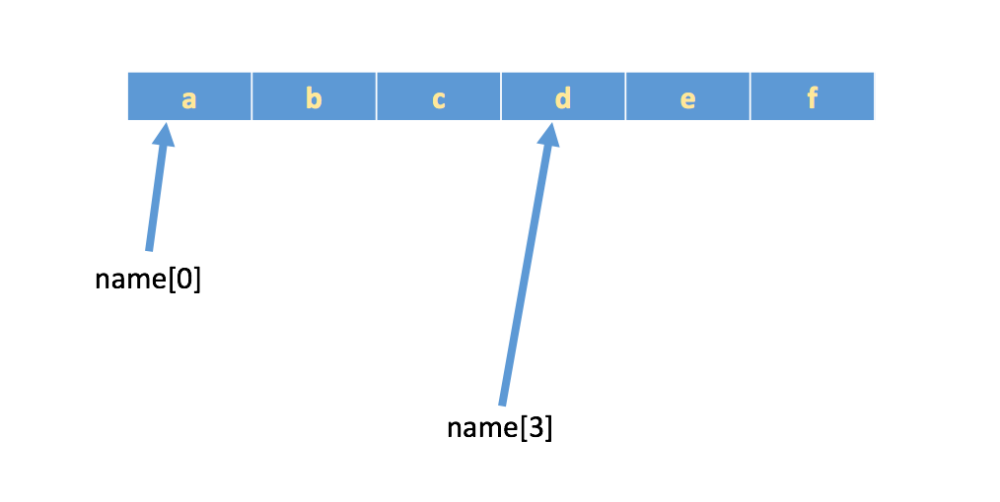

## 元组
> 格式：(数据1, 数据2, 数据3, 数据4......)
> 一个元组可以存储多个数据，元组内的数据是**不能修改的**

### 元组下标
> `“下标”`又叫`“索引”`，就是编号。比如火车座位号，座位号的作用：按照编号快速找到对应的座位。同理，下标的作用即是通过下标快速找到对应的数据
* 下标从==0==开始<br>
  
```python
tTuple = ("info", "value", "key", "just", "back")

print(tTuple[1])# value
print(tTuple[3])# just 
```

### 定义元组
* 元组特点：定义元组使用**小括号**，且**逗号**隔开各个数据，数据可以是不同的数据类型
  ```python
  # 多个数据元组
  tTuple = (1, '2', 3.0)
  
  # 当个数据元组
  tTuple = (1,)
  ```
* 如果定义的元组只有一个数据，那么这个数据后面也好添加逗号，否则数据类型为唯一的这个数据的数据类型
  ```python
  tTuple1 = (1)
  print(type(tTuple1))# <class 'int'>
  
  tTuple2 = ("gudao")
  print(type(tTuple2))# <class 'str'>
  
  tTuple3 = (1,)
  print(type(tTuple3))# <class 'tuple'>
  ```

### 元组常用方法 

------------------------------------

<details>
<summary>index()</summary>

> 返回指定数据所在位置的下标
* 语法：`元组.index(数据, 开始位置下标, 结束位置下标)`
  * 例子
    ```python
    tTuple = (1, '2', 3.0)
    
    # 结果：1
    print(tTuple.index('2', 0, 3))
    
    # 结果：1
    print(tTuple.index('2'))
    ```
  * 注意：如果查找的数据不存在则报错
</details>

<details>
<summary>count()</summary>

> 统计指定数据在当前元组中出现的次数
* 语法：`元组.count(数据)`
    * 例子
      ```python
      tTuple = (1, '2', 3.0)
    
      # 结果：1
      print(tTuple.count("2"))
      ```
</details>

<details>
<summary>len()</summary>

> 统计指定数据在当前元组中出现的次数
* 语法：`len(元组序列)`
    * 例子
      ```python
      tTuple = (1, '2', 3.0)
    
      # 结果：3
      print(len(tTuple))
      ```
</details>
    
### 注意：元组修改就报错，但如果元组里面有列表，修改列表里面的数据则是支持的
* 普通元组修改
```python
tTuple1 = (1, '2', 3.0)

# 报错
tTuple1[0] = 14
```
* 元组中有序列
```python
tTuple2 = (1, '2', 3.0, [0, 1])

# 结果(1, '2', 3.0, [0, 12])
tTuple2[3][1] = 12
print(tTuple2) 
```

### 元组的循环遍历
#### while
```python
tTuple = (1, 6, 8, 4, 5)

i = 0
while i < len(tTuple):
    print(tTuple[i])
    i += 1
```

#### for
```python
tTuple = (1, 6, 8, 4, 5)

for i in tTuple:
    print(i)
```
