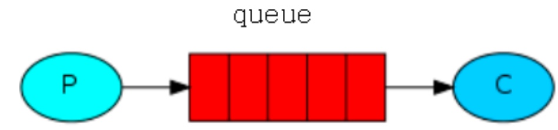
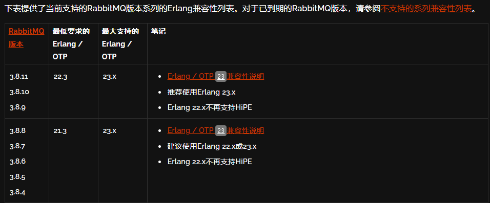

## RabbitMQ介绍及安装

### RabbitMQ
> RabbitMQ是由erlang开发的一个AMQP（Advanced Message Queuing Protocol ）基础上实现的，可复用的企业消息系统。它可以用于大型软件系统各个模块之间的高效通信，支持高并发，支持可扩展。

### 图解MQ
> 三个角色: Producer, Queue, Consumer


### MQ应用场景
* 服务解耦
    > 双11是购物狂节,用户下单后,订单系统需要通知库存系统，中间通过MQ来过渡处理
* 削峰填谷
    > 秒杀活动，一般会因为流量过大，导致应用挂掉,为了解决这个问题，一般在应用前端加入消息队列
* 异步化缓冲
    > 用户注册后，需要发注册邮件和注册短信，并行处理

### 应用思考点
* 生产端可靠投递性
* 消费端幂等性
* 高可用
* 低延迟
* 可靠性
* 扩展性
* 堆积能力

### 使用环境
> 主要面向消息，队列，路由，可靠，安全，对数据的可靠性和稳定性有很好支持，然后对性能吞吐的要求还要在其次

### 安装说明
#### 安装erlang
> RabbitMQ官网提供了新版的rpm包（http://www.rabbitmq.com/download.html），但是安装的时候会提示需要erlang版本>=19.3，然而默认yum仓库中的版本较低。（不推荐）

* [RabbitMQ在github上有提供新的erlang包](https://github.com/rabbitmq/erlang-rpm) ，可以直接加到yum源中
    * CentOS8安装配置
        ```shell
        # 在yum中添加github中指定的erlang配置源
        vim /etc/yum.repos.d/rabbitmq_erlang.repo
        # 添加如下信息
        [rabbitmq_erlang]
        name=rabbitmq_erlang
        baseurl=https://packagecloud.io/rabbitmq/erlang/el/8/$basearch
        repo_gpgcheck=1
        gpgcheck=1
        enabled=1
        # PackageCloud's repository key and RabbitMQ package signing key
        gpgkey=https://packagecloud.io/rabbitmq/erlang/gpgkey
        https://dl.bintray.com/rabbitmq/Keys/rabbitmq-release-signing-key.asc
        sslverify=1
        sslcacert=/etc/pki/tls/certs/ca-bundle.crt
        metadata_expire=300
        
        [rabbitmq_erlang-source]
        name=rabbitmq_erlang-source
        baseurl=https://packagecloud.io/rabbitmq/erlang/el/8/SRPMS
        repo_gpgcheck=1
        gpgcheck=0
        enabled=1
        # PackageCloud's repository key and RabbitMQ package signing key
        gpgkey=https://packagecloud.io/rabbitmq/erlang/gpgkey
        https://dl.bintray.com/rabbitmq/Keys/rabbitmq-release-signing-key.asc
        sslverify=1
        sslcacert=/etc/pki/tls/certs/ca-bundle.crt
        metadata_expire=300
        ```
    * 安装erlang
        ```shell
        # 命令执行后会显示安装的版本号，通过版本号去官网寻找对应得rabbitmq的版本
        yum install erlang
        ```
    * 根据官网提供的信息，找到对应的rabbitmq版本
        * [官网地址](https://www.rabbitmq.com/which-erlang.html)
        
    * 安装RabbitMQ
        * [rabbitmq安装包地址](https://dl.bintray.com/rabbitmq/all/rabbitmq-server)
        ```shell
        # 我现在的erlang是23.1的，所以下载了3.8.7的rpm的安装包
        wget https://dl.bintray.com/rabbitmq/all/rabbitmq-server/3.8.7/rabbitmq-server-3.8.7-1.el7.noarch.rpm
        # 安装rabbitmq
        yum install rabbitmq-server-3.8.7-1.el7.noarch.rpm
        ```
    

