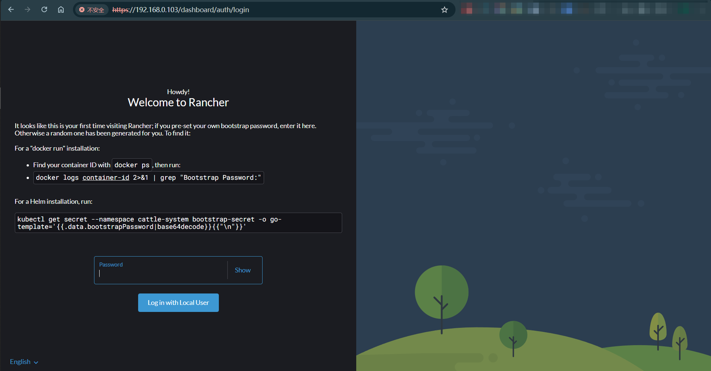
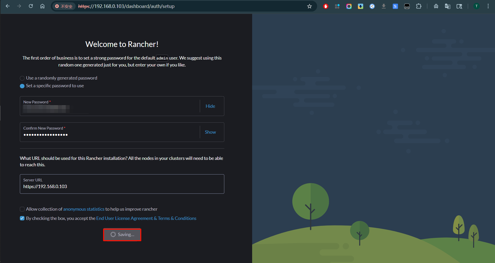

## Rancher单节点部署说明

[toc]

### 资源说明
| IP            | 配置                           | 操作系统   | Docker  |
| ------------- | ------------------------------ | ---------- | ------- |
| 192.168.0.103 | Intel x86 16C 32G内存 500G SSD | CentOS 7.9 | 20.10.8 |

### 配置 Docker 镜像加速器

```shell
vi /etc/docker/daemon.json

# 添加加速（截至2026-1-9正常）
{
  "registry-mirrors": [
    "https://registry.docker-cn.com",
    "https://mirror.ccs.tencentyun.com",
    "https://hub-mirror.c.163.com"
  ]
}

# 重启 Docker
systemctl daemon-reload
systemctl restart docker
```

### 拉取Rancher镜像

```shell
docker pull rancher/rancher:v2.8.4
```

### 放开防火墙

```shell
firewall-cmd --add-port=80/tcp --permanent
firewall-cmd --add-port=443/tcp --permanent
firewall-cmd --reload
```

### 防止Rancher容器内镜像无法拉取，配置容器内的containerd加速

> Rancher 2.8.4内部使用的是k3s，容器管理工具containerd；下载dokcer.io下的镜像就需要通过加速节点才能访问

```shell
# 宿主机创建加速配置
mkdir -p /opt/k3s
vi /opt/k3s/registries.yaml

mirrors:
  docker.io:
    endpoint:
      - https://docker.m.daocloud.io
      - https://hub-mirror.c.163.com
```

### 启动容器

```shell
docker run -d --restart=unless-stopped --name rancher -v /opt/k3s/registries.yaml:/etc/rancher/k3s/registries.yaml -p 80:80  -p 443:443 --privileged rancher/rancher:v2.8.4
```

### 访问地址

```shell
# 访问地址
部署节点IP：https://192.168.0.103

# 密码获取
docker logs  rancher容器名称  2>&1 | grep "Bootstrap Password:"
```

