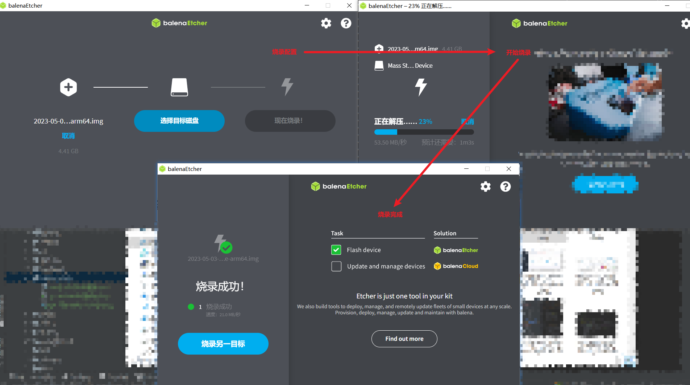
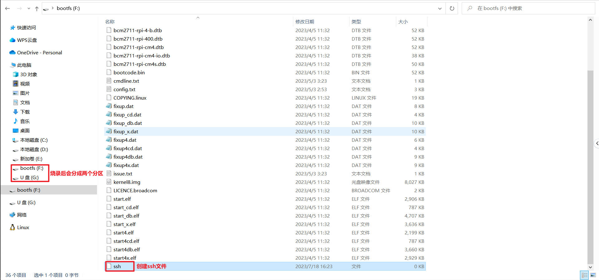

## 树莓派安装

### 安装环境
* 树莓派硬件：树莓派4B
* 树莓派系统：raspios_arm64-2023-05-03 [树莓派操作系统（64位）带桌面的 Raspberry Pi 操作系统](https://downloads.raspberrypi.org/raspios_arm64/images/raspios_arm64-2023-05-03/2023-05-03-raspios-bullseye-arm64.img.xz)
  * [版本仓库地址](https://downloads.raspberrypi.org/raspios_arm64/images/)
  * [界面下载地址](https://www.raspberrypi.com/software/operating-systems/)
* 刻录工具：[balenaEtcher](https://etcher.balena.io/#download-etcher)
* 树莓派盒子：此项可以不予理会，如果使用相同盒子，可以控制风扇（我直接买的是Argon One V2）

#### 烧录
> 找到下载的树莓派系统 -> 选择烧录的U盘 -> 等待烧录完成



#### 创建ssh文件
> raspbian系统默认ssh为关闭状态，最简单的开启方法是在内存卡根目录下建个名为ssh的文件，放入树莓派重启就会自启ssh服务了;
> 如果不用此方法，也可以通过`raspi-config`开启ssh



#### Argon One V2控制风扇
##### 打开终端输入
```shell
curl https://download.argon40.com/argon1.sh | bash
```
