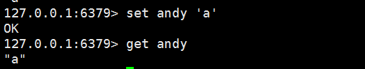
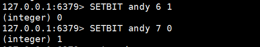
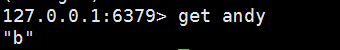
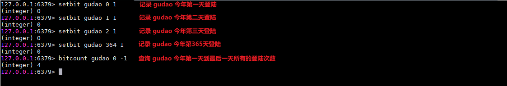

## Redis中的Bit

#### 这个是SETBIT使用方法的简单说明
`SETBIT key offset value` : 设置或清除该位在存储在键的字符串值偏移
>设置或清除该位在存储在键的字符串值偏移

#### 例子
* 设置一个　key-value  ，键的名字叫“andy” 值为字符'a'

* 'a' 的ASCII码是97，转换为二进制是：01100001。
* offset的学名叫做“偏移” ，二进制中的每一位就是offset值啦。
* 比如在这里  offset 0 等于 ‘0’ ，offset 1等于'1' ,offset2等于'1',offset 6 等于'0' 。
* offset是从左往右计数的，也就是从高位往低位。

#### 通过setBig将'a'设置为'b'

* 每次SETBIT完毕之后，有一个（integer） 0或者（integer）1的返回值，这个是在你进行SETBIT 之前，该offset位的比特值。

#### 再次获取“andy”的值

* 此时发现原先的值'a' 通过setBit修改后变成了值 'b'

### bitcount案例
> 使用bit来进行用户登录统计，每个用户一年的数据就只有46字节
```shell
# 用户哪一天登陆就在那一天代表的bit索引下（天数-1=bit代表的索引位）设置为1
127.0.0.1:6379> setbit gudao 0 1
(integer) 0
127.0.0.1:6379> setbit gudao 1 1
(integer) 0
127.0.0.1:6379> setbit gudao 2 1
(integer) 0
127.0.0.1:6379> setbit gudao 364 1
(integer) 0
127.0.0.1:6379> bitcount gudao 0 -1
(integer) 4
```


### bitop案例
