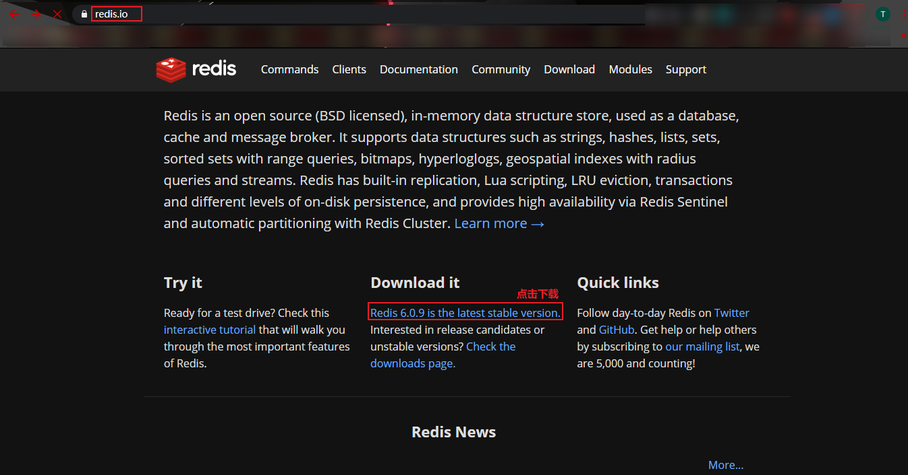
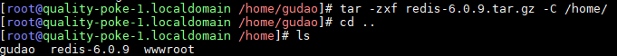
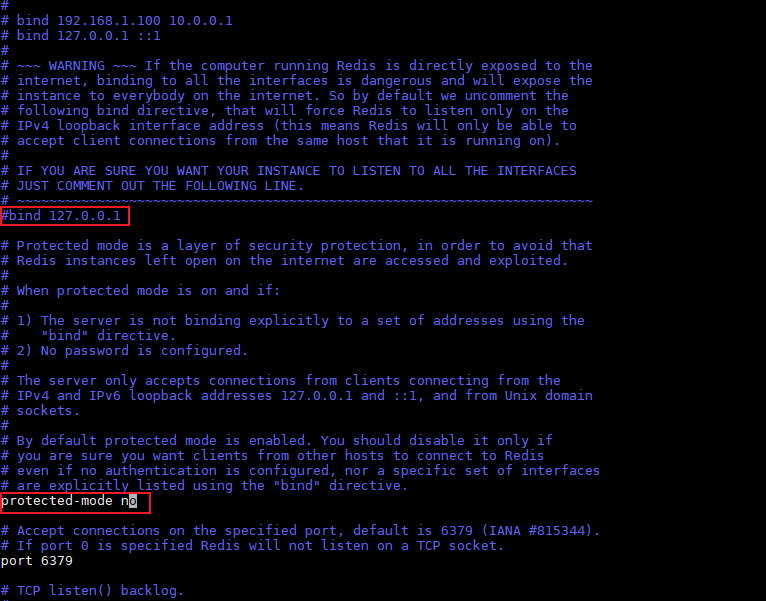
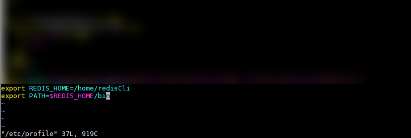
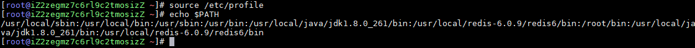
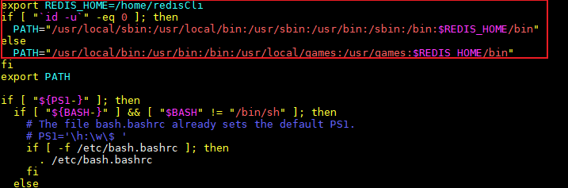
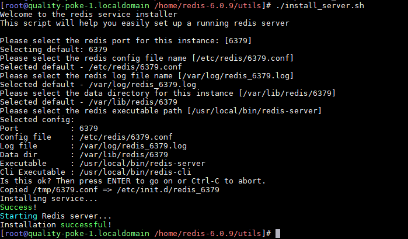
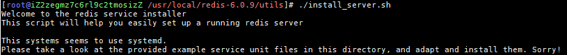
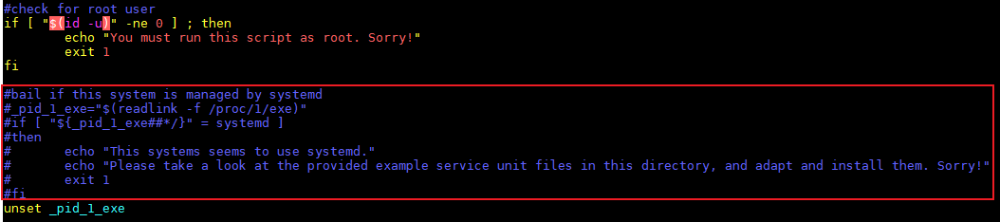

## Redis安装与说明

#### 安装步骤
1. 安装Linux中的安装软件插件
    ```shell
    yum install wget
    ```
2. 官网下载redis安装包
    ```shell
    wget https://download.redis.io/releases/redis-6.0.9.tar.gz
    ```
    
3. 解压文件到指定文件夹中
    ```shell
    tar zxf redis-6.0.9.tar.gz -C /指定路径
    ```
    
4. 安装编译语言C
    ```shell
    yum install gcc
    ```
5. 进入解压好的文件中，进行编译【阅读README.md文件】
    ```shell
    # 直接编译
    make
    
    # 将启动内容存放到/usr/local/bin下面【可以不做，但要做步骤8的时候，这部一定要做】
    make install
    # 将启动内容存放到指定路径下【此时的bin就会存放到 指定的路径中】
    make PREFIX=/指定的路径 install
    
    # 编译失败，必须将先前编译的内容清除，然后再编译
    make distclean
    ```
6. 修改config配置【重要，不配置其它服务器连接不到当前服务器的redis】
    ```shell
    # 进入redis解压文件夹
   
    # 修改配置
    daemonize yes  #后台启动
    protected-mode no  #关闭保护模式，开启的话，只有本机才可以访问redis
    
    # 需要注释掉bind
    #bind 127.0.0.1（bind绑定的是自己机器网卡的ip，如果有多块网卡可以配多个ip，代表允许客户端通过机器的哪些网卡ip去访问，内网一般可以不配置bind，注释掉即可）
    ```
    
7. 启动
    ```shell
    # 进入redis解压后的包中
    
    # 方法一：启动redis【& 表示后台启动】
    src/redis-server & 
    
    # 方法二：通过配置文件启动
    src/redis-server redis.conf &
    
    # 启动客户端
    src/redis-cli
    ```
8. 环境变量配置【以下想做就做，不想做就不做；最好做下】
    ```shell
    # 进入环境变量配置的文件
    vim /ect/profile
    
    # 添加READ_HOME配置项
    export REDIS_HOME=/步骤5中make install 
    # 此处不加 $PATH: 就会出现下面的问题
    exprot PATH=$PATH:${REDIS_HOME}/bin
    
    # 保存后重新加在配置
    source /ect/profile
    # 查看配置
    echo $PATH
    ```
    
    
    
    * 【看系统，有的系统需要这么修改，ContOS则不需要】如果配置中有其它的PATH配置，直接将自己的配置加在后面也行【不然其它的配置可能会不执行】
    
9. 安装server端【此时不安装server，redis也能使用，安装能方便许多】
    ```shell
    # 进入redis解压后的包中，关闭正在运行的redis
    
    # 安装server
    utils/install_server
    ```
    
    * 安装redis6的时候出现问题解决方法
        
    * 解决方案：注释掉redis-stable/utils/instal_server.sh文件中的以下几行
        ```shell
        #bail if this system is managed by systemd
        #_pid_1_exe="$(readlink -f /proc/1/exe)"
        #if [ "${_pid_1_exe##*/}" = systemd ]
        #then
        #       echo "This systems seems to use systemd."
        #       echo "Please take a look at the provided example service unit files in this directory, and adapt and install them. Sorry!"
        #       exit 1
        #fi
        ```
        
10. 退出客户端
    1. quit
11. 退出redis服务： 
    1. pkill redis-server 
    2. kill 进程号                       
    3. src/redis-cli shutdown
    
    