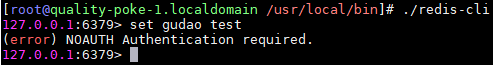

## Redis密码设置
[toc]

### 通过配置文件进行配置
1. yum方式安装的redis配置文件通常在/etc/redis.conf中，打开配置文件找到
```shell
#requirepass foobared
```
2. 去掉行前的注释，并修改密码为所需的密码,保存文件
```shell
requirepass myRedis 
```
3. 重启redis
```shell
# 方法一
sudo service redis restart

# 方法二
sudo service redis stop  
sudo redis-server /etc/redis.conf  
```
4. 这个时候尝试登录redis，发现可以登上，但是执行具体命令是提示操作不允许

5. 尝试用密码登录并执行具体的命令看到可以成功执行
```shell
redis-cli -h 127.0.0.1 -p 6379 -a myRedis  
redis 127.0.0.1:6379> keys *  
1) "myset"  
2) "mysortset"  
redis 127.0.0.1:6379> select 1  
OK  
redis 127.0.0.1:6379[1]> config get requirepass  
1) "requirepass"  
2) "myRedis"  
```

### 通过命令行进行设置
1. 设置密码
```shell
# 设置临时密码
redis 127.0.0.1:6379[1]> config set requirepass my_redis  
OK  

# 获取当前能使用的密码
redis 127.0.0.1:6379[1]> config get requirepass  
1) "requirepass"  
2) "my_redis"  
```
2. 无需重启redis使用第一步中配置文件中配置的老密码登录redis，会发现原来的密码已不可用，操作被拒绝
```shell
# 没有重启，使用配置文件密码，无法使用命令
redis-cli -h 127.0.0.1 -p 6379 -a myRedis 

redis 127.0.0.1:6379> config get requirepass  
(error) ERR operation not permitted 
```
3. 使用修改后的密码登录redis，可以执行相应操作
```shell
redis-cli -h 127.0.0.1 -p 6379 -a my_redis  

redis 127.0.0.1:6379> config get requirepass  
1) "requirepass"  
2) "my_redis 
```
4. 尝试重启一下redis，用新配置的密码登录redis执行操作，发现新的密码失效，redis重新使用了配置文件中的密码
```shell
# 重启后使用临时密码登录，不能使用命令
redis-cli -h 127.0.0.1 -p 6379 -a my_redis  
redis 127.0.0.1:6379> config get requirepass  
(error) ERR operation not permitted

# 重启后时候配置文件密码，可以使用命令
redis-cli -h 127.0.0.1 -p 6379 -a myRedis  
redis 127.0.0.1:6379> config get requirepass  
1) "requirepass"  
2) "myRedis"  
```
5. 除了在登录时通过 -a 参数制定密码外，还可以登录时不指定密码，而在执行操作前进行认证。
```shell
redis-cli -h 127.0.0.1 -p 6379  
redis 127.0.0.1:6379> config get requirepass  
(error) ERR operation not permitted

# 通过auth登录认证  
redis 127.0.0.1:6379> auth myRedis  
OK  

# 获取密码
redis 127.0.0.1:6379> config get requirepass  
1) "requirepass"  
2) "myRedis"  
```
6. master配置了密码，slave如何配置
    * 若master配置了密码则slave也要配置相应的密码参数否则无法进行正常复制的。slave中配置文件内找到如下行，移除注释，修改密码即可
        ```shell
        #masterauth  mstpassword 
        ```
    

