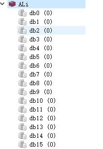
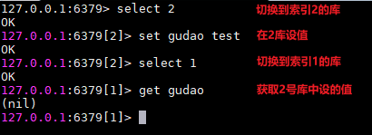
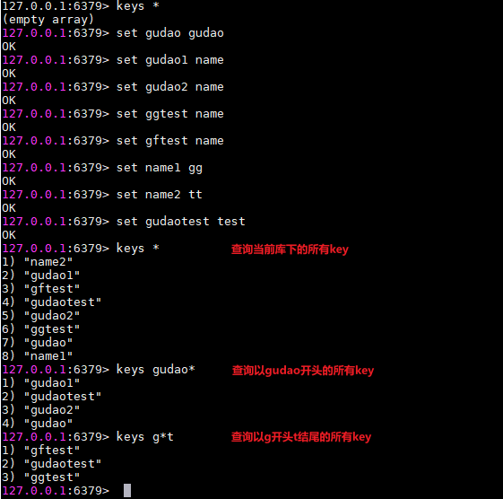

## Redis中的高级命令说明

### 提前说明
* 每个redis都会为自己分配16个库，每个数据库的数据是不共享的<br>


### select index
```shell
127.0.0.1:6379> select 1
OK
```


### keys *
> 全量遍历键，用来列出所有满足特定正则字符串规则的key，当redis数据量比较大时，性能比较差，要避免使用
```shell
127.0.0.1:6379> keys *
(empty array)
127.0.0.1:6379> set gudao gudao
OK
127.0.0.1:6379> set gudao1 name
OK
127.0.0.1:6379> set gudao2 name
OK
127.0.0.1:6379> set ggtest name
OK
127.0.0.1:6379> set gftest name
OK
127.0.0.1:6379> set name1 gg
OK
127.0.0.1:6379> set name2 tt
OK
127.0.0.1:6379> set gudaotest test
OK
127.0.0.1:6379> keys *
1) "name2"
2) "gudao1"
3) "gftest"
4) "gudaotest"
5) "gudao2"
6) "ggtest"
7) "gudao"
8) "name1"
127.0.0.1:6379> keys gudao*
1) "gudao1"
2) "gudaotest"
3) "gudao2"
4) "gudao"
127.0.0.1:6379> keys g*t
1) "gftest"
2) "gudaotest"
3) "ggtest"
```


### BIT系列【案例请看【JS】redis中的Bit系列方法初步认识.md】
#### bitcount
`BITCOUNT key [start] [end]`
> 计算给定字符串中，被设置为 1 的比特位的数量。
* 一般情况下，给定的整个字符串都会被进行计数，通过指定额外的 start 或 end 参数，可以让计数只在特定的位上进行。
* start 和 end 参数的设置和 GETRANGE 命令类似，都可以使用负数值：比如 -1 表示最后一个位，而 -2 表示倒数第二个位，以此类推。
* 不存在的 key 被当成是空字符串来处理，因此对一个不存在的 key 进行 BITCOUNT 操作，结果为 0 

#### setbit
`SETBIT key offset value`
> 对 key 所储存的字符串值，设置或清除指定偏移量上的位(bit)。
* 位的设置或清除取决于 value 参数，可以是 0 也可以是 1 。
* 当 key 不存在时，自动生成一个新的字符串值。
* 字符串会进行伸展(grown)以确保它可以将 value 保存在指定的偏移量上。当字符串值进行伸展时，空白位置以 0 填充。
* offset 参数必须大于或等于 0 ，小于 2^32 (bit 映射被限制在 512 MB 之内)。

#### getbit
`GETBIT key offset`
> 对 key 所储存的字符串值，获取指定偏移量上的位(bit)。
* 当 offset 比字符串值的长度大，或者 key 不存在时，返回 0 。

#### bitop
`BITOP operation destkey key [key ...]`
> 对一个或多个保存二进制位的字符串 key 进行位元操作，并将结果保存到 destkey 上。
* operation 可以是 AND 、 OR 、 NOT 、 XOR 这四种操作中的任意一种：
    * BITOP AND destkey key [key ...] ，对一个或多个 key 求逻辑并，并将结果保存到 destkey 。
    * BITOP OR destkey key [key ...] ，对一个或多个 key 求逻辑或，并将结果保存到 destkey 。
    * BITOP XOR destkey key [key ...] ，对一个或多个 key 求逻辑异或，并将结果保存到 destkey 。
    * BITOP NOT destkey key ，对给定 key 求逻辑非，并将结果保存到 destkey 。
* 除了 NOT 操作之外，其他操作都可以接受一个或多个 key 作为输入。
* 处理不同长度的字符串
* 当 BITOP 处理不同长度的字符串时，较短的那个字符串所缺少的部分会被看作 0 。
* 空的 key 也被看作是包含 0 的字符串序列。

### scan：渐进式遍历键
`SCAN cursor [MATCH pattern] [COUNT count]`
> scan 参数提供了三个参数，第一个是 cursor 整数值(hash桶的索引值)，第二个是 key 的正则模式，第三个是一次遍历的key的数量(参考值，底层遍历的数量不一定)，并不是符合条件的结果数量。第一次遍历时，cursor 值为 0，然后将返回结果中第一个整数值作为下一次遍历的 cursor。一直遍历到返回的 cursor 值为 0 时结束。

> 注意：但是scan并非完美无瑕， 如果在scan的过程中如果有键的变化（增加、 删除、 修改） ，那么遍历效果可能会碰到如下问题： 新增的键可能没有遍历到， 遍历出了重复的键等情况， 也就是说scan并不能保证完整的遍历出来所有的键， 这些是我们在开发时需要考虑的。
