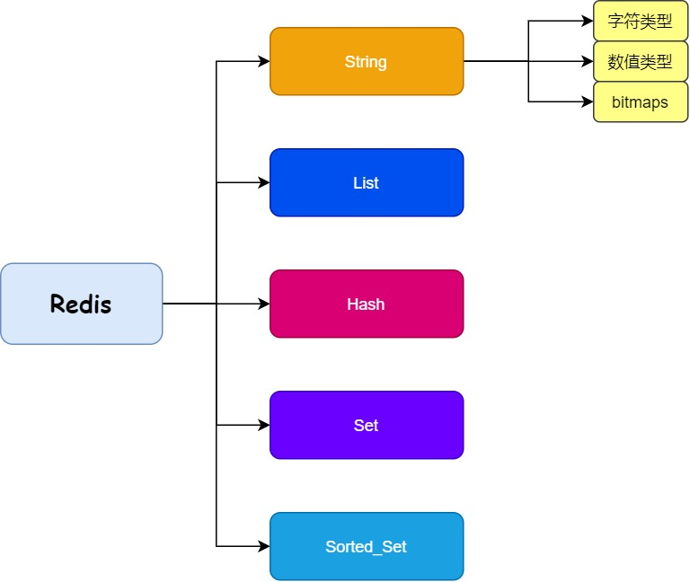

## Redis数据类型

### Redis数据类型

#### 五种数据类型
* 字符串（String）
* 哈希（hash）
* 字符串列表（list）
* 字符串集合（set）
* 有序字符串集合（sorted set）

| 数据类型  | 可以存储的值                                             | 操作                                                                           | 应用场景                                 |
| --------- | -------------------------------------------------------- | ------------------------------------------------------------------------------ | --------------------------------------- |
| STRING    | 字符串、整数或者浮点数                                   | 对整个字符串或者字符串的其中一部分执行操作；对整数和浮点数执行自增或者自减操作 | 做简单的键值对缓存 |
| LIST      | 列表                                                     | 从两端压入或者弹出元素；对单个或者多个元素进行修剪，只保留一个范围内的元素     | 存储一些列表型的数据结构，类似粉丝列表、文章的评论列表之类的数据 |
| SET       | 无序集合                                                 | 添加、获取、移除单个元素；检查一个元素是否存在于集合中；计算交集、并集、差集   | 从集合里面随机获取元素交集、并集、差集的操作，比如交集，可以把两个人的粉丝列表整一个交集 |
| HASH      | 包含键值对的无序散列表                                   | 添加、获取、移除单个键值对；获取所有键值对；检查某个键是否存在                 | 结构化的数据，比如一个对象 |
| ZSET      | 有序集合                                                 | 添加、获取、删除元素；根据分值范围或者成员来获取元素；计算一个键的排名         | 去重但可以排序，如获取排名前几名的用户 |

