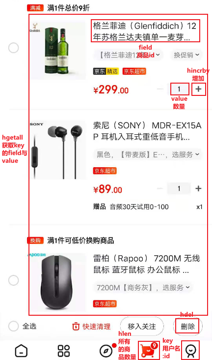

## Redis-Hash使用场景
#### 对象缓存
```shell
hmset user 001:name swordsman 001:balance 1888
hmget user 001:name 001:balance
```

#### 购物车案例
```shell
# 电商购物车
key   : 用户名:用户id
field : 商品id
value : 商品购买数量

# 购物车操作
# hset 用户名:用户id 商品id 商品购买数量
hset gudao:001 1001 1
(integer) 1

# 商品购买数量加一
hincrby gudao:001 1001 1
(integer) 2

# 用户购物车中所有商品种类数量
hlen gudao:001
(integer) 1

# 获取购物车中指定商品的
hget gudao:001 1001
"2"

# 删除指定商品商品
hdel gudao:001 1001
(integer) 1

# 获取购物车中所有的商品id与其对应的数量
hgetall gudao:001
"1001"
"2"
```


#### hash类型的优缺点
> 优点:
* 同类数据归类整合储存，方便数据管理
* 相比 string 操作消耗内存和 cpu 更小
* 相比 string 储存更节省空间
	
> 缺点:
* 过期功能不能使用在 field 上，只能用在 key 上
* redis 集群架构下不适合大规模使用