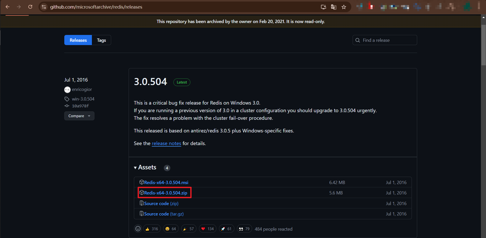
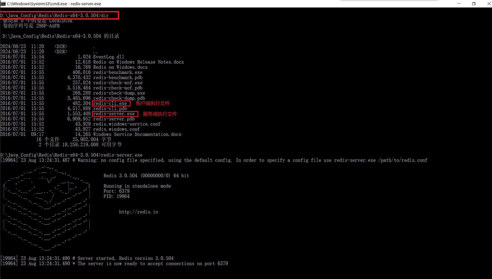
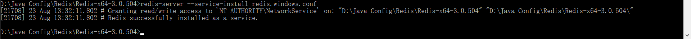
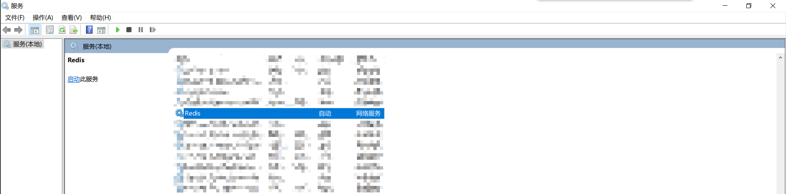
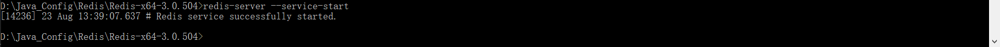
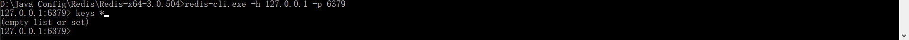
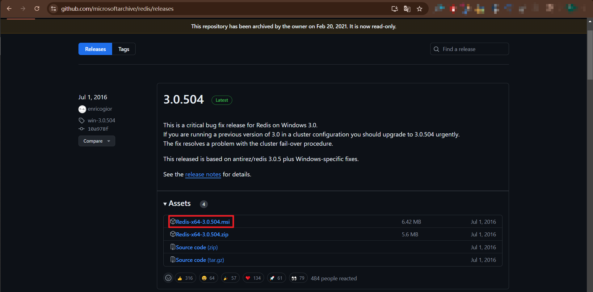
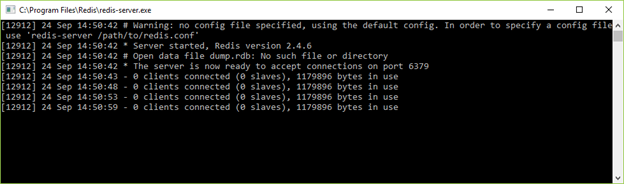

## Windows 上安装 Redis
> Redis 官方不建议在 windows 下使用 Redis，所以官网没有 windows 版本可以下载。还好微软团队维护了开源的 windows 版本，虽然只有 3.2 版本，对于普通测试使用足够了。

### 安装环境说明
* Windows 10
* Redis开源项目tag：v3.0.504

### 压缩包方式安装 redis
> 下载地址：https://github.com/MicrosoftArchive/redis/releases

#### 选择安装包版本


#### 解压安装包到相应文件夹，任何盘符都行；使用命令行启动 Redis 服务
> 运行 cmd，cd 进入对应目录（解压位置）执行

```shell
# 启动服务端命令，后面的配置文件可以忽略
redis-server.exe redis.windows.conf
```

**注：** 可以把 redis 的路径加到系统的环境变量里，这样就省得再输路径了，后面的那个 redis.windows.conf 可以省略，如果省略，会启用默认的参数。

#### 安装 redis 到 windows 服务
```shell
redis-server --service-install redis.windows.conf
```


##### 查看 windows 服务是否加入


#### 通过命令启动redis服务
> 先将原来通过cmd启动的redis服务关闭；
> 也可以通过服务菜单中的Redis，右击直接启动

```shell
# 启动 redis 服务
redis-server --service-start
# 停止 redis 服务
redis-server --service-stop
```


#### 客户端连接命令
```shell
redis-cli.exe -h 127.0.0.1 -p 6379
```


### 安装包方式安装 Redis 服务
> 下载地址：https://github.com/MicrosoftArchive/redis/releases

#### 选择安装包版本


#### 文件介绍
> 安装流程直接默认安装即可，安装完成后，打开部署路径

* redis-server.exe：服务端程序，提供 redis 服务
* redis-cli.exe: 客户端程序，通过它连接 redis 服务并进行操作
* redis-check-dump.exe：RDB 文件修复工具
* redis-check-aof.exe：AOF 文件修复工具
* redis-benchmark.exe：性能测试工具，用以模拟同时由 N 个客户端发送 M 个 SETs/GETs 查询 (类似于 Apache 的 ab 工具)
* redis.windows.conf： 配置文件，将 redis 作为普通软件使用的配置，命令行关闭则 redis 关闭
* redis.windows-service.conf：配置文件，将 redis 作为系统服务的配置

#### redis-server.exe，启动 Redis 服务

