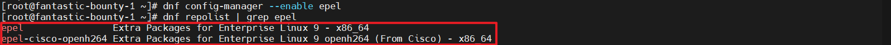
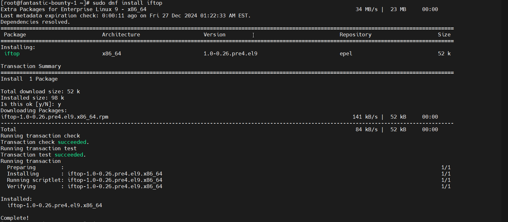

# Rocky Linux 安装 EPEL (Extra Packages for Enterprise Linux) 仓库的配置包

## 说明
* 版本：Rocky Linux 9.5 (Blue Onyx)

## 问题
当使用 yum install iftop 时，提示找不到 iftop 包。
```shell
Last metadata expiration check: 0:51:58 ago on Fri 27 Dec 2024 12:24:50 AM EST.
No match for argument: iftop
Error: Unable to find a match: iftop
```

### 启用 EPEL 和 CRB 存储库
```shell
sudo dnf install -y epel-release
```

#### 确认 EPEL 仓库是否正确启用
> 若如下图，系统只启用了 epel-cisco-openh264 仓库，但没有启用主要的 EPEL 仓库，则无法找到 iftop 包。
```shell
dnf repolist | grep epel
```


#### 启用所有 EPEL 相关的仓库
```shell
sudo dnf config-manager --enable epel
# 再次查看EPEL是否启动
dnf repolist | grep epel
```


### 安装iftop工具
```shell
dnf install iftop
```

