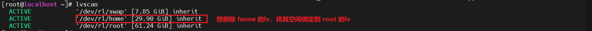
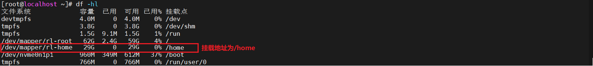
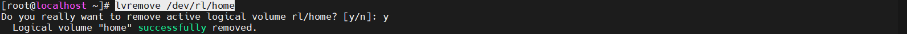
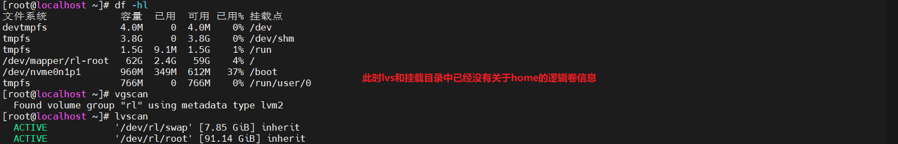
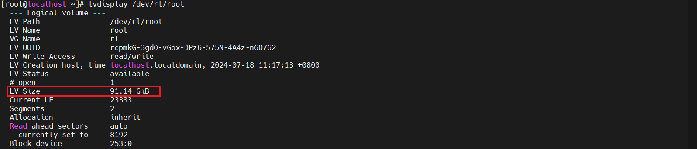
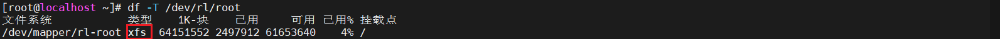
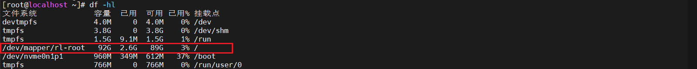

# Linux删除原有逻辑卷，将空闲出来的空间分配给其它逻辑卷

## 说明
* 版本：Rocky Linux 9.4 x86_64（Centos中也适配）

## 前提
> 安装**lvm2**工具包
```shell
# 更新软件包列表
sudo yum update
# 安装 LVM2
sudo yum install lvm2
```

### 查看逻辑卷信息
```shell
lvscan
```


### 查看当前需要删除的lv挂载信息
```shell
# 查看挂载信息
df -hl
# 查看逻辑卷详细信息
lvdisplay /dev/rl/home
```


### 清理当前lv所关联的信息
```shell
# 杀死当前lv文件或目录所在文件系统的所有进程的PID
fuser -mki /dev/rl/home
# 取消挂载
umount /home
```

### 删除逻辑卷 **/dev/rl/home**
```shell
lvremove /dev/rl/home
```



### 分配空闲空间到root逻辑卷中
> 通过上图可以看出，vg卷组只有rl一个，删除的逻辑卷可以直接通过lvextend来重新分配

```shell
# 将所有空间分配给root（/dev/rl/root）逻辑卷
lvextend -l +100%free /dev/rl/root
```

### 查看root逻辑卷详情
```shell
lvdisplay /dev/rl/root
```


**注意：** 到此还没有分配完成，通过`df -hl`查看得出的信息也不会有所改变；还需要对新增加的空间进行文件系统格式化

### 查看分配逻辑卷`/dev/rl/root`文件系统类型
```shell
df -T /dev/rl/root
```
* 此时可以看到，文件系统个`xfs`
* 此处也可以会是：ext4, xfs等（最初始运维人员文件格式化的操作不同，这块也会不同）



### 根据文件系统类型扩展新增空间文件系统
```shell
# 对于 XFS 文件系统命令（此处适用）
xfs_growfs /dev/rl/root

# 对于 ext2, ext3, 或 ext4 文件系统
resize2fs /dev/rl/root （按需选择）
```
#### 如果是根分区（/）扩容，可能需要添加如下命令（可选，按上面执行效果选择是否执行）
```shell
xfs_growfs /
```

### 最终效果
```shell
df -hl
```

