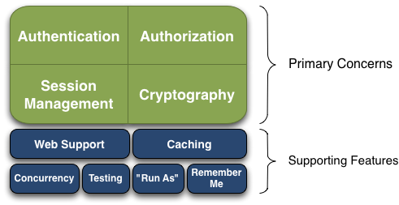

## 概念和架构

### 四大核心模块
* 身份认证
    > Authentication，身份证认证，一般就是登录
* 授权
    > Authorization，给用户分配角色或者访问某些资源的权限
* 会话管理
    > Session Management, 用户的会话管理员，多数情况下是web session
* 加密
    > Cryptography, 数据加解密，比如密码加解密等

### 架构
