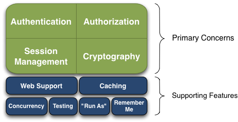
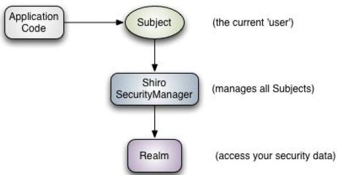

## 概念和架构

### 四大核心模块
* 身份认证
    > Authentication，身份证认证，一般就是登录
* 授权
    > Authorization，给用户分配角色或者访问某些资源的权限
* 会话管理
    > Session Management，用户的会话管理员，多数情况下是web session
* 加密
    > Cryptography，数据加解密，比如密码加解密等
* Web支撑
    > Web Support，可以非常容易的集成到Web环境
* 缓存，
    > Caching，比如用户登录后，其用户信息、拥有的角色/权限不必每次去查，提高效率
* 多线程
    > Concurrency，Shiro支持多线程应用的并发验证，即如在一个线程中开启另一个线程，能把权限自动传播出去
* 测试
    > Testing，提供测试支持
* 允许
    > " Run As "，允许一个用户假装为另一个用户(如果他们允许)的身份进行访问
* 记住我
    > Remember Me，即一次登录后,下次再来的话不用登陆
#### 图示

### 架构

#### Subject
> 应用代码直接交互的对象是  Subject，也就是说 Shiro 的对外 API 核心就是 Subject。Subject 代表了当前“用户”， 这个用户不一定 是一个具体的人，与当前应用交互的任何东西都是 Subject，如网络爬虫， 机器人等；与  Subject  的所有交互都会委托给  SecurityManager； Subject 其实是一个门面，SecurityManager 才是实际的执行者；
#### SecurityManager
> 安全管理器；即所有与安全有关的操作都会与 SecurityManager 交互；且其管理着所有 Subject；可以看出它是 Shiro 的核心，它负责与  Shiro 的其他组件进行交互，它相当于 SpringMVC  中 DispatcherServlet 的角色
#### Realm
> Shiro 从 Realm 获取安全数据（如用户、角色、权限），就是说 SecurityManager 要验证用户身份，那么它需要从 Realm 获取相应的用户 进行比较以确定用户身份是否合法；也需要从 Realm 得到用户相应的角色/ 权限进行验证用户是否能进行操作；可以把 Realm 看成 DataSource
