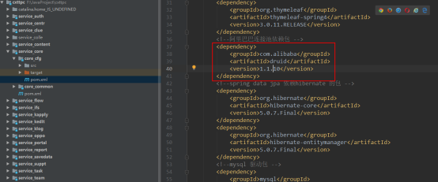
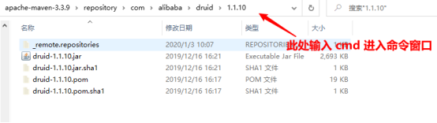
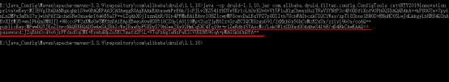
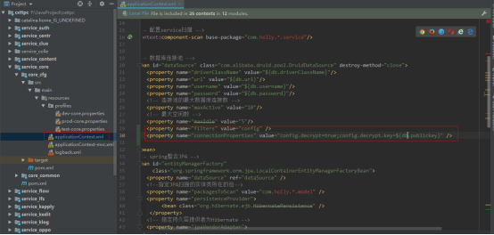
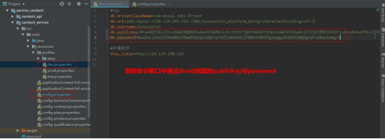

## Druid数据库密码加密配置
 
### 找到数据库中Druid的maven坐标产看版本号


### 本地maven中打开当前项目的druid的jar包位置


### 进入命令行后输入
* 执行命令
    ```shell
    java -cp druid-1.1.10.jar com.alibaba.druid.filter.config.ConfigTools 数据库密码
    ```
* 生成加密信息
    

### 修改Spring中的数据源配置文件
* 代码配置文件中添加解密配置
    ```properties
    <property name="filters" value="config" />
    <property name="connectionProperties" value="config.decrypt=true;config.decrypt.key=${db.publickey}" />
    ```
    

### 复制公钥与密码到数据库连接配置文件中



