## Spring源码环境

#### 依赖工具
* IntelliJ IDEA-2018
* Spring 源码-5.2.9
* Gradle-5.6.4
* JDK-1.8.0_131

#### 下载Gradle包
* 地址：<https://services.gradle.org/distributions/><br>
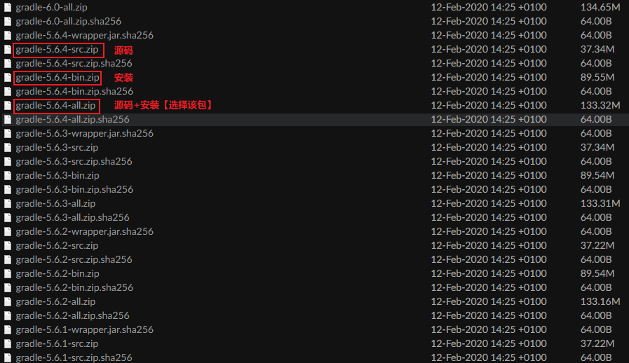

#### Gradle环境变量配置【与Java环境配置相同】
* 添加GRADLE_HOME<br>
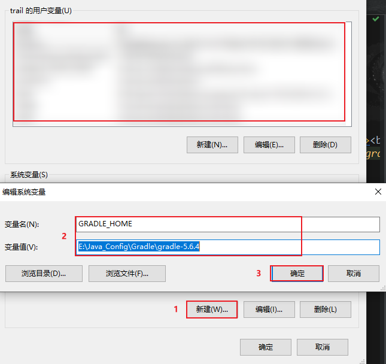
* 将GRADLE_HOME添加到Path变量<br>
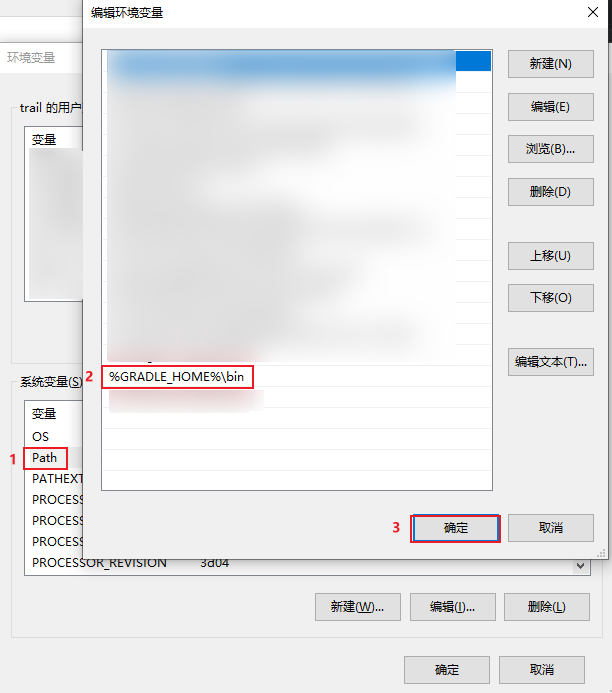
* 添加gradle-repository用户变量[注意：自己写的地址的gradleRepository文件要存在]<br>
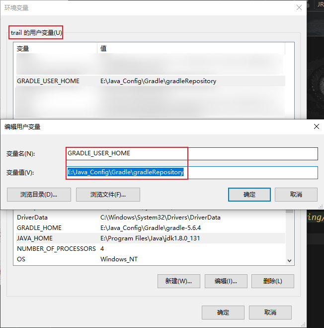
* 测试环境变量`gradle -version`<br>
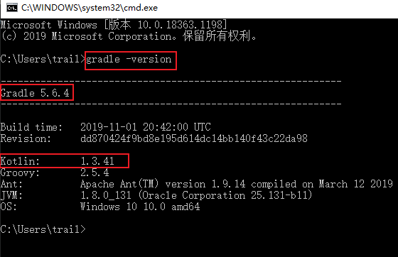

#### 代码下载
* github下载指定版本`5.2.9RELEASE`压缩包，地址：<https://github.com/spring-projects/spring-framework><br>
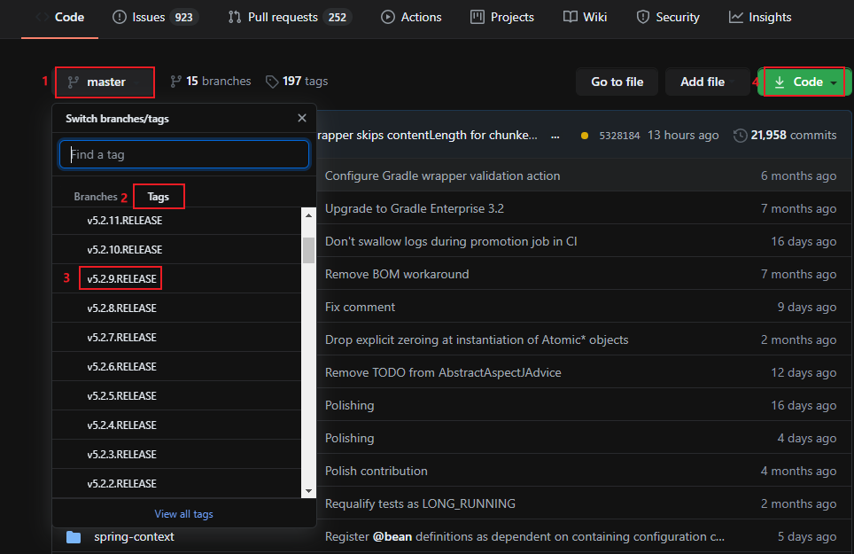
* 解压后配置idea中的gradle配置+配置`gradleRepositroy`jar包仓库
    > gradle内存设置：`-XX:MaxPermSize=2048m -Xmx2048m -XX:MaxHeapSize=2048m`[防止内存溢出]
    
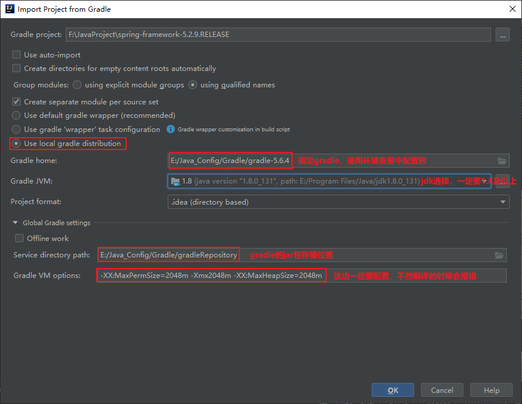

#### 构建前准备【网络不好，可以配置下，未测，不知效果】[网络上提供，自己未测试]
* 打开工程下的gradle目录->wrapper目录下的，gradle-wrapper.properties文件。因为gradle每次编译都会从官网下载指定版本（gradle-6.5.1-all.zip），所以我们在它第一次下载完之后，将distributionUrl设置成本地文件，这样就不会每次编译都从官网下载了，如下图：
    > `distributionUrl=file:///E:/Java_Config/Gradle/gradle-5.6.4-all.zip(这里选择gradle的压缩包的全路径地址)`
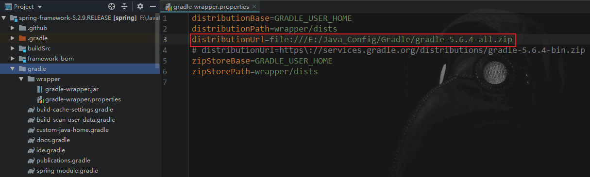

* 打开build.gradle文件（这个就相当于是maven的pom文件），在文件头部加上
```markdown
buildscript {
	repositories {
		maven { url "https://repo.spring.io/plugins-release" }
	}
}
```
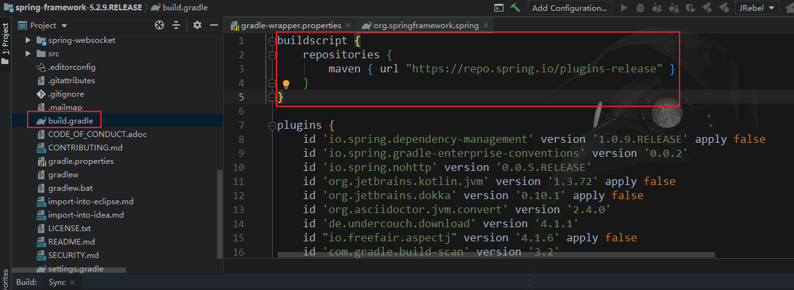

* 添加阿里云镜像
```markdown
repositories {
			// 新增以下2个阿里云镜像
			maven { url 'https://maven.aliyun.com/nexus/content/groups/public/' }
			maven { url 'https://maven.aliyun.com/nexus/content/repositories/jcenter' }
			mavenCentral()
			maven { url "https://repo.spring.io/libs-spring-framework-build" }
			maven { url "https://repo.spring.io/milestone" } // Reactor
			// 新增spring插件库
			maven { url "https://repo.spring.io/plugins-release" }
}
```
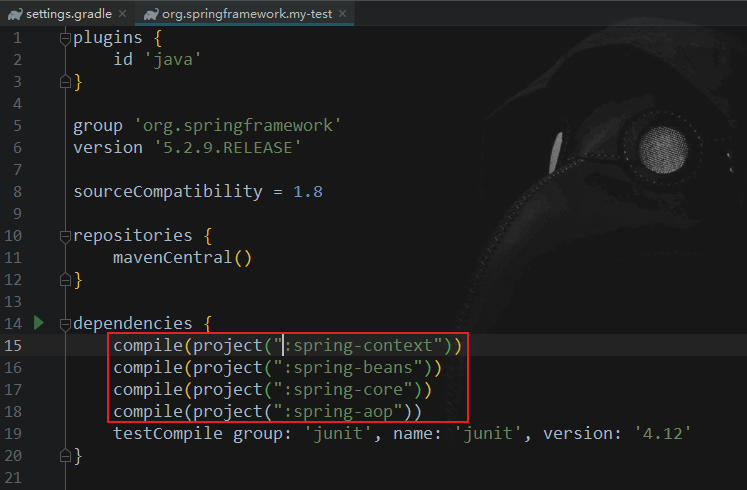

#### 等待构建完成
> 构建期间一定要保证网络畅通，如果出现构建异常，重新构建也能解决

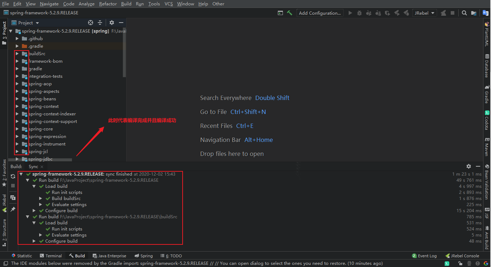
* 查看`ApplicationContext`接口是否能查看类图
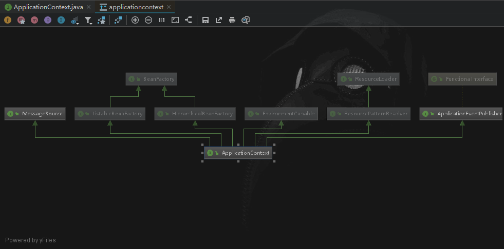

#### 编译前注意
* 编译之前需要对`dosc.gradle`文档进行修改，因为有些注释，文件路径在编译时需要调整
    * 注释dokka
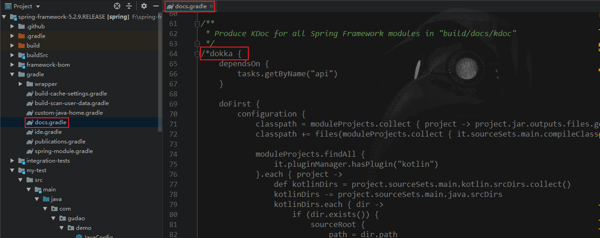
    * 注释asciidoctor
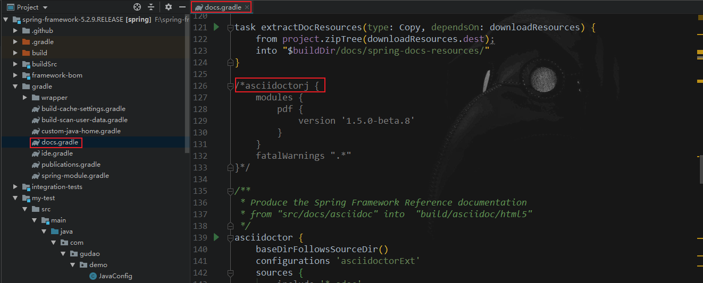

#### 编译源码
> 在编译之前需要进行一些配置修改，可以查看import-into-idea.md文档
1. 文档要求先编译spring-oxm下的compileTestjava，点击右上角gradle打开编译视图，找到spring-oxm模块，然后在other下找到compileTestjava，双击即可
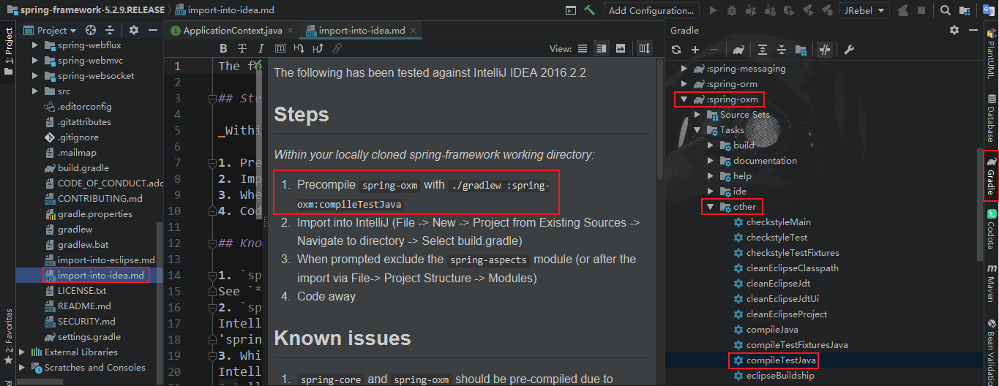
    * 编译成功显示
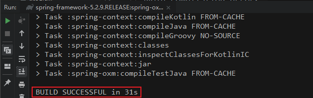
    * 保险起见再编译下spring-core模块，因为之后的spring-context依赖于core
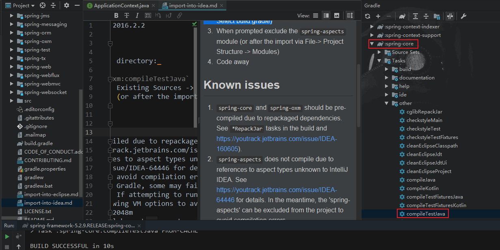

#### 源码测试
* 【File】->【New】->【Module…】
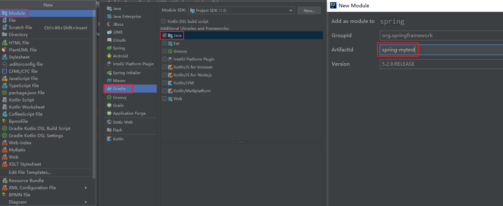
* 打开全局配置文件：settings.gradle文件最下面，系统自动加上了spring-mytest模块
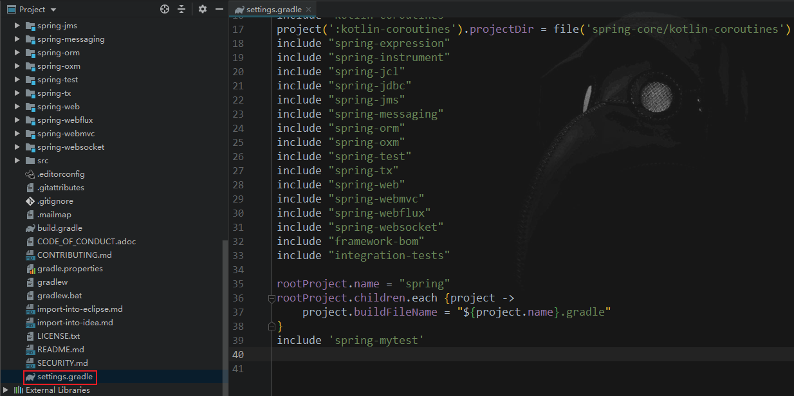
* 找到新建的测试模块spring-mytest，打开build.gradle文件（相当于是pom文件），默认dependencies依赖(这里的dependencies和maven里的依赖是一样的)只有一个junit，手工添加spring-context，spring-beans，spring-core，spring-aop这4个核心模块，具体如下：

```markdown
dependencies {
    //添加完要构建一下，否则代码中无法引用
    compile(project(":spring-context"))
    compile(project(":spring-beans"))
    compile(project(":spring-core"))
    compile(project(":spring-aop"))
    testCompile group: 'junit', name: 'junit', version: '4.12'
}
```
* 写一个简单的applicationContext获取容器用的bean，测试Spring源码构建编译过程是否成功！
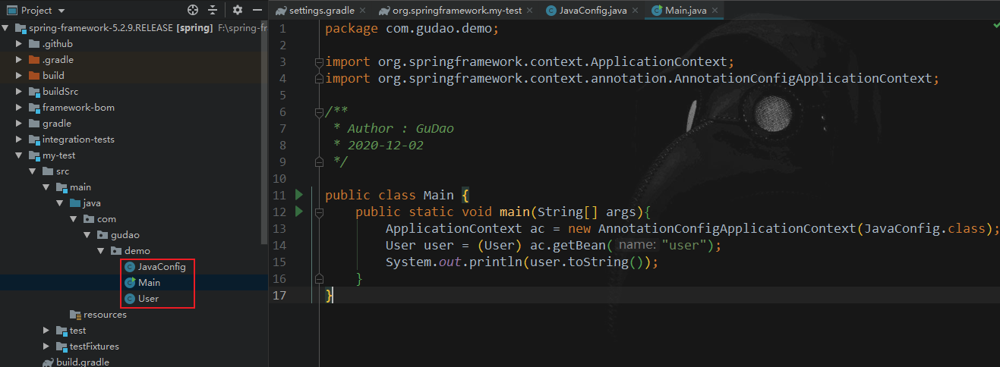
```java
import org.springframework.context.annotation.Bean;
import org.springframework.context.annotation.ComponentScan;
import org.springframework.context.annotation.Configuration;

/**
 * Author : GuDao
 * 2020-12-02
 */

@Configuration
@ComponentScan
public class JavaConfig {
	@Bean
	public User user(){
		return new User(101,"ganquanzhong","pwd","13995978321","china");
	}
}
```
```java
/**
 * Author : GuDao
 * 2020-12-02
 */

public class User {
	private int uid;
	private String username;
	private String pwd;
	private String tel;
	private String addr;

	public User() {
	}

	public User(int uid, String username, String pwd, String tel, String addr) {
		this.uid = uid;
		this.username = username;
		this.pwd = pwd;
		this.tel = tel;
		this.addr = addr;
	}

	@Override
	public String toString() {
		return "User{" +
				"uid=" + uid +
				", username='" + username + '\'' +
				", pwd='" + pwd + '\'' +
				", tel='" + tel + '\'' +
				", addr='" + addr + '\'' +
				'}';
	}
}
```
```java
import org.springframework.context.ApplicationContext;
import org.springframework.context.annotation.AnnotationConfigApplicationContext;

/**
 * Author : GuDao
 * 2020-12-02
 */

public class Main {
	public static void main(String[] args){
		ApplicationContext ac = new AnnotationConfigApplicationContext(JavaConfig.class);
		User user = (User) ac.getBean("user");
		System.out.println(user.toString());
	}
}
```


#### 编译中的问题
##### Could not resolve all files for configuration ':spring-aspects:aspectj'
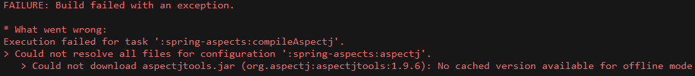
* 解决
> 发现spring-aspects模块有错误， 选中该模块，右键--Load/Unload Modules ，把spring-aspects下的所有项目排除出去<br>
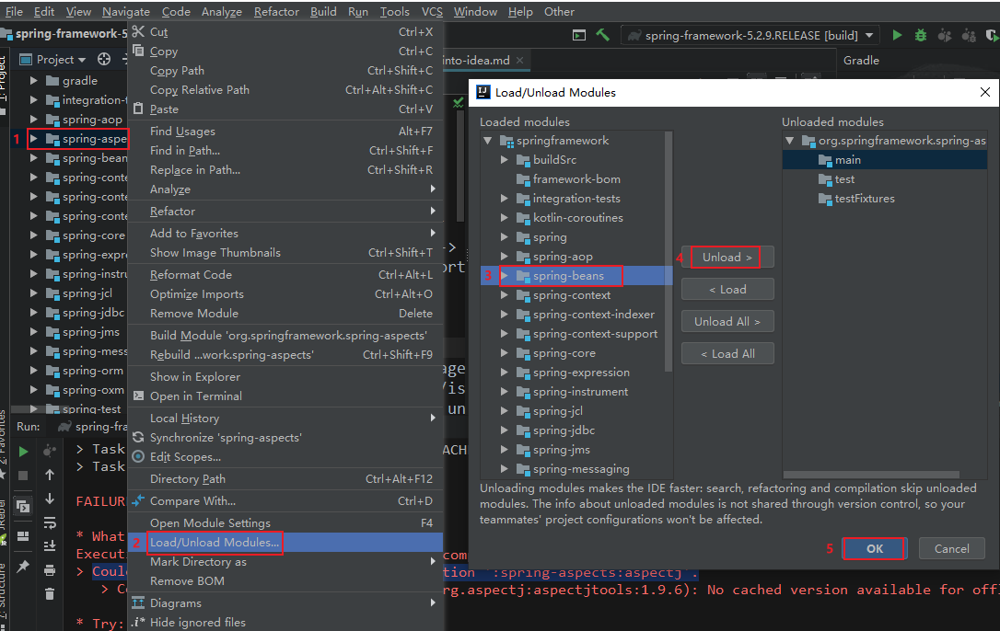

#### 找不变量CoroutinesUtils
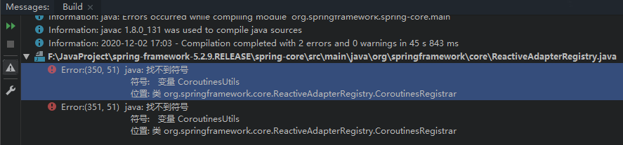
* 解决
> 点击【File】 ->【Project Structure】 -> 【Libraries】 -> 【+】 -> 【Java】，然后选择spring-framework/spring-core/kotlin-coroutines/build/libs/kotlin-coroutines-5.3.0-SNAPSHOT.jar，在弹出的对话框中选择spring-core.main，再重新build项目即可。
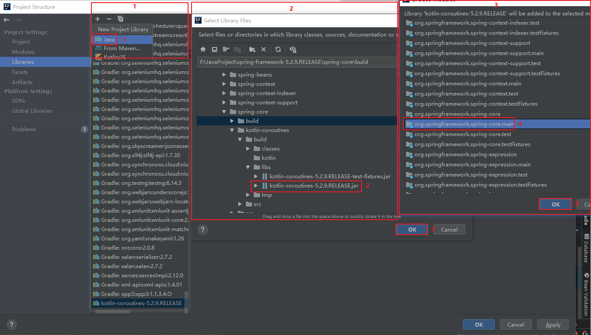

#### 找不到类InstrumentationSavingAgent

* 解决
> 修改spring-context模块下的spring-context.gradle文件，找到optional(project(":spring-instrument"))，将optional改为compile 
```markdown
//optional改为compile，否则报错：找不到InstrumentationSavingAgent
//optional(project(":spring-instrument"))
compile(project(":spring-instrument"))
```
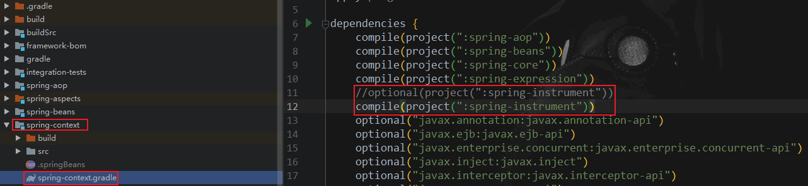

#### No cached version of org.jibx:jibx-bind:1.3.3 available for offline mode.
```markdown
* What went wrong:
Execution failed for task ':spring-oxm:compileTestJava'.
> Could not resolve all files for configuration ':spring-oxm:jibx'.
   > Could not resolve org.jibx:jibx-bind:1.3.3.
     Required by:
         project :spring-oxm
      > No cached version of org.jibx:jibx-bind:1.3.3 available for offline mode.
      > No cached version of org.jibx:jibx-bind:1.3.3 available for offline mode.
   > Could not resolve org.apache.bcel:bcel:6.0.
     Required by:
         project :spring-oxm
      > No cached version of org.apache.bcel:bcel:6.0 available for offline mode.
      > No cached version of org.apache.bcel:bcel:6.0 available for offline mode.
```
* 解决
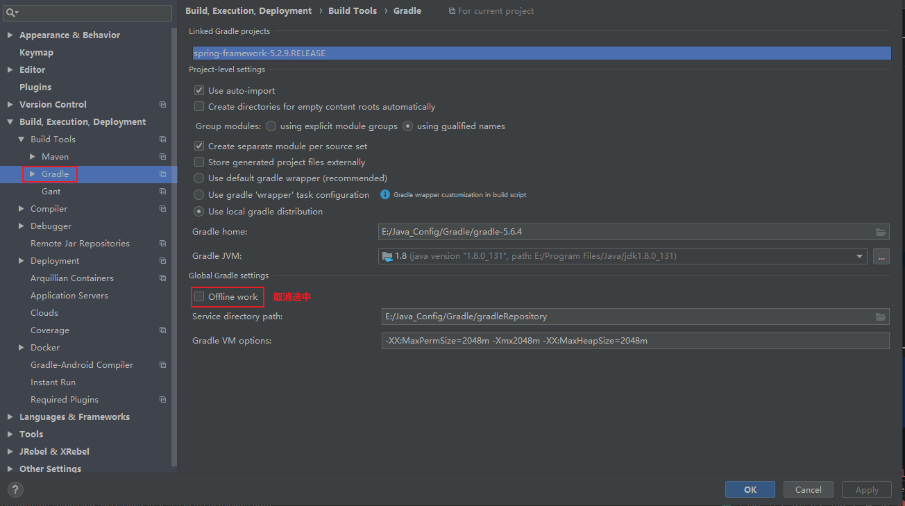

#### Kotlin问题
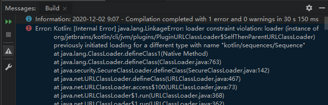
* 解决
> 更新Kotlin版本，没有就安装<br>
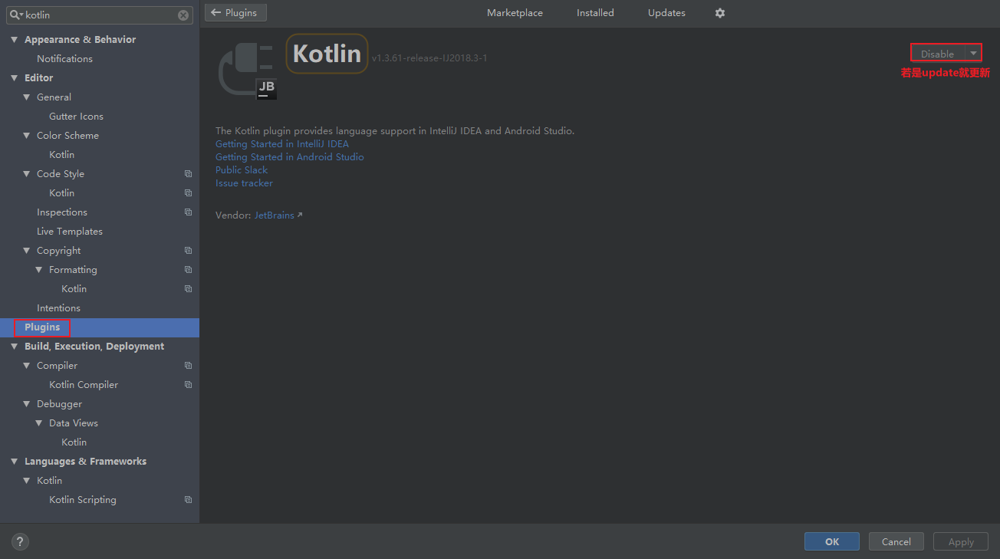
* 还有一种版本错误【一般不会出现】

    * idea中版本修改
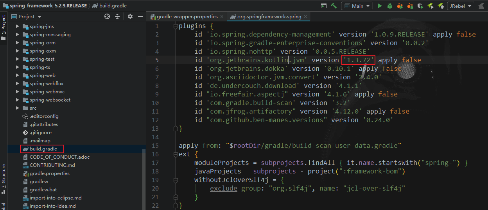


    


