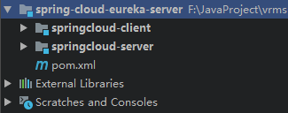
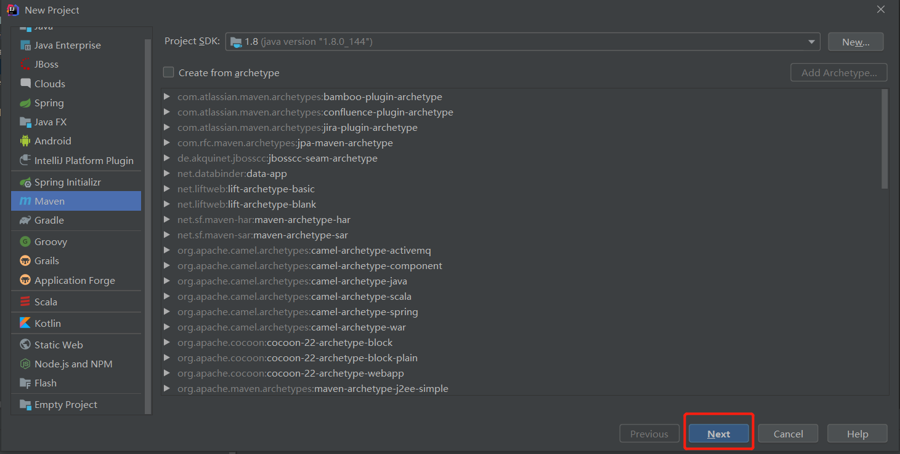
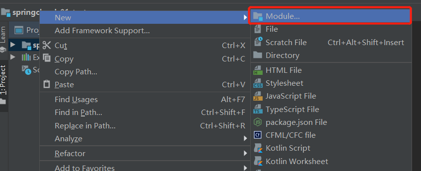
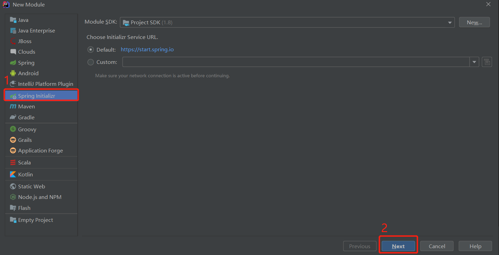
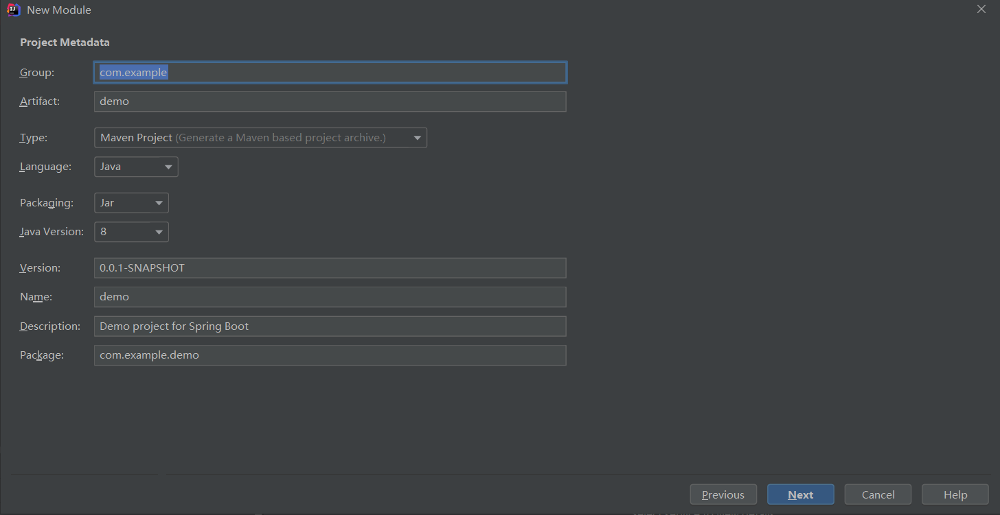
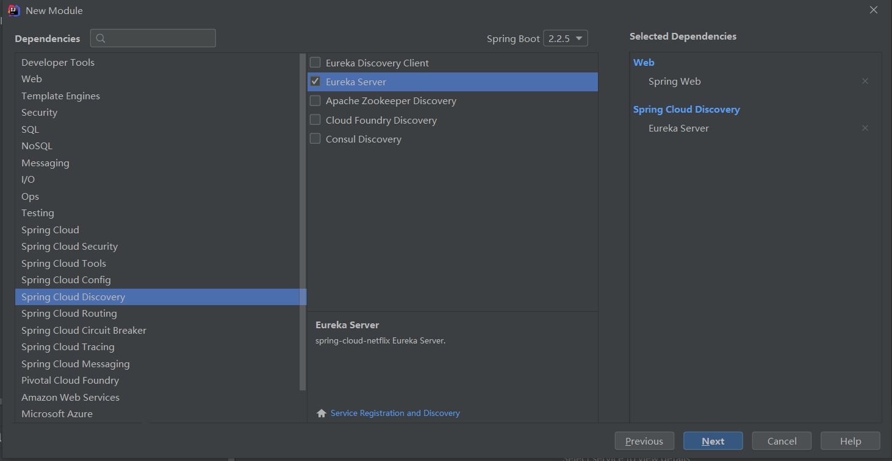
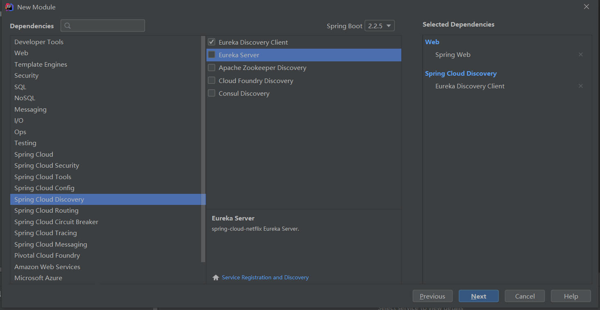
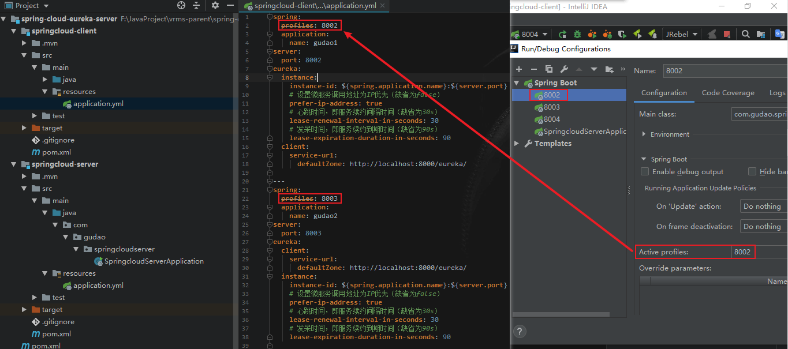
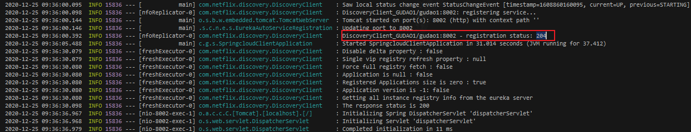

## SpringCloud-Eureka单机搭建

### IDEA中搭建SpringCloud-Eureka（spring-cloud-eureka-server）
* 最终目录结构<br>
    
    
#### 创建parent项目
* 创建完后直接将src的文件删除即可<br>
    

#### 选择项目鼠标右键新增模块（springcloud-server）
* 新增server模块<br>

* 创建springcloud项目<br>

* 填写好GroupId（项目的目录结构），ArtifactId（项目名）<br>

* 模块作为Eureka服务器；需要的依赖有Spring Web模块以及Eureka server <br>


#### 选择项目鼠标右键新增模块（springcloud-client）
* 前三步同上
* 模块作为Eureka客户端；依赖选择Spring Web和Eureka Discovery Client


#### 代码修改部分
> Server配置
* 在server的启动类上添加注解：@EnableEurekaServer
```java
@SpringBootApplication
@EnableEurekaServer
public class SpringcloudServerApplication {
    public static void main(String[] args) {
        SpringApplication.run(SpringcloudServerApplication.class, args);
    }
}
```
* application配置文件[properties文件]
```properties
## server
server.port=8081

##eureka
#指定环境
eureka.environment=work
# 设置是否将自己作为客户端注册到注册中心（缺省true）
# 这里为不需要（查看@EnableEurekaServer注解的源码，会发现它间接用到了@EnableDiscoveryClient）
eureka.client.register-with-eureka=false
# 设置是否从注册中心获取注册信息（缺省true）
# 因为这是一个单点的EurekaServer，不需要同步其它EurekaServer节点的数据，故设为false
eureka.client.fetch-registry=false
# 设置服务网址
eureka.client.serviceUrl.defaultZone=http://localhost:${server.port}/eureka/
#是否开启自我保护模式，默认为true。
eureka.server.enable-self-preservation=true
#续期时间，即扫描失效服务的间隔时间（缺省为60*1000ms）
eureka.server.eviction-interval-timer-in-ms=10000
```
* application配置文件[yml文件]
```yaml
## server：tomcat中运行项目的端口
server:
  port: 8000

## eureka
eureka:
  # 指定环境
  environment: work
  client:
    # 设置是否将自己作为客户端注册到注册中心（缺省true）
    register-with-eureka: false
    # 设置是否从注册中心获取注册信息（缺省true）
    fetch-registry: false
    # 设置服务网址
    service-url:
      defaultZone: http://localhost:${server.port}/eureka/
  server:
    # 是否开启自我保护模式，默认为true
    enable-self-preservation: true
    # 续期时间，即扫描失效服务的间隔时间（缺省为60*1000ms）
    eviction-interval-timer-in-ms: 10000
```
* jar包
```shell
<dependency>
    <groupId>org.springframework.cloud</groupId>
    <artifactId>spring-cloud-starter-netflix-eureka-server</artifactId>
</dependency>
```

> Client配置
* 在client的启动类中添加注解：@EnableEurekaClient
```java
@SpringBootApplication
@EnableEurekaClient
public class SpringcloudClientApplication {
    public static void main(String[] args) {
        SpringApplication.run(SpringcloudClientApplication.class, args);
    }
}
```
* application配置文件[properties文件]
```properties
spring.application.name=gudao
server.port=8002
##eureka
eureka.client.serviceUrl.defaultZone=http://localhost:8081/eureka/
eureka.instance.instance-id=${spring.application.name}:${server.port}
# 设置微服务调用地址为IP优先（缺省为false）
eureka.instance.prefer-ip-address=true
# 心跳时间，即服务续约间隔时间（缺省为30s）
eureka.instance.lease-renewal-interval-in-seconds=30
# 发呆时间，即服务续约到期时间（缺省为90s）
eureka.instance.lease-expiration-duration-in-seconds=90
```
* application配置文件[yml文件，配置三台client向server中注册]
```yaml
spring:
  profiles: 8002
  application:
    name: gudao1
server:
  port: 8002
eureka:
  instance:
    instance-id: ${spring.application.name}:${server.port}
    # 设置微服务调用地址为IP优先（缺省为false）
    prefer-ip-address: true
    # 心跳时间，即服务续约间隔时间（缺省为30s）
    lease-renewal-interval-in-seconds: 30
    # 发呆时间，即服务续约到期时间（缺省为90s）
    lease-expiration-duration-in-seconds: 90
  client:
    # 设置服务注册中心的URL
    service-url:
      defaultZone: http://localhost:8000/eureka/
# 在 application.yml 再建一个配置文件，语法是 --- 
---
spring:
  profiles: 8003
  application:
    name: gudao2
server:
  port: 8003
eureka:
  client:
    # 设置服务注册中心的URL
    service-url:
      defaultZone: http://localhost:8000/eureka/
  instance:
    instance-id: ${spring.application.name}:${server.port}
    # 设置微服务调用地址为IP优先（缺省为false）
    prefer-ip-address: true
    # 心跳时间，即服务续约间隔时间（缺省为30s）
    lease-renewal-interval-in-seconds: 30
    # 发呆时间，即服务续约到期时间（缺省为90s）
    lease-expiration-duration-in-seconds: 90
# 在 application.yml 再建一个配置文件，语法是 --- 
---
spring:
  profiles: 8004
  application:
    name: gudao3
server:
  port: 8004
eureka:
  client:
    # 设置服务注册中心的URL
    service-url:
      defaultZone: http://localhost:8000/eureka/
  instance:
    instance-id: ${spring.application.name}:${server.port}
    # 设置微服务调用地址为IP优先（缺省为false）
    prefer-ip-address: true
    # 心跳时间，即服务续约间隔时间（缺省为30s）
    lease-renewal-interval-in-seconds: 30
    # 发呆时间，即服务续约到期时间（缺省为90s）
    lease-expiration-duration-in-seconds: 90
```
* idea中单个模块当多么块用[配置文件不同]方法一


* jar包
```shell
<dependency>
    <groupId>org.springframework.cloud</groupId>
    <artifactId>spring-cloud-starter-netflix-eureka-client</artifactId>
</dependency>
```

##### 注册成功控制台标识
```shell
DiscoveryClient_API-LISTEN-ORDER/api-listen-order:30.136.133.9:port - registration status: 204  
```


#### 环境地址
* defaultZone中的地址
```shell
http://localhost:8000
```
#### 单机环境搭建完成界面

