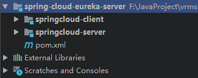
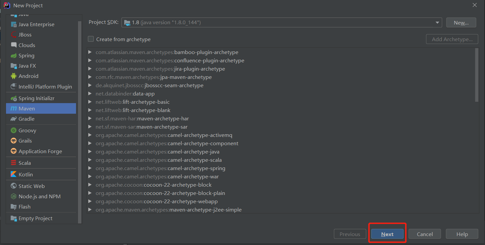
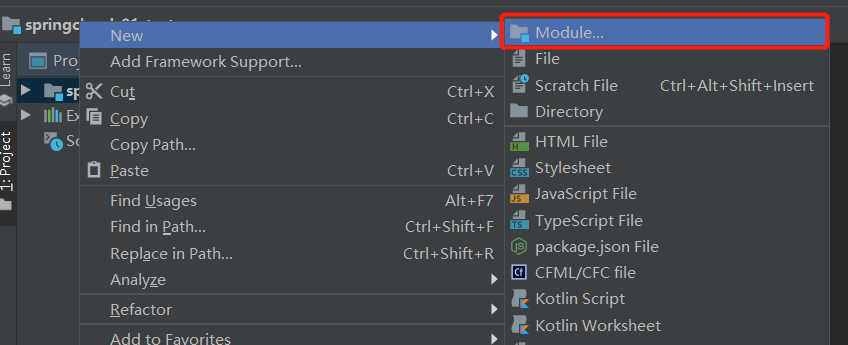
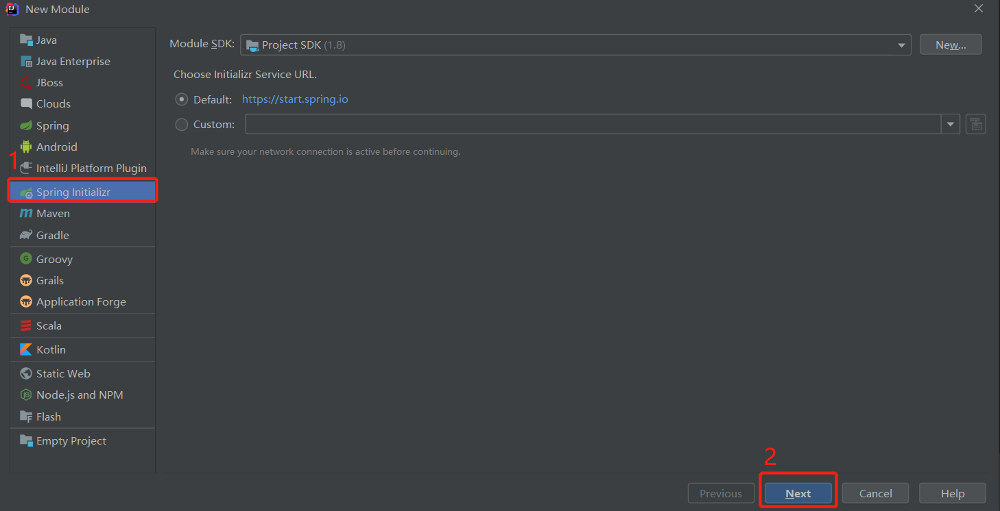
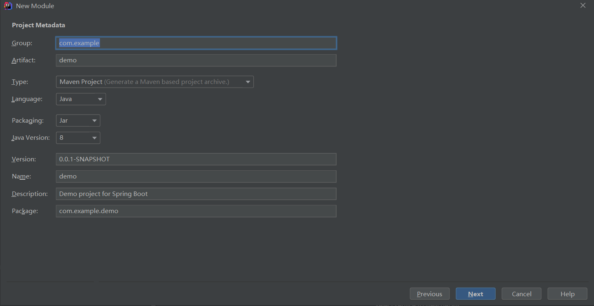
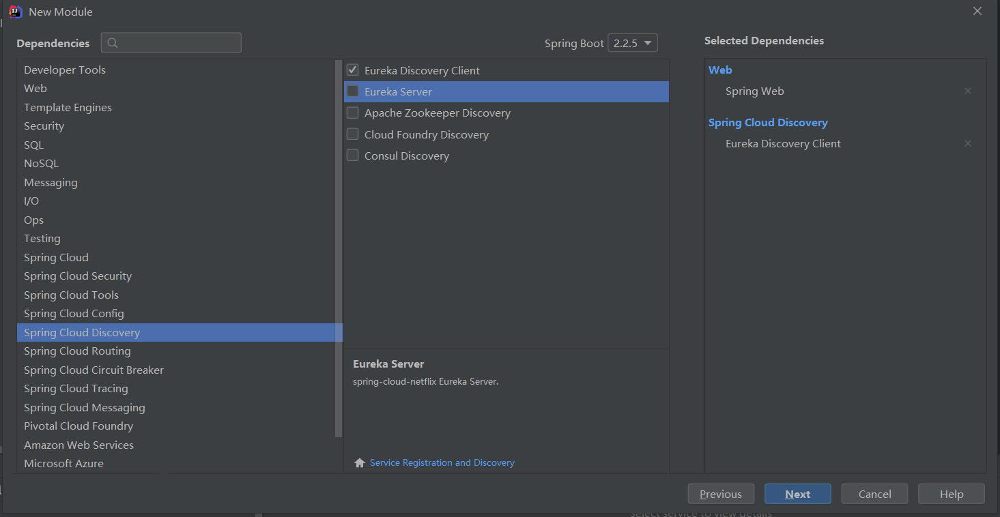

## SpringCloud-Eureka集群搭建

### IDEA中搭建SpringCloud-Eureka（spring-cloud-eureka-server）
* 最终目录结构<br>
    
    
#### 创建parent项目
* 创建完后直接将src的文件删除即可<br>
    

#### 选择项目鼠标右键新增模块（springcloud-server）
* 新增server模块<br>

* 创建springcloud项目<br>

* 填写好GroupId（项目的目录结构），ArtifactId（项目名）<br>

* 模块作为Eureka服务器；需要的依赖有Spring Web模块以及Eureka server <br>


#### 选择项目鼠标右键新增模块（springcloud-client）
* 前三步同上
* 模块作为Eureka客户端；依赖选择Spring Web和Eureka Discovery Client


#### host文件添加域名ip


#### 代码修改部分
> Server配置
* 在server的启动类上添加注解：@EnableEurekaServer
```java
@SpringBootApplication
@EnableEurekaServer
public class SpringcloudServerApplication {
    public static void main(String[] args) {
        SpringApplication.run(SpringcloudServerApplication.class, args);
    }
}
```
* application配置文件[yml文件]
```yaml
server:
  port: 8001
spring:
  application:
    name: gudao
  profiles: 8001
eureka:
  client:
    # 是否将自己注册到其他Eureka Server,默认为true
    register-with-eureka: true
    # 是否从eureka server获取注册信息
    fetch-registry: true
    # 设置服务注册中心的URL，用于client和server端交流
    # 此节点应向其他节点发起请求
    service-url:
      # 此节点应向其他节点发起请求，互相注册，eureka 第二个实例所在域名
      defaultZone: http://eureka2.com:8002/eureka/
      #主机名，必填
  instance:
    hostname: eureka1.com
# 在 application.yml 再建一个配置文件，语法是 --- 
---
server:
  port: 8002
spring:
  application:
    name: gudao
  profiles: 8002
eureka:
  client:
    # 是否将自己注册到其他Eureka Server,默认为true
    register-with-eureka: true
    # 是否从eureka server获取注册信息，集群时必须设置为 true 才能配合 ribbon 负载均衡
    fetch-registry: true
    # 设置服务注册中心的URL，用于client和server端交流
    # 此节点应向其他节点发起请求
    service-url:
      # 此节点应向其他节点发起请求，互相注册，eureka 第一个实例所在域名
      defaultZone: http://eureka1.com:8001/eureka/
      #主机名，必填
  instance:
    hostname: eureka2.com
```
* jar包
```shell
<dependency>
    <groupId>org.springframework.cloud</groupId>
    <artifactId>spring-cloud-starter-netflix-eureka-server</artifactId>
</dependency>
```

> Client配置
* 在client的启动类中添加注解：@EnableEurekaClient
```java
@SpringBootApplication
@EnableEurekaClient
public class SpringcloudClientApplication {
    public static void main(String[] args) {
        SpringApplication.run(SpringcloudClientApplication.class, args);
    }
}
```
* application配置文件[yml文件，配置三台client向server中注册]
```yaml
spring:
  profiles: 8011
  application:
    name: gudao1
server:
  port: 8011
eureka:
  instance:
    instance-id: ${spring.application.name}:${server.port}
    # 设置微服务调用地址为IP优先（缺省为false）
    prefer-ip-address: true
    # 心跳时间，即服务续约间隔时间（缺省为30s）
    lease-renewal-interval-in-seconds: 30
    # 发呆时间，即服务续约到期时间（缺省为90s）
    lease-expiration-duration-in-seconds: 90
  client:
    # 设置服务注册中心的URL
    service-url:
      defaultZone: http://eureka2.com:8002/eureka/
# 在 application.yml 再建一个配置文件，语法是 --- 
---
spring:
  profiles: 8012
  application:
    name: gudao2
server:
  port: 8012
eureka:
  client:
    # 设置服务注册中心的URL
    service-url:
      defaultZone: http://eureka1.com:8001/eureka/
  instance:
    instance-id: ${spring.application.name}:${server.port}
    # 设置微服务调用地址为IP优先（缺省为false）
    prefer-ip-address: true
    # 心跳时间，即服务续约间隔时间（缺省为30s）
    lease-renewal-interval-in-seconds: 30
    # 发呆时间，即服务续约到期时间（缺省为90s）
    lease-expiration-duration-in-seconds: 90
```
* idea中单个模块当多么块用[配置文件不同]，方法看单机搭建教程


* jar包
```shell
<dependency>
    <groupId>org.springframework.cloud</groupId>
    <artifactId>spring-cloud-starter-netflix-eureka-client</artifactId>
</dependency>
```

#### 实现效果


