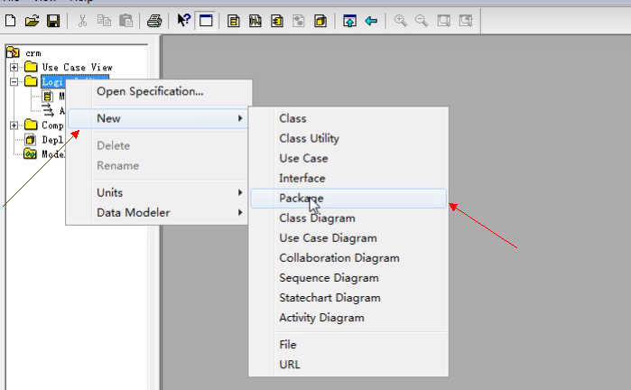
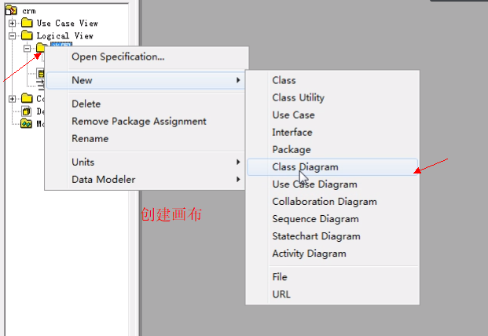
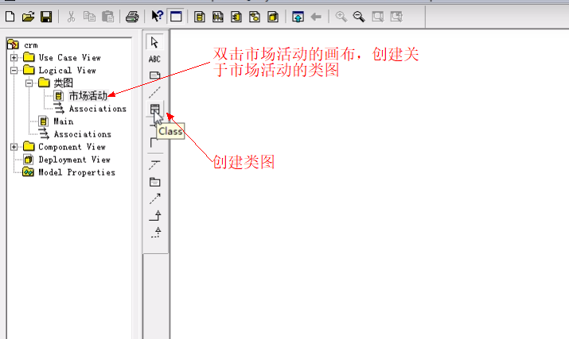
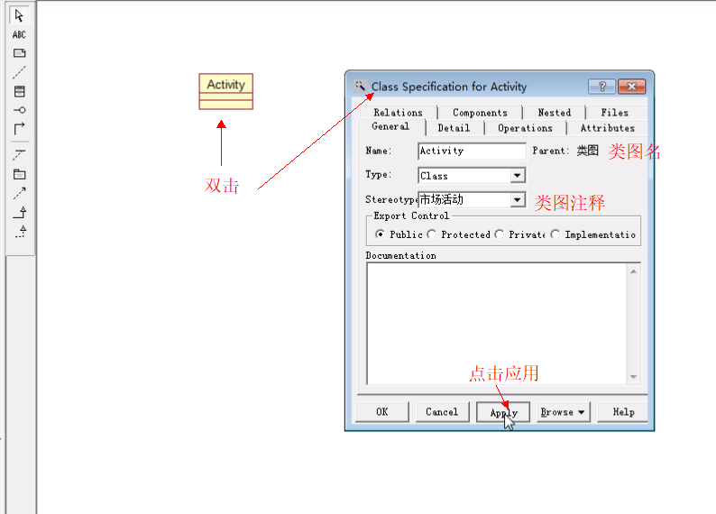
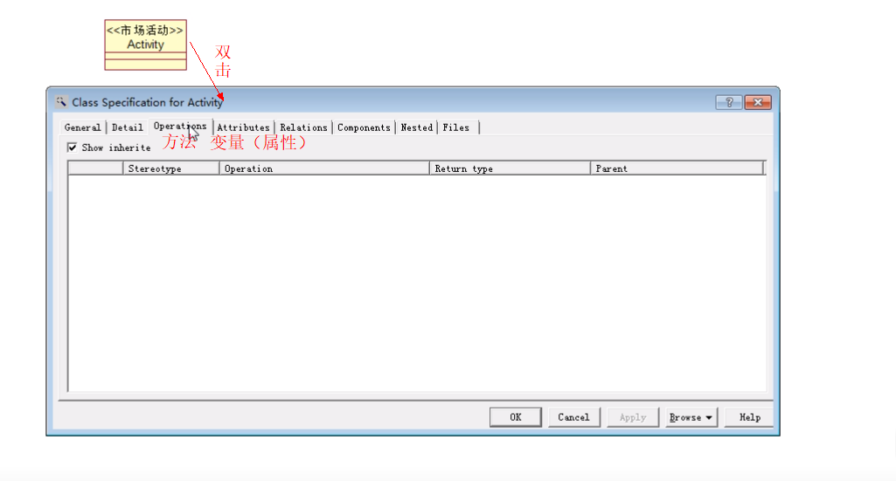
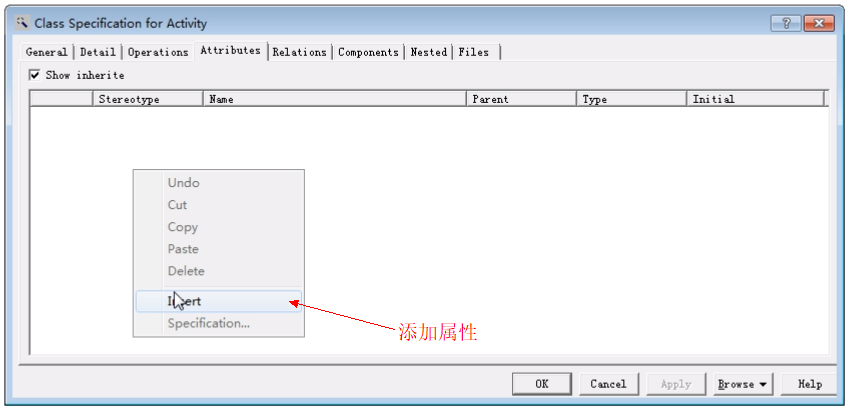
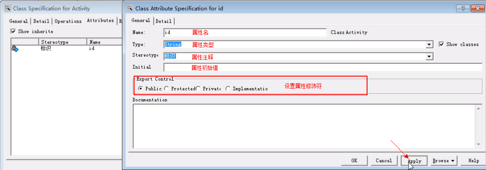

## UML操作说明

### UML图常见的包括哪些图呢?
* 类图( class Diagram)：描述类的信息(包括属性、方法),以及类和类之间的关系信息
* 用例图(Use Case Diagram)：站在系统用户(系统角色)的自分析系统存在哪些功能
* 时序图(Sequence Diagram)：描述程序的执行过程,方法的调用过程,方法的返回值等信息。(程序是一步一步怎么执行的,怎么调用的）
* 状态图：
* 活动图：

### 类图
> 描述类的信息,以及类和类之间的关系信息。

#### 画一个类图：
> 通常在Rational Rose工具的Logical View目录下实现类图,一般会创建一些目录用来组织这些类图,因为类可能会比较多。

#### 操作说明：
1. **创建业务包** 

2. **创建画布** 

3. **创建类图** 

4. **给类图起名、备注** 

5. **创建属性与变量** 

6. **设置属性的内容** 

