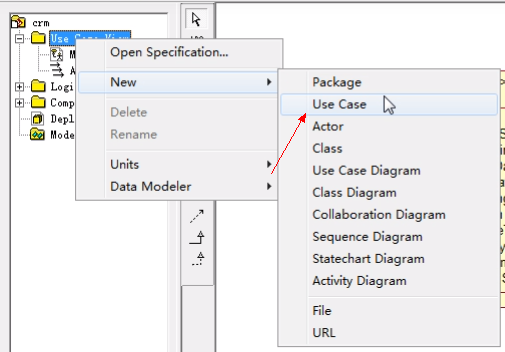
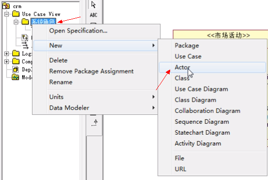
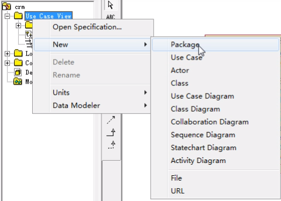
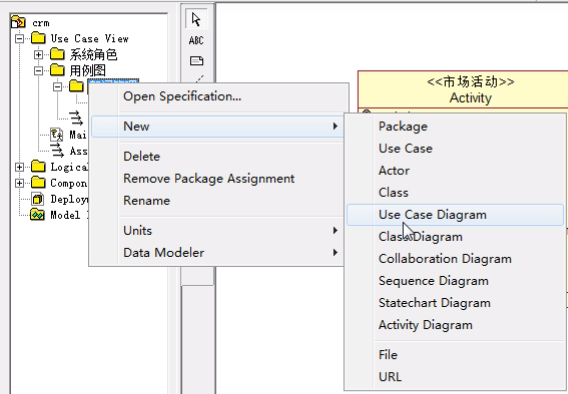
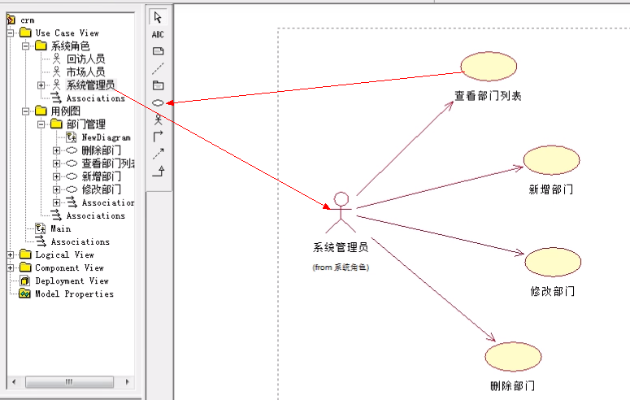

### 用例图

#### 什么是用例图? 
* 站在系统用户(系统角色)的角度分析系统存在哪些功能?
* 实现用例图的时候,需要先进行系统角色的抽取。
* 在Rational Rose工具当中一般会在Use Case View当中实现用例图。

#### 操作说明：
1. **创建包** 

2. **创建角色** 

3. **创建用用例图包** 

4. **创建用例图画布** 

5. **创建用例** 

