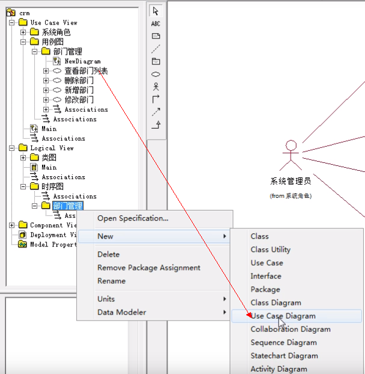
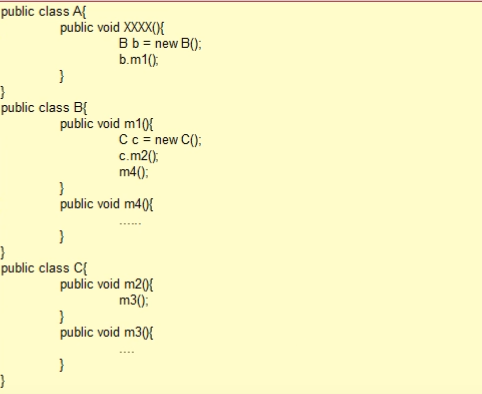

### 时序图

#### 什么是时序图?
* 时序图当中描述了方法的调用过程,程序的执行流程,以及方法执行结束的返回值情况。

#### 操作说明：
1. **创建时序图包**<br>

2. **创建用例图对应的包**<br>

3. **创建用例图对应的时序画布**<br>

4. **完善时序图需要的内容**<br>


**注解：**
```shell
小人:动作的发起人
矩形/小圆圈:对象
实线箭头:调用
虚线箭头:返回
柱状:对象的生命周期,柱状不能断,在同一个流程当中不能断
回折线:当前对象中的方法执行过程中调用自己当前类中的方法。
```



