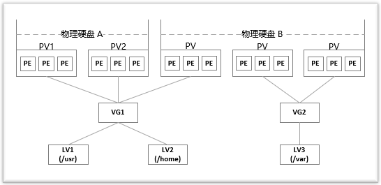

# LVM详细说明

### LVM中的基本概念
> 通过 LVM 技术，可以屏蔽掉磁盘分区的底层差异，在逻辑上给文件系统提供了一个卷的概念，然后在这些卷上建立相应的文件系统
* 物理存储设备(Physical Media)：指系统的存储设备文件，比如 /dev/sda、/dev/sdb 等。
* PV(物理卷 Physical Volume)：指硬盘分区或者从逻辑上看起来和硬盘分区类似的设备(比如 RAID 设备)。
* VG(卷组 Volume Group)：类似于非 LVM 系统中的物理硬盘，一个 LVM 卷组由一个或者多个 PV(物理卷)组成。
* LV(逻辑卷 Logical Volume)：类似于非 LVM 系统上的磁盘分区，LV 建立在 VG 上，可以在 LV 上建立文件系统。
* PE(Physical Extent)：PV(物理卷)中可以分配的最小存储单元称为 PE，PE 的大小是可以指定的。
* LE(Logical Extent)：LV(逻辑卷)中可以分配的最小存储单元称为 LE，在同一个卷组中，LE 的大小和 PE 的大小是一样的，并且一一对应。

### 图解
> LVM 是把硬盘的分区分成了更小的单位(PE)，再用这些单元拼成更大的看上去像分区的东西(PV)，进而用 PV 拼成看上去像硬盘的东西(VG)，最后在这个新的硬盘上创建分区(LV)。文件系统则建立在 LV 之上，这样就在物理硬盘和文件系统中间添加了一层抽象(LVM)。下图大致描述了这些概念之间的关系


* 两块物理硬盘 A 和 B 组成了 LVM 的底层结构，这两块硬盘的大小、型号可以不同。PV 可以看做是硬盘上的分区，因此可以说物理硬盘 A 划分了两个分区，物理硬盘 B 划分了三个分区。然后将前三个 PV 组成一个卷组 VG1，后两个 PV 组成一个卷组 VG2。接着在卷组 VG1 上划分了两个逻辑卷 LV1 和 LV2，在卷组 VG2 上划分了一个逻辑卷 LV3。最后，在逻辑卷 LV1、LV2 和 LV3 上创建文件系统，分别挂载在 /usr、/home 和 /var 目录。

### 如果安装系统时没有默认安装 LVM 工具包，可以通过下面的命令安装
```shell
yum install lvm2 -y
```

### LVM命令说明
* 将普通分区转换为物理卷的命令是pvcreate
* 将物理卷组合为卷组的命令是vgcreate
* 从卷组中提取容量创建逻辑卷的命令是Ivcreate

| 功能        | 物理卷管理 | 卷组管理  | 逻辑卷管理 |
| ----------- | ---------- | --------- | ---------- |
| Scan扫描    | pvscan     | vgscan    | lvscan     |
| Create建立  | pvcreate   | vgcreate  | lvcreate   |
| Display显示 | pvdisplay  | vgdisplay | lvdisplay  |
| Remove删除  | pvremove   | vgremove  | lvmove     |
| Extend扩展  | ---------- | vgextend  | lvextend   |
| Reduce减少  | ---------- | vgreduce  | lvreduce   |