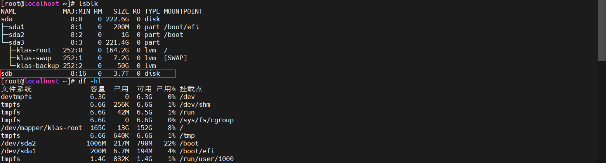
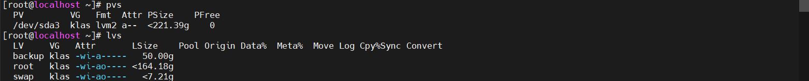
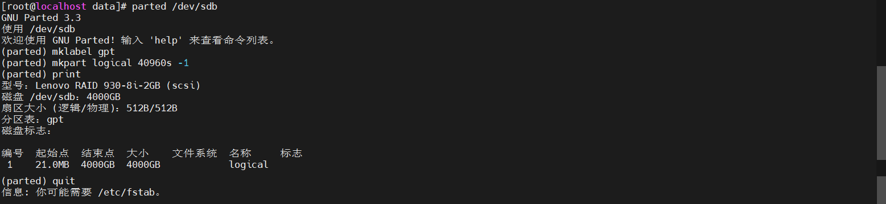
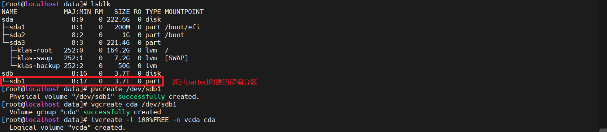
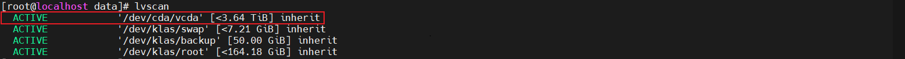
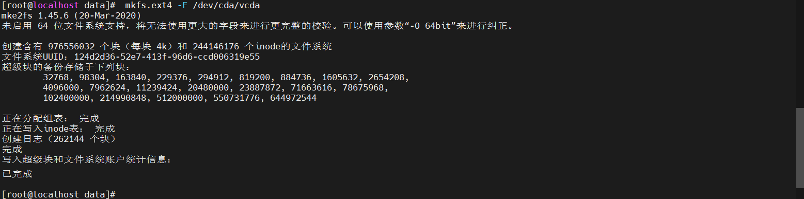
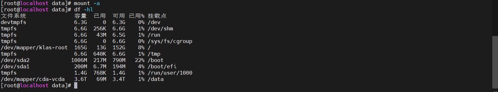

# 虚拟机给CentOS 7 添加磁盘（大于2T）

## 操作前请先阅读【YC】LVM说明.md

### 查看磁盘
```shell
# 显示硬盘设备命令
lsblk
```


### 查看是否已经创建 物理卷、卷组、逻辑卷（可选）
> 查看物理卷、卷组、逻辑卷情况，确保需要操作的硬盘没有被创建物理卷等信息
```shell
# 显示物理卷
pvs
# 显示卷组
vgs
# 显示逻辑卷
pvs
```


### 通过parted分配2T以上硬盘
```shell
# 通过`lsblk`命令得出，需要挂载的盘为`/dev/sdb`
parted /dev/sdb

# 将磁盘设置为gpt格式
mklabel gpt
# 创建一个逻辑分区：将磁盘所有的容量设置为GPT格式
mkpart logical 40960s -1
# 查看分区结果
print

# 退出
quit
```


### 查看逻辑逻辑分区情况并为这个分区创建物理卷、卷组、逻辑卷
```shell
# 创建一个物理卷
## pvcreate 物理分区名称（通过parted创建的）
### pvcreate: 是一个命令，用于创建物理卷。
### /dev/sdb1: 是一个设备文件名，指的是第二个硬盘（sdb）的第一个分区（1）。
pvcreate /dev/sdb1

# 创建一个卷组
## vgcreate 卷组名称 物理卷名称（通过pvcreate创建的，可以使用pvs查看）
### vgcreate: 是一个命令，用于创建卷组。
### cda: 是卷组的名称，可以是任意的字符串。
### /dev/sdb1: 是一个物理卷的设备文件名。
vgcreate cda /dev/sdb1

# 创建一个逻辑卷
## lvcreate -l 100%FREE -n 逻辑卷名称 卷组名称（通过vgcreate创建的，可以使用vgs查看）
### lvcreate: 是一个命令，用于创建逻辑卷。
### -l: 指定逻辑卷的大小，单位为百分比（%）。
### 100%FREE: 指定逻辑卷的大小为卷组剩余空间的 100%。
### -n: 指定逻辑卷的名称。
### vcda: 逻辑卷的名称，可以是任意的字符串。
### cda: 逻辑卷所属的卷组名称。
lvcreate -l 100%FREE -n vcda cda
```


### 查看逻辑卷信息
```shell
lvscan
```

#### 注意
* lvscan：查看逻辑卷信息，获取到的`/dev/cda/vcda`在挂盘和写入文件系统时需要使用

### 创建文件系统、格式化分区，使用ext4格式化分区
```shell
# 为逻辑卷创建ext4文件系统
## mkfs.ext4 -F ext4 逻辑卷名称（通过lvscan查看）
### mkfs.ext4: 是一个命令，用于创建 Ext4 文件系统。
### -F: 是一个选项，用于强制创建文件系统，即使设备上已经有数据。
### ext4: 是文件系统类型，指定创建 Ext4 文件系统。
### /dev/cda/vcda: 是逻辑卷的设备文件名，指的是卷组 cda 中的逻辑卷 vcda。
mkfs.ext4 -F ext4 /dev/cda/vcda
```


### 创建挂载路径，并挂载磁盘
```shell
# 创建挂载路径
mkdir /data
# 挂载磁盘
## mount 逻辑卷名称 挂载路径
mount /dev/cda/vcda /data
```

### 永久挂盘
```shell
vi /etc/fstab

# 添加如下内容
## <逻辑卷名称> <本地挂载目录> <文件系统类型> <挂载选项> <挂载优先级> <挂载点检查间隔>
/dev/cda/vcda           /data                   ext4    defaults        0 0
```

### 验证挂载所有在 /etc/fstab 中配置的文件系统
```shell
mount -a

# 查看挂载情况
df -h
```


### 提示：当mkfs或者pvcreate命令执行失败时，显示磁盘繁忙时，可以使用fuser命令来查看挂载信息
> 如果这样还是不行，那就重启服务器`reboot`就好了
```shell
# fuser -mki 挂载点信息
fuser -mki /mnt/usb
```
* -m（或--mount）：此选项指定检查挂载点。给定一个或多个文件或目录，fuser将显示使用这些文件或目录所在文件系统的所有进程的PID（进程ID）。
* -k（或--kill）：杀死访问指定文件或文件系统的所有进程。使用此选项时要非常小心，因为它会立即终止所有正在使用指定文件或文件系统的进程。
* -i：在杀死进程之前，fuser会询问是否真的要执行操作。这是一种安全措施，以防止误杀重要进程

