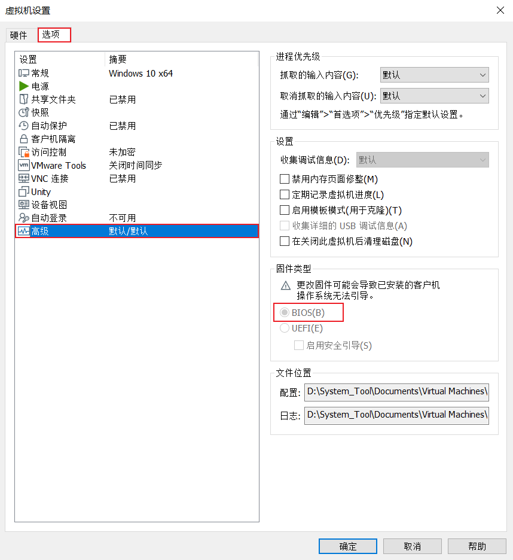

## 虚拟机安装windows10操作系统时，提示：press any key to boot from CD or DVD......

### 错误截图

### 错误原因
> 虚拟机新建的硬盘格式与虚拟机设置不一致导致。
* 明白原因就好进行设置了，我这里是依次设置“虚拟机设置|编辑虚拟机设置 - 选项 - 高级 - 固件类型”，将格式从“UEFI --> BIOS”，即虚拟机硬件格式需要为“BIOS”格式，然后“开启此虚拟机”就可以正常安装了
* 注意：设置格式时需要先关闭运行中的虚拟机，才可以对该虚拟机进行设置

