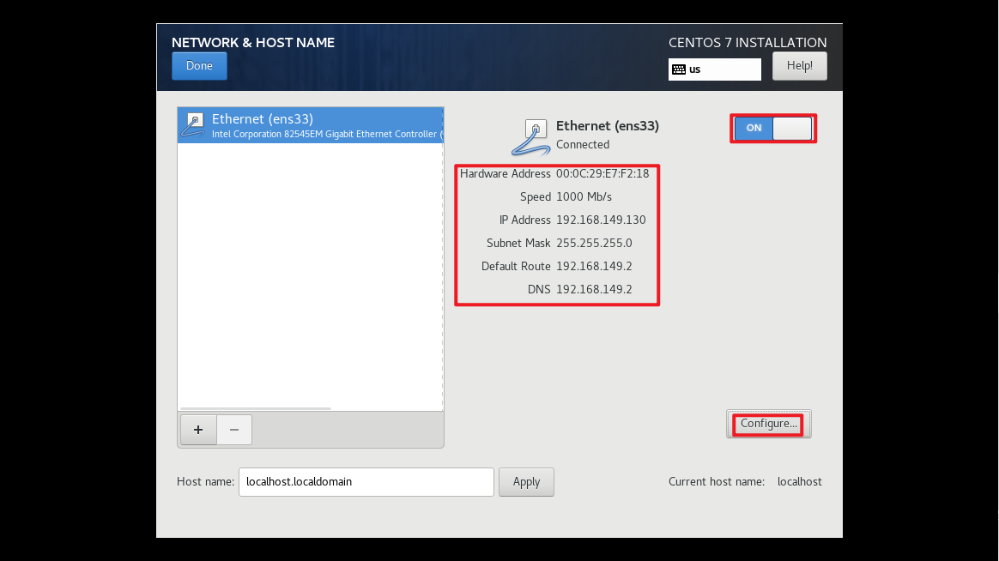

## CentOS 7 镜像安装

### 按照图例配置
* 指定镜像系统
  
  * 镜像路径指定
    

* 镜像启动
  

* 光标移动到install centos 7
  

* 安装语言指定
  

* 网络配置
  
  * 网络自定义开关打开
    
  * 配置IPV4
    
  * 配置主机名
    

* 配置磁盘（直接默认即可）
  
  * 配置磁盘详情
    

* 配置时间（选择上海）
  
  * 配置时间详情
    

* 配置系统语言
  
  * 配置系统语言详情
    

* 安装设置（默认即可）
  

* root密码设置
  
  * root密码设置详情
    

* root密码设置
  

* 运行系统（选择第一个）
  

* root登陆
  

* 测试网络
  
