 # 虚拟机给CentOS 7 添加磁盘

## 操作前请先阅读【YC】LVM说明.md
## 界面话操作图片说明：centos-磁盘挂载界面操作.png

### 在创建虚拟机的时候需要通过配置，让其创建根目录的卷组
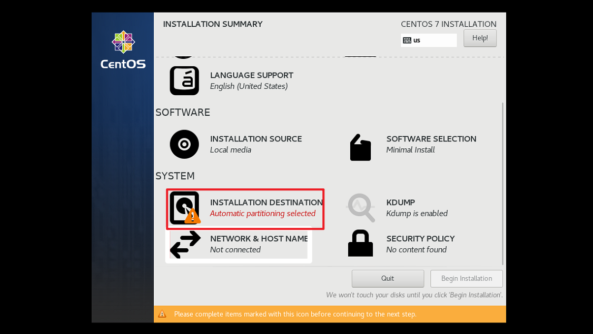
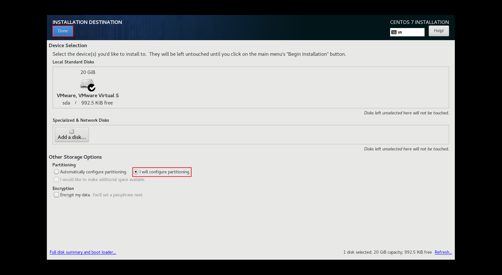
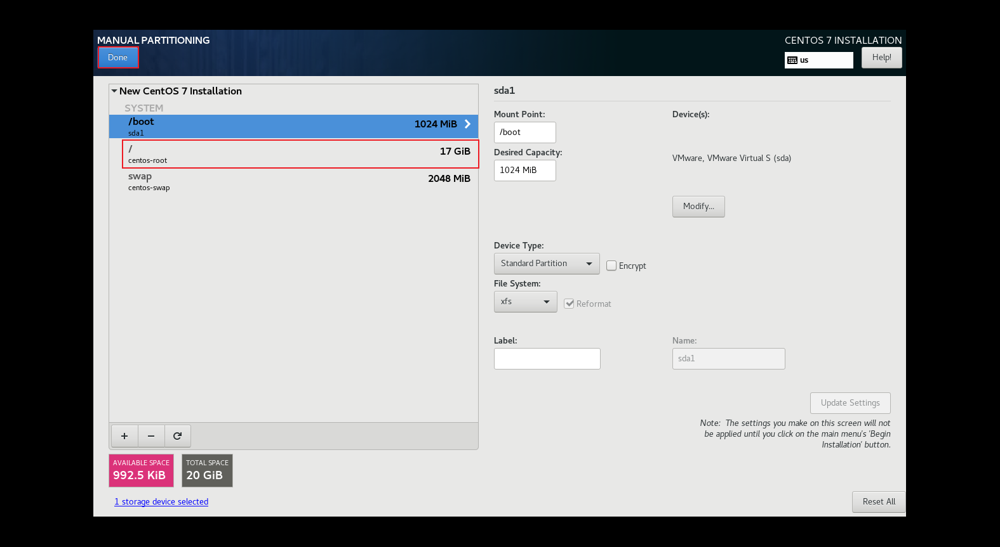
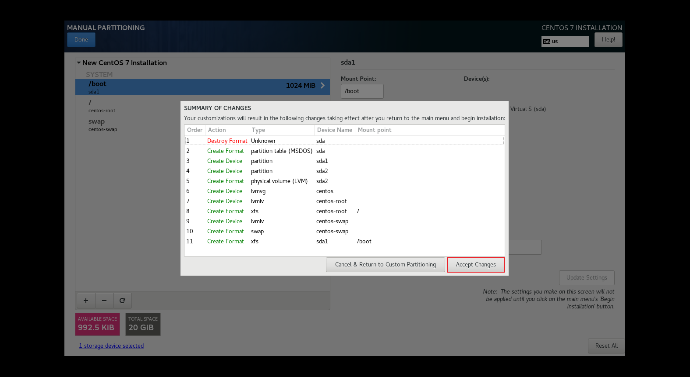

### 配置完成后，磁盘的分区情况
> 可以看到，此时就默认创建了一个卷组绑定到根目录

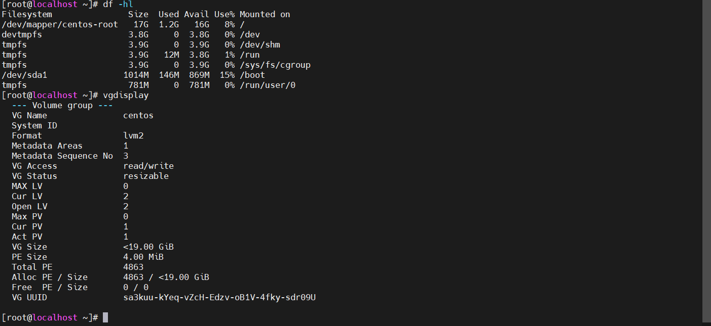

### 找到需要添加磁盘的虚拟机设置，添加新磁盘
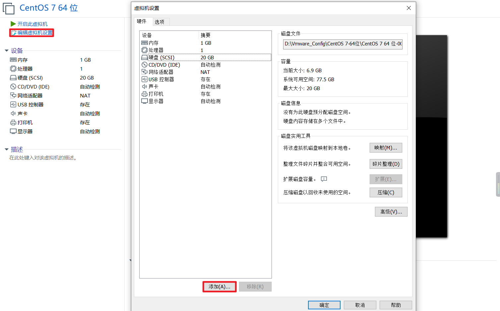

### 添加新磁盘
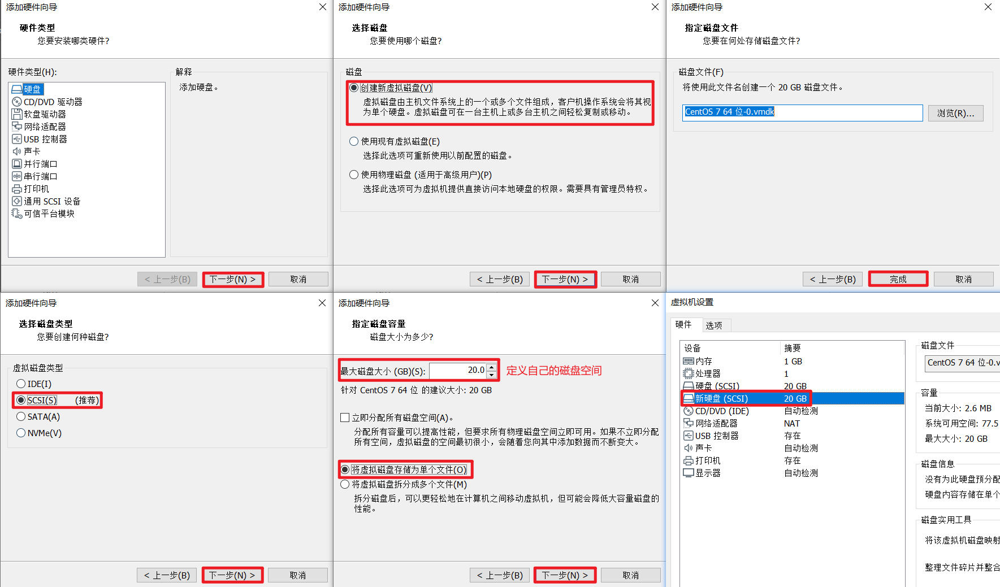

### 启动虚拟机，查看磁盘
```shell
# 查看系统中所有的磁盘信息
# linux 中所有外设都会在这个目录下，对应一个文件，其中第一块硬盘是sda,第二块硬盘是sdb,第三块硬盘是sdc
lsblk

# 查看磁盘详情
fdisk -l
```
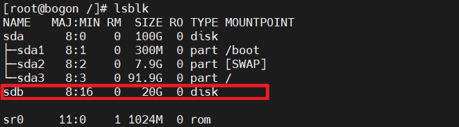
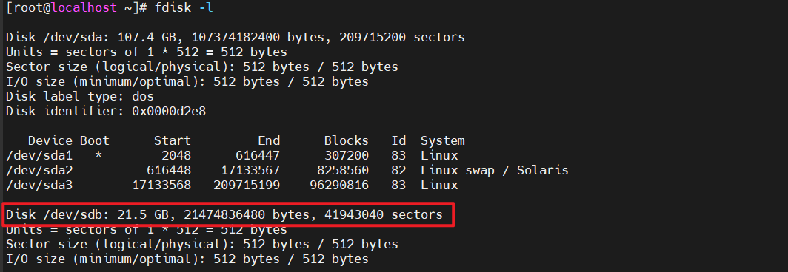

### 对新加入的磁盘进行分区
```shell
fdisk /dev/sdb
```
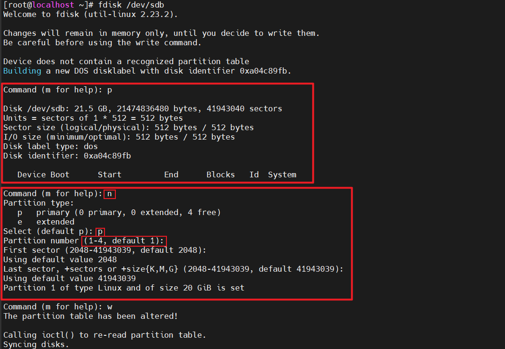

### 通过p命令查看分区情况，这步可以在上面做
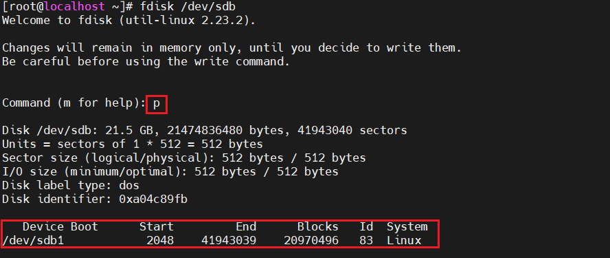

### 刚创建的分区是用来储存物理卷的，通过pvcreate命令创建物理卷
```shell
pvcreate /dev/sdb1
```

### 将创建的分区扩展根目录卷组`centos`
```shell
# 将/dev/sdb1分区绑定到centos卷组
vgextend centos /dev/sdb1

# 查看centos卷组详情
vgdisplay centos
```
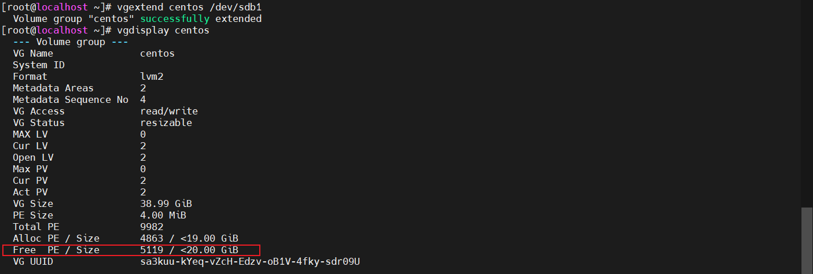

### 将磁盘空间分配到根目录的逻辑卷
```shell
# 查询centos卷组的逻辑卷信息，后面进行绑定
vgdisplay centos -v
# 100%free是把所有剩余空间分配给/dev/centos/root，/dev/centos/root是通过 vgdisplay centos -v 查看获取的
lvextend -l +100%free /dev/centos/root
# 扩展：这个是只添加50G空间到cenentos的卷组中
lvextend -L +50G /dev/centos/root
# 扩展完成后还要将文件系统扩大或者使用resize2fs（cat /etc/fstab查看系统文件格式，centos7默认xfs格式；如果是格式ext格式的，执行resize2fs /dev/sda3）
xfs_growfs /dev/centos/root
```
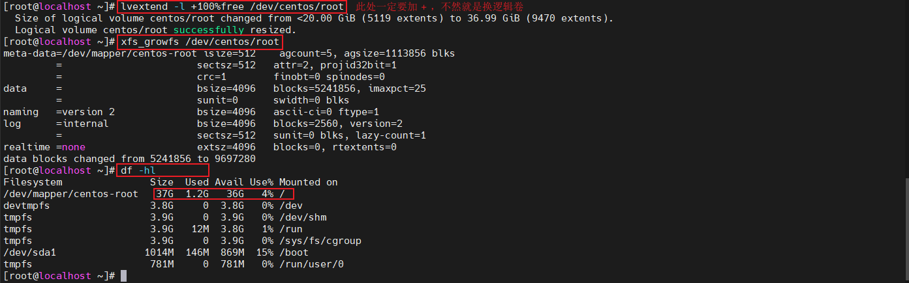


