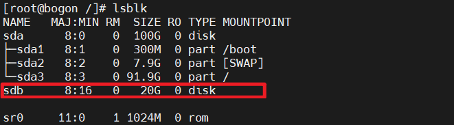
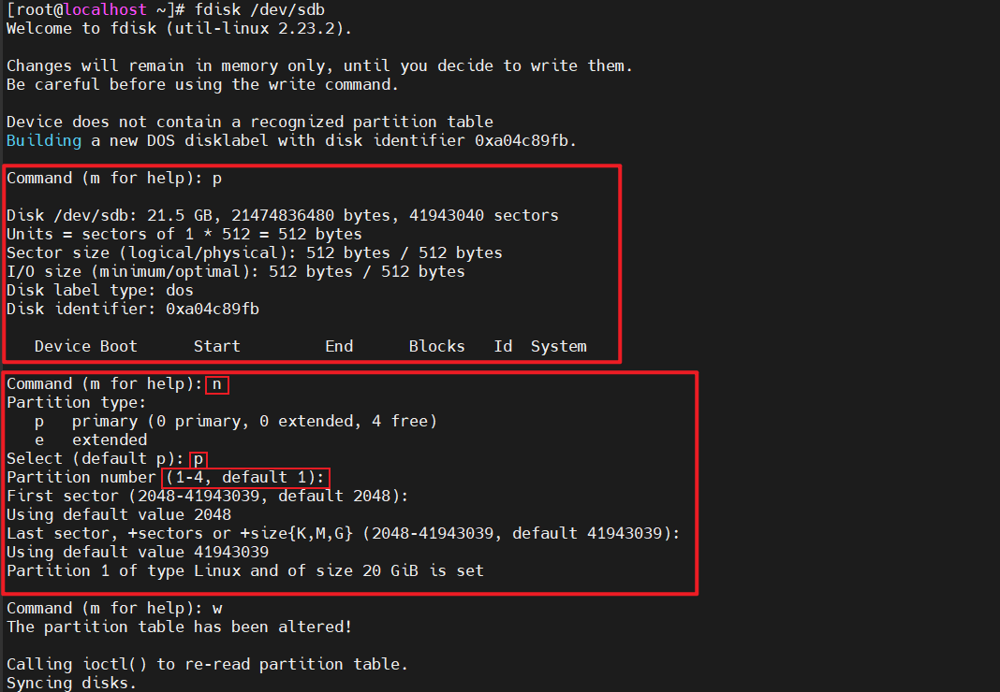

# 虚拟机给CentOS 7 添加磁盘（小于2T）

## 操作前请先阅读【YC】LVM说明.md
## 界面话操作图片说明：centos-磁盘挂载界面操作.png

### 找到需要添加磁盘的虚拟机设置，添加新磁盘


### 添加新磁盘


### 启动虚拟机，查看磁盘
```shell
# 查看系统中所有的磁盘信息
# linux 中所有外设都会在这个目录下，对应一个文件，其中第一块硬盘是sda,第二块硬盘是sdb,第三块硬盘是sdc
lsblk

# 查看磁盘详情
fdisk -l
```



### 对新加入的磁盘进行分区
`fdisk /dev/sdb`
```shell
# 说明
fdisk 上图中红框中的disk路径
m：列出所有命令
p：打印出当前分区的情况
n：新建分区
d：删除分区

[root@master ~]# fdisk /dev/sdb
欢迎使用 fdisk (util-linux 2.23.2)。

更改将停留在内存中，直到您决定将更改写入磁盘。
使用写入命令前请三思。

Device does not contain a recognized partition table
使用磁盘标识符 0x3eadb844 创建新的 DOS 磁盘标签。

# 输入n时，系统会提示选择主分区（primary  partition）还是扩展分区（extended），我们最开始选择主分区，输入p，然后输入主分区的序号1、2、3、4，我们这是第一个分区，故输入1
命令(输入 m 获取帮助)：n                                      n代表创建新分区
Partition type:
   p   primary (0 primary, 0 extended, 4 free)
   e   extended
Select (default p): p                                      p代表主分区
分区号 (1-4，默认 1)：1
起始 扇区 (2048-41943039，默认为 2048)：                      回车表示选择默认
将使用默认值 2048 
Last 扇区, +扇区or +size{K,M,G} (2048-41943039，默认为 41943039)： 回车表示选择默认
将使用默认值 41943039
分区 1 已设置为 Linux 类型，大小设为 20 GiB

命令(输入 m 获取帮助)：w                                       w代表保存以上设置
The partition table has been altered!

Calling ioctl() to re-read partition table.
正在同步磁盘。

# 系统会提示我们输入第一个分区的柱面的开始位置，我们输入1，即表示从第一个字节开始，之后系统会提示我们输入该柱面的结束位置，这里我们有两种输入格式，既可以输入结束的字节位置（如输入：256），也可以输入柱面的大小（格式：+2000M），在此需要说明，“256”与“+2000M”为柱面设定的大小是一样的
# 我这边使用的全是默认值；至此，第一个分区就创建完了，使用默认值，也就会把这个磁盘整个创建为一个分区
```


### 通过p命令查看分区情况，这步可以在上面做


### 刚创建的分区是用来储存物理卷的，通过pvcreate命令创建物理卷
```shell
pvcreate /dev/sdb1
```

#### 查看物理卷详情
```shell
# 查询系统中所有的物理卷
pvscan
# 通过pvname查看指定的物理卷详情
pvdisplay /dev/sdb1
# pvdisplay 想看的物理卷名称
```

#### 创建错误，可以通过下面命令进行物理卷删除
```shell
pvremove /dev/sdb1
```

### 创建名为'volume-group-sdb1'的卷组，使用/dev/sdb1创建
```shell
vgcreate volume-group-sdb1 /dev/sdb1
```

#### 查看卷组详情
```shell
# 查询系统中所有的卷组
vgscan

# 通过vgdisplay查看指定的卷组详情
vgdisplay volume-group-sdb1
# vgdisplay 想看的卷组名称
```

#### 创建错误，可以通过下面命令进行卷组删除
```shell
vgremove volume-group-sdb1
```

### 创建一个名为'gudao'、大小为500MB的逻辑卷；将卷组帮到lv上
```shell
lvcreate -L 500M -n gudao volume-group-sdb1
# lvcreate -L 分配大小 -n 逻辑卷命名 从哪个卷组分配

# 100%的空间都分配给这个逻辑卷
lvcreate -l 100%FREE -n 逻辑卷名称 待分配娟组
```

#### 如果需要删除逻辑卷，将空出来的逻辑卷分配给其它逻辑卷
````shell
lvextend -l +100%free 逻辑卷名称
````
#### 查看逻辑卷详情
```shell
# 查询系统中所有的逻辑卷
lvscan

# 通过vgdisplay查看指定的逻辑卷详情
lvdisplay /dev/volume-group-sdb1/gudao
# vgdisplay 想查看的卷组名+逻辑卷名称
```


### 创建文件系统、格式化分区，使用ext4格式化分区
```sehll
mkfs.ext4 /dev/volume-group-sdb1/gudao

mkfs.ext4 lv逻辑卷名称卷名称
```


### 临时挂载硬盘，一旦逻辑卷挂载，我们就可以到挂载点 /data 上读写了。要创建和挂载其它的逻辑卷，我们重复这个过程
```shell
# 创建临时挂载盘目录
mkdir /data
# 临时挂载磁盘（mount 逻辑卷路径 挂载路径）
mount /dev/volume-group-sdb1/gudao /data
```


### 设置永久挂载硬盘（开机自动挂载）
`vi /etc/fstab`
```shell
# 说明
磁盘分区路径 挂载路径 磁盘文件系统 defaults 0 0

#
# /etc/fstab
# Created by anaconda on Wed Aug 24 14:20:10 2022
#
# Accessible filesystems, by reference, are maintained under '/dev/disk'
# See man pages fstab(5), findfs(8), mount(8) and/or blkid(8) for more info
#
UUID=2bd5926e-5a94-4d70-bc82-f384da88f0bb /                       xfs     defaults        0 0
UUID=db219e79-21d3-429e-b68c-e059ed76476b /boot                   xfs     defaults        0 0
UUID=e23817f7-1d25-4c30-bd6b-135e5811880d swap                    swap    defaults        0 0
/dev/volume-group-sdb1/gudao              /data                   ext4    defaults        0 0
```


### 删除逻辑卷
```shell
# 取消挂载
umount /data/
# umount 挂载路径

# 删除逻辑卷
lvremove /dev/volume-group-sdb1/gudao
# lvmove 逻辑卷名称

# 删除/etc/fstab中添加的挂载信息
```
