## CentOS 7 镜像配置

### 按照图例配置
* 自定义镜像
  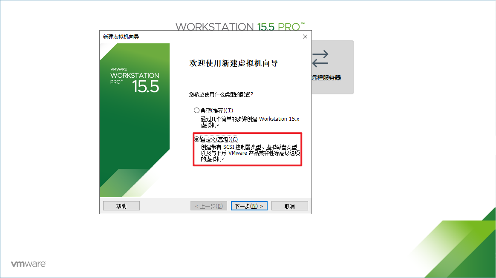

* 配置兼容性
  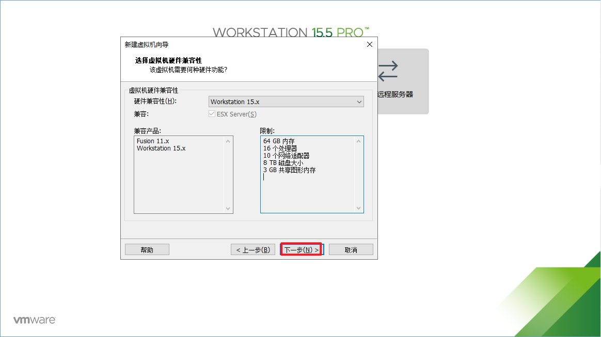

* 安装操作系统
  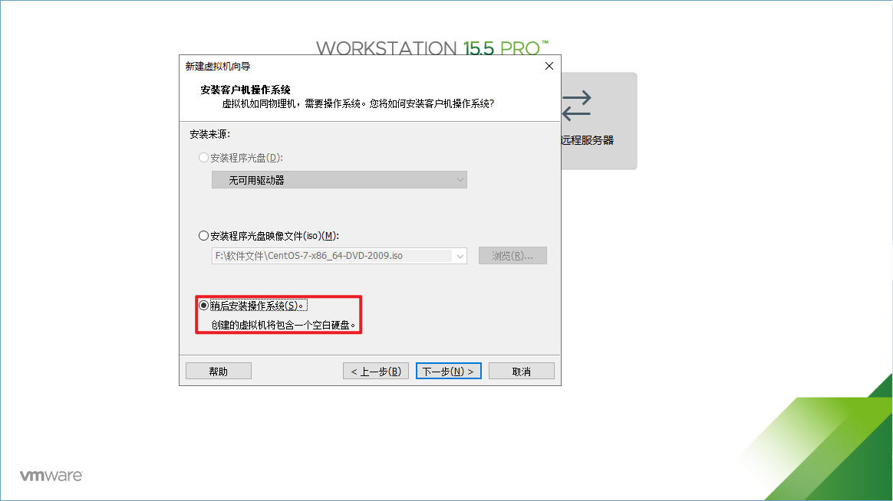

* 选择操作系统
  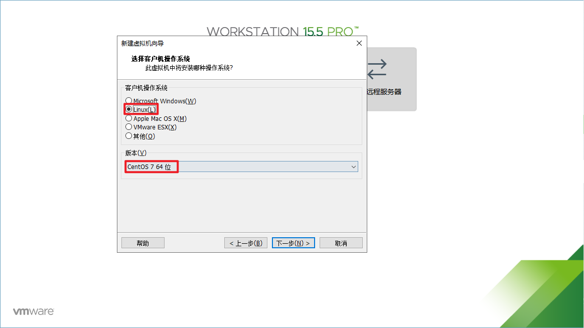

* 命名虚拟机&选择镜像
  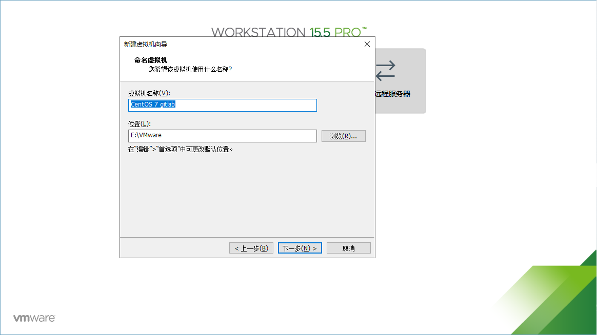

* 指定处理器内核
  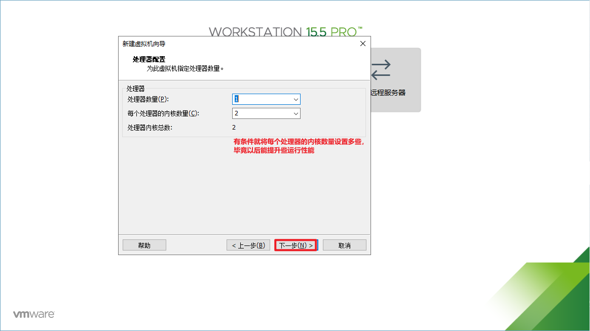

* 指定内存
  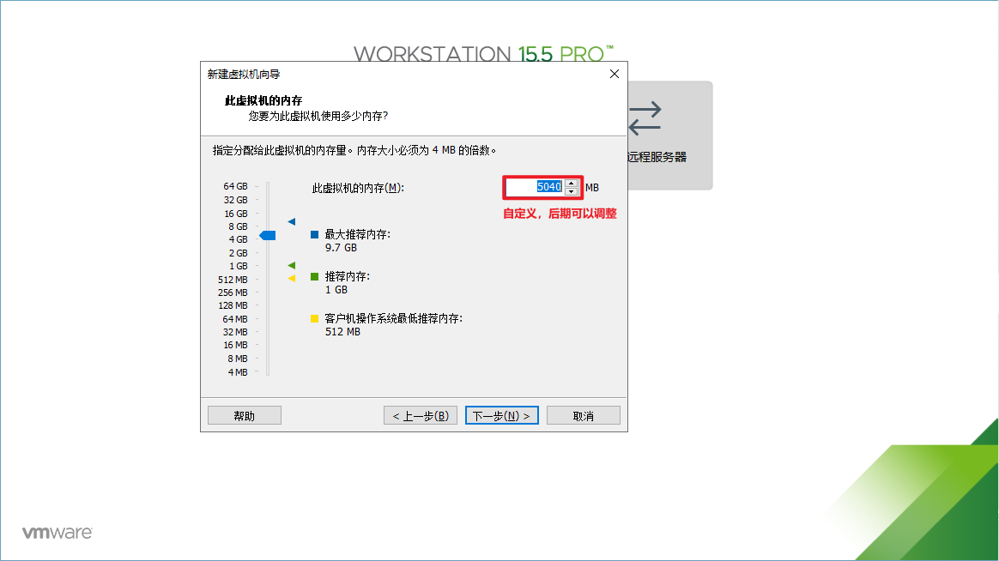

* 指定网络
  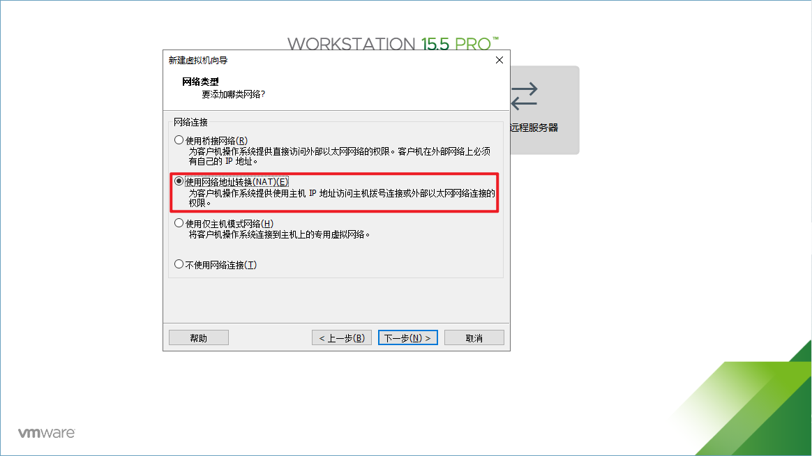

* 选择IO类型
  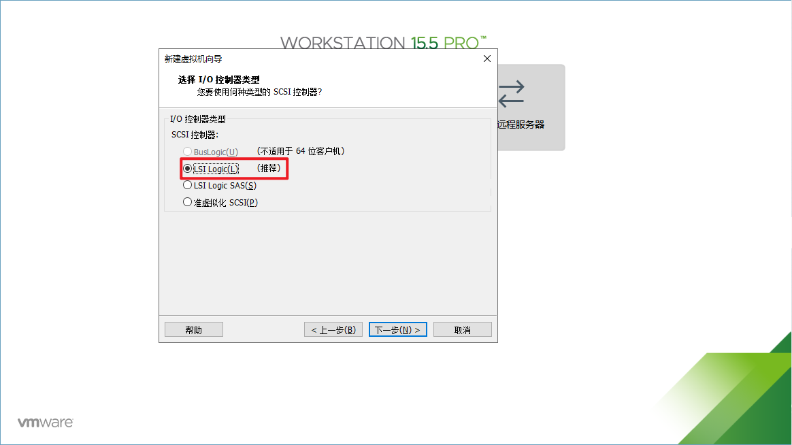

* 选择磁盘类型
  

* 创建虚拟磁盘
  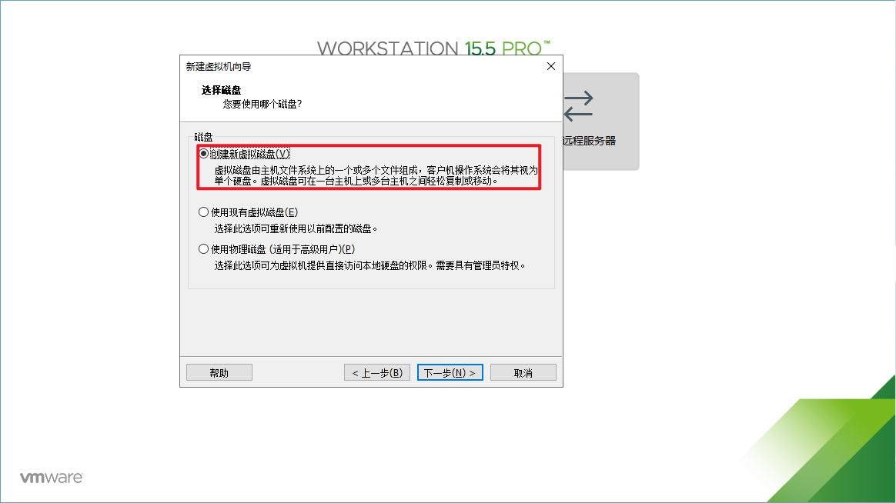

* 指定磁盘容量
  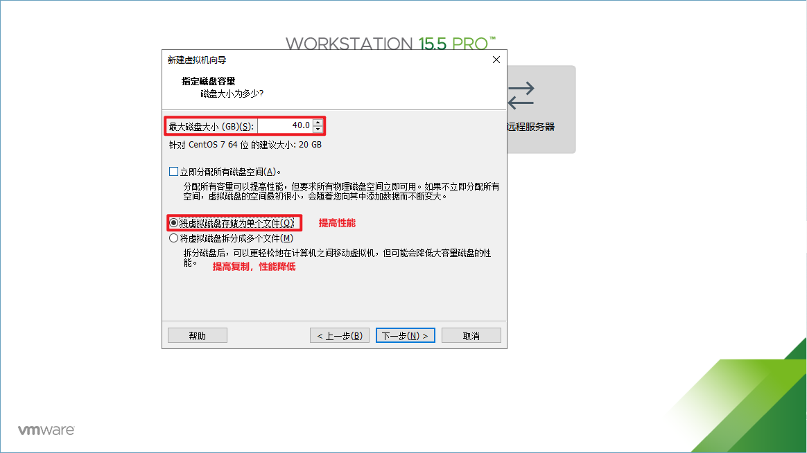
  
* 指定磁盘文件
  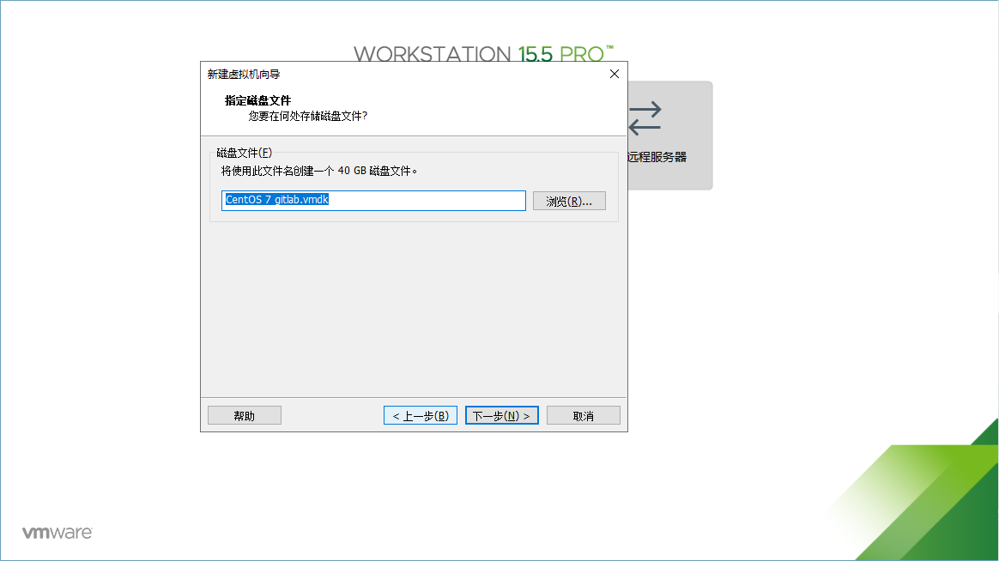

* 配置完成
  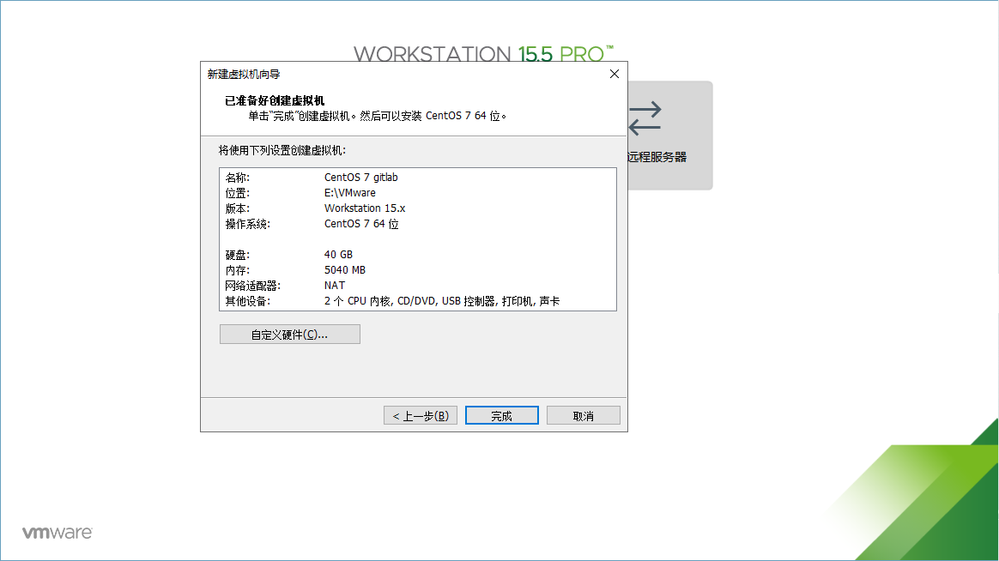