# 虚拟机给CentOS 7 配置本地Yum源

## 镜像说明
* 镜像位置：[../resource/vmware/iso/CentOS-7-x86_64-DVD-1810.zip]
* CentOS版本：CentOS Linux release 7.6.1810 (Core)

### 操作说明
#### 前置工作
##### 查看网络是否正常，如果正常也不需要配置了（直接就能联网下载）
```shell
ping www.baidu.com
```

##### 检查yum源（如下图，说明配置的是官方镜像源，此时没有网络，无法使用yum命令下载工具）
```shell
yum list
```
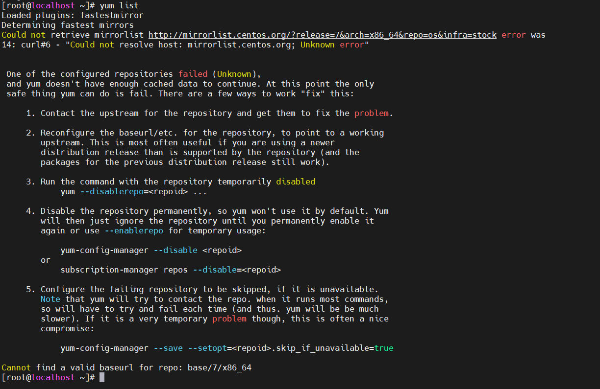

#### 如果系统中没有当前部署系统的iso镜像，需要进行下载，要保证yum源的进行与部署系统的镜像是相同版本
* 如果有当前系统的iso镜像文件，直接将iso文件上传到需要配置本地yum源的服务器上
* 如果没有，则需要下载；通过`cat /etc/redhat-release`查看本地系统版本
  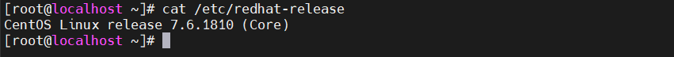
* 然后到centos官网找到对应版本进行下载，然后上传到服务器
  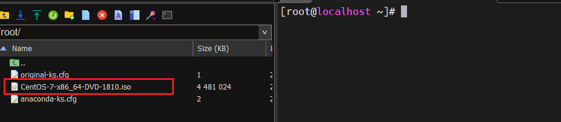

#### 挂载iso镜像文件
```shell
mount -o loop centos的iso镜像地址 需要挂载的位置
# 例如
#创建挂载文件夹
mkdir /osyum
mkdir /osyum/test
#挂载iso镜像
mount -o loop /root/CentOS-7-x86_64-DVD-1810.iso /osyum/test/
```
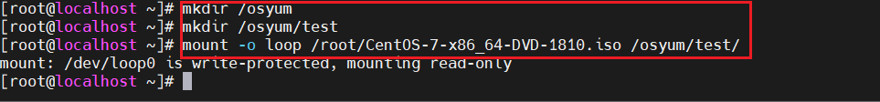

#### 查看是否挂载成功
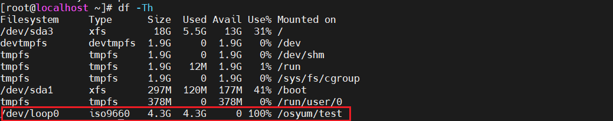


#### 配置本地yum源
##### 备份本地yum源
```shell
# 创建yum源备份文件夹
mkdir /etc/yum.repos.d_bak
# 将系统自带的yum源移动到创建的备份文件夹
mv /etc/yum.repos.d/* /etc/yum.repos.d_bak/
```
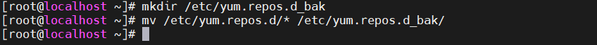
##### 编写repo文件并指向镜像的挂载目录
```shell
[local]
name=local
# 指向iso镜像挂载的位置
baseurl=file:///opt/centos
enabled=1
gpgcheck=0
```
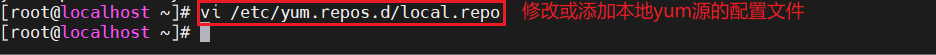
##### 清除缓存，使最新的yum配置生效
```shell
# 清除yum源缓存
yum clean all
# 把Yum源缓存到本地，加快软件的搜索好安装速度
yum makecache
# 列出了yum包
yum list
```
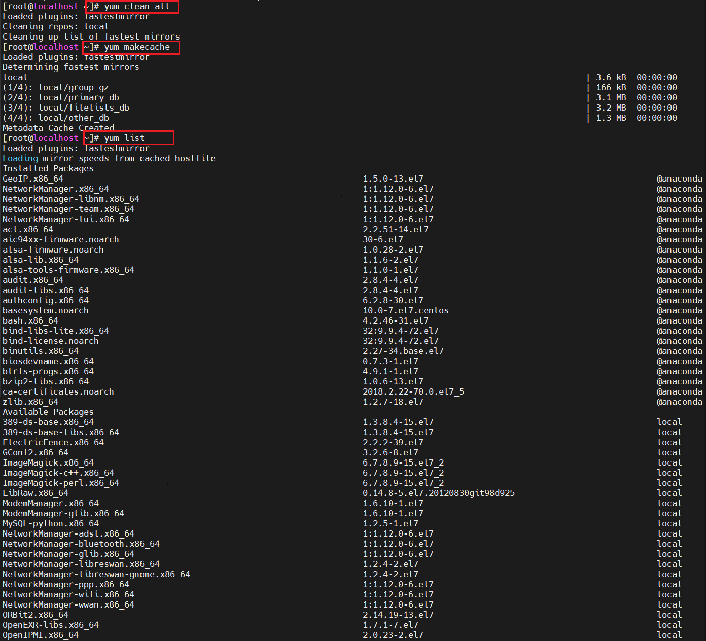

#### 查看yum仓库列表
```shell
# 查看yum仓库列表
yum repolist
```
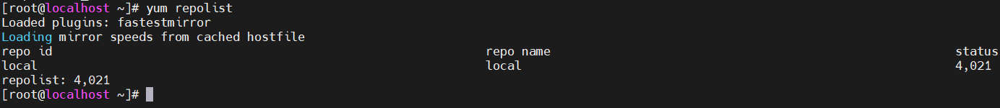

#### 设置开机自动挂载，在/etc/fstab表中，添加最后的一行，将iso文件永久挂载到系统中
```shell
vi /etc/fstab

# 添加
# iso镜像文件绝对路径 镜像挂载文件夹地址 文件编码（通过df -Th命令查看，上图有） 挂载方式 0 0
/root/CentOS-7-x86_64-DVD-1810.iso        /osyum/test             iso9660 loop            0 0
```
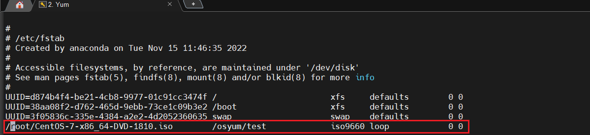

#### 取消挂载（需要的时候再执行）
```shell
umount /osyum/test
```

### 测试（如图，在断网情况下，还能下载unzip工具包）
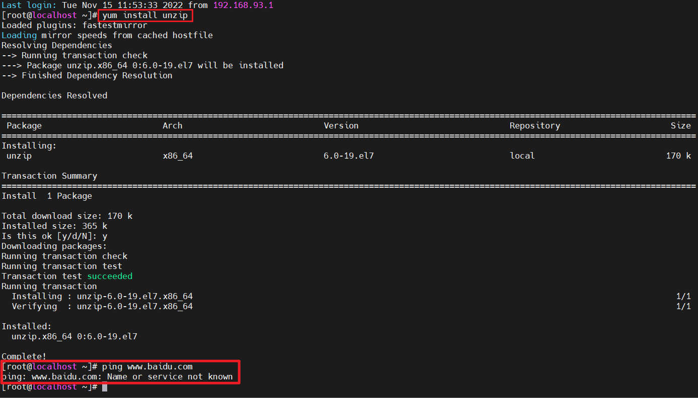
