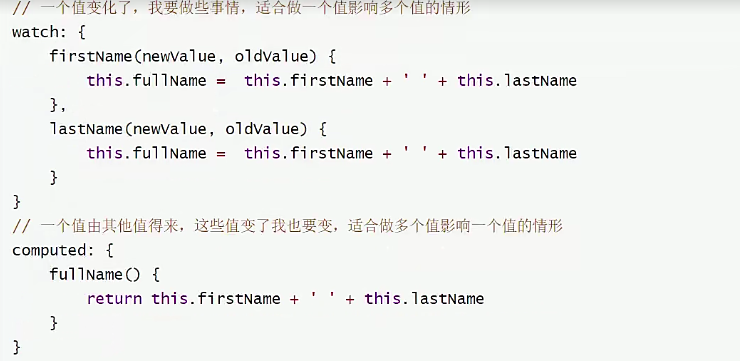

## 计算属性：computed

### 课程数量统计
```html
<body>
    <div id="app">
        <p>总数量：{{total}}</p>
    </div>
</body>
</html>
<script>
    var vm = new Vue({
        el: '#app',
        data: {
            courses: ["a","b"]
        },
        //计算属性有缓存性:如果值没有发生变化,则页面不回重新渲染
        computed: {
            total(){
                return this.test.courses   
            }
        }
    })
</script>
```

### 计算属性 vs 监听器
* 处理数据的场景不同，监听器适合一个数据影响多个数据，计算属性适合一个数据受多个数 据影响
* 计算属性有缓存性，计算所得的值如果没有变化不会重复执行
* 监听器选项提供了更通用的方法，适合执行异步操作或较大开销操作的情况

* 语义上的差异

