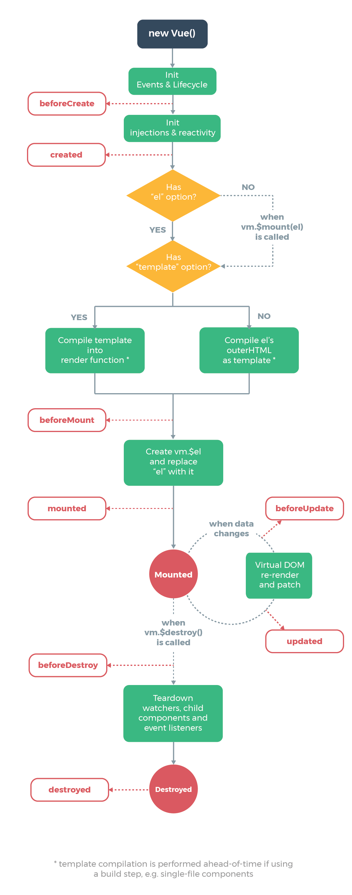

## Vue声明周期

### 图解


### 测试用例
```html
<!DOCTYPE html>
<html>
<head>
    <title>Vue源码剖析</title>
    <script src="vue.js"></script>
</head>
<body>
    <div id="demo">
        <h1>初始化流程</h1>
        <p>{{foo}}</p>
    </div>
    <script>
        // 创建实例
        const app = new Vue({
            el: '#demo',
            data:{
                foo: 'foo'
            },
            beforeCreate(){
                console.log('beforeCreate')
            },
            
            created(){
                console.log('created '+this.$el)
            },
            
            beforeMount(){
                console.log('beforeMount')
            },
            
            mounted(){
                setTimeout(() => {
                    this.foo = 'foooooo'
                }, 2000);
                console.log('mounted '+this.$el)
            },
            
            beforeUpdate(){
                console.log('beforeUpdate')
            },
            
            updated(){
                console.log('updated')},
            });
        </script>
</body>
</html>
```
* 结论
    > 三个阶段：初始化、更新、销毁
    * 初始化：beforeCreate、created、beforeMount、mounted
    * 更新：beforeUpdate、updated
    * 销毁：beforeDestroy、destroyed

* 详解
    ```shell
    {
        beforeCreate(){} // 执行时组件实例还未创建，通常用于插件开发中执行一些初始化任务
        created(){} // 组件初始化完毕，各种数据可以使用，常用于异步数据获取
        beforeMounted(){} // 未执行渲染、更新，dom未创建
        mounted(){} // 初始化结束，dom已创建，可用于获取访问数据和dom元素
        beforeUpdate(){} // 更新前，可用于获取更新前各种状态
        updated(){} // 更新后，所有状态已是最新
        beforeDestroy(){} // 销毁前，可用于一些定时器或订阅的取消
        destroyed(){} // 组件已销毁，作用同上
    }
    ```