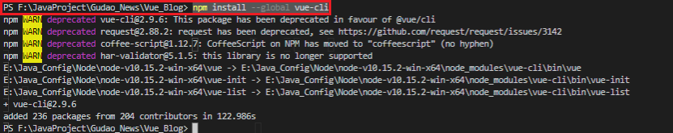
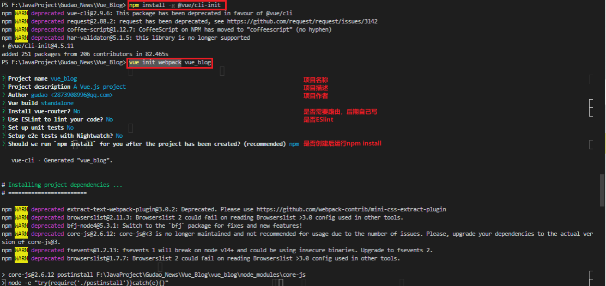
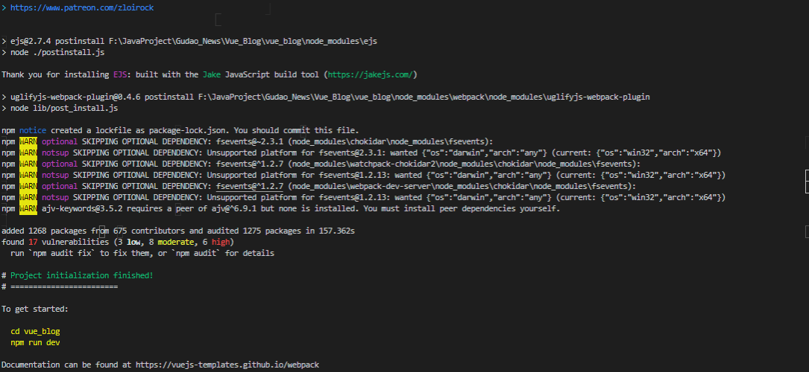

## Vue Cli项目搭建
<https://cli.vuejs.org/zh/guide/prototyping.html>

### node.js版本确认
> 在使用vue-cli之前，请确认你的电脑已经安装了 node，Vue CLI 需要 Node.js 8.9 或更高版本 (推荐 8.11.0+)，根据使用的的Vue的版本下载对应的Node版本【Node配置参考：node.js安装说明】

### 下载全局的Vue Cli
* 下载命令
    > Vue CLI 的包名称由 vue-cli 改成了 @vue/cli。 如果你已经全局安装了旧版本的 vue-cli (1.x 或 2.x)，你需要先通过 npm uninstall vue-cli -g 或 yarn global remove vue-cli 卸载它。
    ```shell
    # 老版本
    npm install --global vue-cli
    # 新版本 
    npm install -g @vue/cli
    ```
    
* 升级命令
    ```shell
    npm update -g @vue/cli
    ```
* 搭建Vue项目
    * 注意：
        > Vue CLI >= 3 和旧版使用了相同的 vue 命令，所以 Vue CLI 2 (vue-cli) 被覆盖了。如果你仍然需要使用旧版本的 vue init 功能，你可以全局安装一个桥接工具
        ```shell
        npm install -g @vue/cli-init
        ```
      * 搭建命令：
        ```shell
        # 创建项目
        vue init webpack my-project
        # 移动到项目下
        cd my-project
        # 安装插件
        npm install
        # 运行项目
        npm run dev
        ```
        
        

