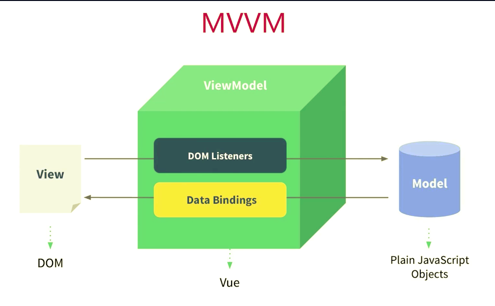

## Vue
* Vue诞生于2014年，是由中国在校大学生尤雨溪创建出来的。
* Vue(读音 /vjuː/，类似于 view)是一套用于构建用户界面的渐进式（JavaScript）框架。与其它大型框架不同的是，Vue 被设计为可以自底向上逐层应用。Vue 的核心库只关注视图层，不仅易于上手，还便于与第三方库或既有项目整合

#### 官网地址
<https://cn.vuejs.org/>

#### Vue设计思想
* 数据驱动应用
* MVVM模式的践行者

* MVVM框架的三要素:响应式、模板引學及其演响应式: vue如何监听数据变化?
* 模版: vue的模版如何编写和解析?
* 渲染: vue如何将模板转换为html?

#### 其它框架
* Angular诞生于2009年，是由谷歌创建出来的框架
* React诞生于2013年，是由facebook公司创建出来框架