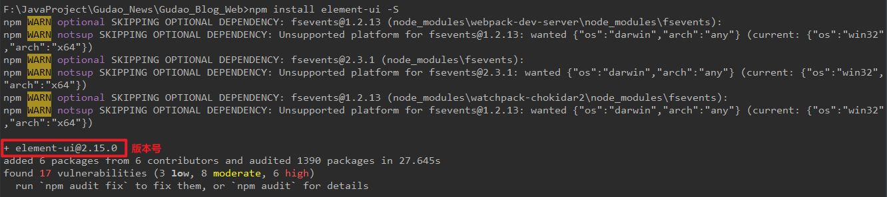
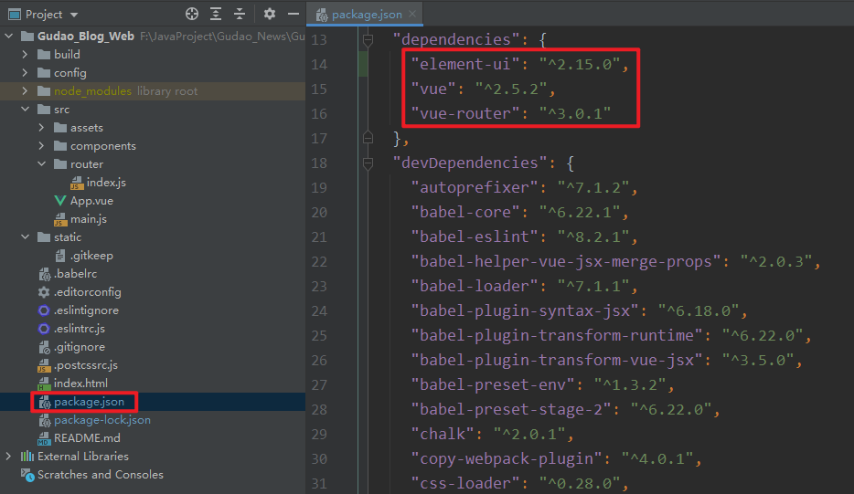
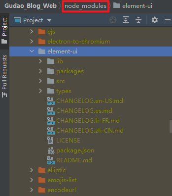
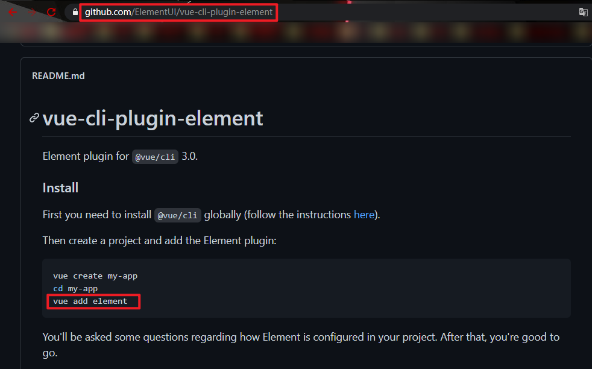
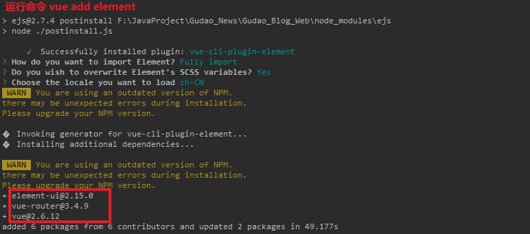
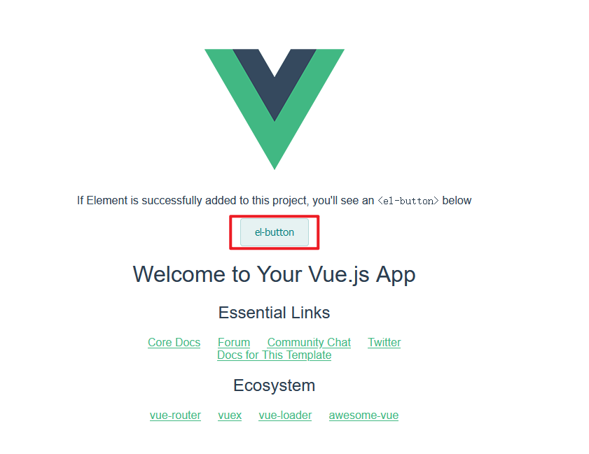

## Vue挂载Element-UI

### 挂载详情
#### 安装element-ui插件
#### 方法一
* 安装命令
    ```shell
    npm install element-ui -S
    ```
    

* 查看配置文件package.json，是否有element-ui组件的版本号


* 安装的element-ui信息都能在`node_modules`查看


* main.js中引入element-ui/在路由中引入element-ui
```html
import ElementUI from 'element-ui'
import 'element-ui/lib/theme-chalk/index.css'

Vue.use(ElementUI);
```

#### 方法二
> 查看element-ui官网，提供了一套自动搭载在vue上的命令
* 地址:
    <https://element.eleme.cn/#/zh-CN/component/quickstart><br>
    
* 执行命令
    ```shell
    vue add element
    ```
    
* 启动项目`npm run dev`
    
